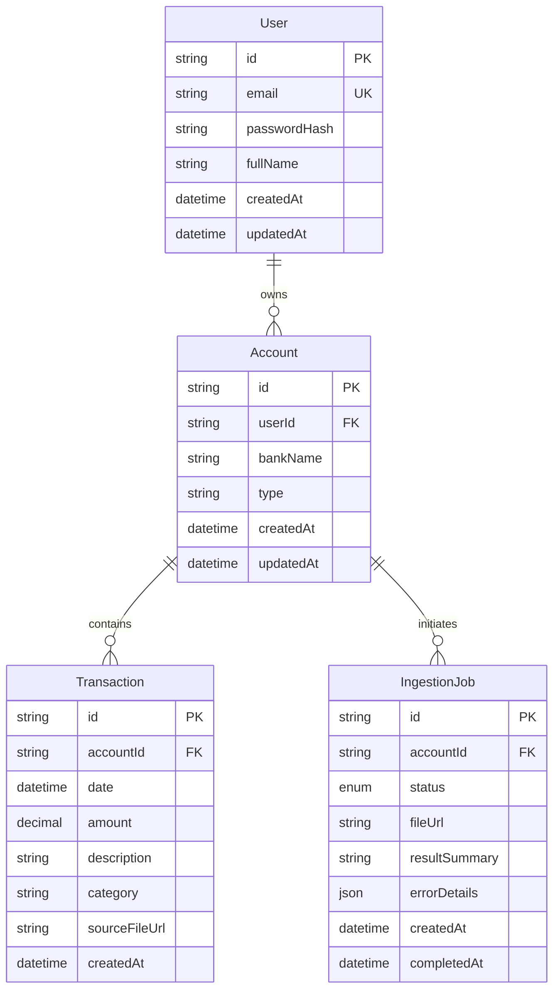
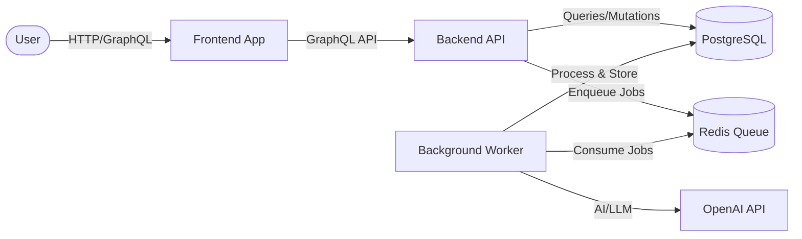

# IntelliFinance - Developer Onboarding Guide

**Welcome to IntelliFinance!** 🚀

This comprehensive guide will help you understand the project, its current state, and how to get started as a new developer on the team.

---

## 📋 Table of Contents

1. [Project Overview](#project-overview)
2. [Tech Stack](#tech-stack)
3. [Architecture](#architecture)
4. [Feature Status](#feature-status)
5. [Development Workflow](#development-workflow)
6. [Onboarding Plan](#onboarding-plan)

---

## Project Overview

### Vision

**IntelliFinance** is a scalable, monorepo-based financial management platform designed to provide intelligent insights and robust data processing. The platform aims to help users manage their finances by:

- **Automating transaction imports** from bank statements using AI
- **Categorizing and tracking** income and expenses
- **Providing intelligent insights** into spending patterns
- **Enabling secure user authentication** and data privacy

### Core Principles

The project follows strict architectural principles defined in [`AGENTS.md`](file:///c:/devWorkspace/intellifinance/AGENTS.md):

#### 1. **Spec-Driven Development (SDD)**

- No code is written without a validated Markdown Spec (`.spec.md`)
- All features have comprehensive documentation in the `specs/` directory

#### 2. **Strong Typing & Contracts**

- TypeScript Strict Mode is mandatory
- `any` type is forbidden
- All I/O validated via **Zod** schemas

#### 3. **Asynchronous Decoupling**

- Heavy tasks (AI inference, PDF parsing) utilize **BullMQ**
- API never blocks; returns a `jobId` for async tasks

#### 4. **Monorepo Boundaries**

- `apps/`: Deployable units (Backend, Frontend, Workers) - Minimal logic
- `packages/`: Shared logic, Schemas, UI Kits

---

## Tech Stack

### Runtime & Languages

- **Runtime**: Node.js v20+
- **Language**: TypeScript 5.x (Strict Mode)
- **Package Manager**: Yarn Workspaces

### Backend

- **API Framework**: Express.js
- **API Layer**: GraphQL (Apollo Server v4)
- **Authentication**: JWT (dual-token strategy: access + refresh)
- **Password Hashing**: bcrypt
- **Security**: GraphQL Shield

### Frontend

- **Framework**: React 18
- **Build Tool**: Vite
- **UI Library**: Material UI (MUI) v5+ with Emotion *(Feature 005)*
- **Forms**: React Hook Form with Zod validation
- **State Management**: Apollo Client (GraphQL)

### Database & Storage

- **Database**: PostgreSQL
- **ORM**: Prisma
- **Cache/Queue**: Redis
- **Queue Management**: BullMQ

### Asynchronous Processing

- **Worker Framework**: BullMQ
- **AI/LLM Integration**: LangChain.js
- **PDF Processing**: pdf-parse

### Development Tools

- **Containerization**: Docker & Docker Compose
- **Code Quality**: ESLint, Prettier
- **Git Hooks**: Husky, lint-staged
- **Testing**: Vitest (Unit), Playwright (E2E - planned)

---

## Architecture

### Monorepo Structure

```
intellifinance/
├── apps/                    # Deployable applications
│   ├── backend/            # GraphQL API server (Node.js/Express)
│   ├── frontend/           # React web application (Vite)
│   └── worker/             # Background job processor (BullMQ)
│
├── packages/               # Shared libraries
│   ├── config/            # Shared ESLint/TSConfig
│   ├── database/          # Prisma schema & client
│   ├── jobs/              # BullMQ job definitions
│   └── types/             # Zod schemas & TypeScript types
│
├── specs/                 # Feature specifications (Source of Truth)
│   ├── 001-monorepo-structure/
│   ├── 002-user-auth/
│   ├── 003-async-infra/
│   ├── 004-smart-ingestion/
│   └── 005-financial-core/  (on branch only)
│
├── .github/               # GitHub Actions & CODEOWNERS
├── .gemini/              # AI context & memory
└── docker-compose.yml    # Local development orchestration
```

### Data Model

The current database schema includes:



> [!NOTE]
> Feature 005 (on separate branch) extends this model with Category and enhanced Transaction types.

### Application Flow



---

## Feature Status

### ✅ Completed Features (on `main` branch)

#### **001: Monorepo Structure & Project Foundation**

- **Status**: ✅ Complete (100%)
- **Branch**: Merged to `main`
- **What it delivers**:
  - Yarn workspaces configuration
  - Docker Compose setup (PostgreSQL, Redis, Backend, Frontend, Worker)
  - TypeScript strict mode enforcement
  - Git hooks (Husky + lint-staged)
  - CODEOWNERS protection for critical directories
  - Development environment ready

**Key Artifacts**:

- [Spec](file:///c:/devWorkspace/intellifinance/specs/001-monorepo-structure/spec.md)
- [Tasks](file:///c:/devWorkspace/intellifinance/specs/001-monorepo-structure/tasks.md) (All 40 tasks complete)

---

#### **002: User Authentication**

- **Status**: ✅ Complete (100%)
- **Branch**: Merged to `main`
- **What it delivers**:
  - User registration with bcrypt password hashing
  - Login with JWT dual-token strategy (access: 15min, refresh: 7 days)
  - GraphQL Shield for protected routes
  - `me` query for authenticated user profile
  - Shared Zod validation schemas
  - Frontend auth forms and context

**Key Components**:

- Backend: `AuthService`, registration/login/refresh resolvers
- Frontend: `RegisterForm`, `LoginForm`, `AuthContext`
- Shared: `RegisterInputSchema`, `LoginInputSchema`

**Key Artifacts**:

- [Spec](file:///c:/devWorkspace/intellifinance/specs/002-user-auth/spec.md)
- [Tasks](file:///c:/devWorkspace/intellifinance/specs/002-user-auth/tasks.md) (All 28 tasks complete)

---

#### **003: Async Worker Infrastructure**

- **Status**: ✅ Complete (100%)
- **Branch**: Merged to `main`
- **What it delivers**:
  - BullMQ integration with Redis
  - Shared job definitions in `packages/jobs`
  - Worker application with processor framework
  - QueueService for job enqueueing
  - Retry policy (3 attempts, exponential backoff)
  - TEST_JOB proof-of-concept

**Key Components**:

- `packages/jobs`: Queue names, Zod schemas, job types
- `apps/worker`: Worker factory, job processors
- `apps/backend`: QueueService for job creation

**Key Artifacts**:

- [Spec](file:///c:/devWorkspace/intellifinance/specs/003-async-infra/spec.md)
- [Tasks](file:///c:/devWorkspace/intellifinance/specs/003-async-infra/tasks.md) (All tasks complete)

---

#### **004: Smart Document Ingestion**

- **Status**: ✅ Complete (implementation done)
- **Branch**: Merged to `main`
- **What it delivers**:
  - PDF upload via GraphQL (with file size validation: max 5MB)
  - Async PDF text extraction using `pdf-parse`
  - LLM-powered transaction extraction via LangChain
  - Mock mode fallback (when `OPENAI_API_KEY` missing)
  - Bulk transaction insertion
  - IngestionJob status tracking (PENDING, PROCESSING, COMPLETED, FAILED)

**Key Components**:

- Backend: `uploadStatement` mutation, UploadService
- Worker: IngestionProcessor, PdfService, LlmService
- Database: Account, Transaction, IngestionJob models
- Shared: ExtractedTransaction Zod schema

**Workflow**:

1. User uploads PDF → Backend saves file, creates IngestionJob
2. Backend enqueues `ingest-pdf` job to BullMQ
3. Worker extracts text from PDF
4. Worker sends text to LLM (or uses mock data)
5. Worker validates LLM output with Zod
6. Worker bulk-inserts transactions
7. IngestionJob status updated to COMPLETED/FAILED

**Key Artifacts**:

- [Spec](file:///c:/devWorkspace/intellifinance/specs/004-smart-ingestion/spec.md)
- [Tasks](file:///c:/devWorkspace/intellifinance/specs/004-smart-ingestion/tasks.md)

> [!NOTE]
> Some verification tasks were skipped due to environment setup issues but implementation is complete.

---

### 🚧 In Progress Features

#### **005: Financial Core & Transactions List MVP**

- **Status**: 🚧 In Progress (~70% complete)
- **Branch**: `origin/005-financial-core` (NOT merged to main)
- **What it delivers**:
  - Enhanced data model: Account types, Category system
  - Transaction types: INCOME, EXPENSE, TRANSFER
  - Transaction status: PENDING, COMPLETED
  - Material UI-based frontend implementation
  - Transactions list page with filtering
  - Summary cards: Balance, Income, Expenses
  - Beautiful, premium UI design (MUI v5)

**Enhanced Data Model** (on branch 005):

- **Account**: `type` enum (CHECKING, CREDIT_CARD, CASH), `balance` field
- **Category**: New model with `name`, `icon`, `color`, `type` (INCOME/EXPENSE)
- **Transaction**: Extended with `type`, `status`, `categoryId` relation

**Frontend Features** (on branch 005):

- AuthenticatedLayout with AppBar + User Avatar
- TransactionsPage with:
  - SummaryCards (Saldo, Receitas, Despesas)
  - FilterSection (Account, Date Range, Type)
  - TransactionList with color-coded amounts (Green=Income, Red=Expense)
  - Pagination
  - Floating Action Button (placeholder for "New Transaction")

**Design System**:

- Primary Color: `#0D47A1` (Deep Blue)
- Success Color: `#2E7D32` (Green)
- Error Color: `#D32F2F` (Red)
- Background: `#F4F6F8` (Light Gray)

**What's on the branch**:

- 3 commits implementing financial core backend, frontend integration, and seed data
- Not yet merged to main

**Next Steps for Feature 005**:

- Code review
- Merge to main
- User acceptance testing

---

### 📅 Planned Features (Future Roadmap)

Based on the project architecture and goals, potential future features include:

- **006: Budget Planning** - Create and track budgets by category
- **007: Analytics Dashboard** - Visualizations and spending insights
- **008: Multi-Currency Support** - Handle multiple currencies
- **009: Recurring Transactions** - Auto-categorization of recurring items
- **010: Mobile App** - React Native companion app
- **011: Export/Import** - CSV/Excel export capabilities
- **012: Notifications** - Budget alerts and spending notifications

---

## Development Workflow

### 1. Getting Started

#### Prerequisites

- Node.js v20+
- Docker & Docker Compose
- Yarn

#### Initial Setup

```bash
# Clone the repository
git clone <repository-url>
cd intellifinance

# Install dependencies
yarn install

# Start the full stack
docker-compose up --build
```

This will start:

- **PostgreSQL** on port `5432`
- **Redis** on port `6379`
- **Backend API** on `http://localhost:3000`
- **Frontend** on `http://localhost:5173`
- **Worker** (background process)

> [!IMPORTANT]
> Ensure ports 3000, 5173, 5432, and 6379 are free on your machine.
>
> **Windows/WSL Users**:
> If you encounter issues with "process not found" or line endings, ensure your git config is set to handle CRLF correctly:
> `git config --global core.autocrlf input`
> Also, always run `yarn install` from inside your WSL terminal, not from Windows PowerShell.

### 2. Development Commands

```bash
# Run linting
yarn lint

# Format code
yarn format

# Build TypeScript
cd apps/backend && yarn build
```

### 3. Database Migrations

```bash
# Navigate to database package
cd packages/database

# Run migrations
npx prisma migrate dev

# Generate Prisma client
npx prisma generate

# Open Prisma Studio (DB GUI)
npx prisma studio
```

### 4. Working with Branches

#### Main Branch

- Contains features 001-004 (fully merged and stable)
- Safe to use as base for new features

#### Feature Branch: 005-financial-core

- Contains Financial Core implementation
- **DO NOT** base new work on this branch until it's merged

```bash
# To explore feature 005
git checkout origin/005-financial-core

# To return to main
git checkout main
```

### 5. Spec-Driven Development Process

Following the project's SDD principle:

1. **Start with a Spec** - All features begin with a `.spec.md` file
2. **Create Implementation Plan** - Break down into tasks (`tasks.md`)
3. **Implement** - Write code following monorepo boundaries
4. **Test** - Validate against acceptance criteria
5. **Document** - Update specs and README files

**Example**: When creating a new feature:

```bash
# 1. Create spec directory
mkdir specs/006-your-feature

# 2. Write specification
# Create specs/006-your-feature/spec.md

# 3. Create task breakdown
# Create specs/006-your-feature/tasks.md

# 4. Create feature branch
git checkout -b 006-your-feature

# 5. Implement following the tasks

# 6. Submit PR
```

### 6. Code Organization Rules

> [!WARNING]
> **Critical Boundaries**

- ✅ `packages/*` can import other `packages/*`
- ✅ `apps/*` can import `packages/*`
- ❌ `apps/*` **CANNOT** import other `apps/*` (enforced by ESLint)
- ❌ `packages/*` **CANNOT** import `apps/*`

**Rationale**: Shared logic belongs in `packages/`, applications only compose the logic.

---

## Onboarding Plan

Here's a structured **5-day onboarding plan** to ramp up as a new developer:

### 📅 Day 1: Environment Setup & Codebase Exploration

**Goal**: Get the project running locally and understand the architecture.

#### Morning (3-4 hours)

- [ ] Set up development environment (Node.js, Docker)
- [ ] Clone repository and install dependencies
- [ ] Start the full stack with `docker-compose up --build`
- [ ] Verify all services are running:
  - Backend GraphQL Playground: `http://localhost:3000/graphql`
  - Frontend: `http://localhost:5173`
  - PostgreSQL: Port 5432
  - Redis: Port 6379

#### Afternoon (3-4 hours)

- [ ] Read [README.md](file:///c:/devWorkspace/intellifinance/README.md)
- [ ] Read [AGENTS.md](file:///c:/devWorkspace/intellifinance/AGENTS.md)
- [ ] Explore `specs/` directory structure
- [ ] Review [Spec 001](file:///c:/devWorkspace/intellifinance/specs/001-monorepo-structure/spec.md) - Understand monorepo architecture
- [ ] Explore directory structure:
  - Navigate through `apps/backend`, `apps/frontend`, `apps/worker`
  - Check `packages/database`, `packages/types`, `packages/jobs`

**Deliverable**: Running local environment + basic understanding of project structure

---

### 📅 Day 2: Understanding Features 001-002 (Foundation + Auth)

**Goal**: Understand the foundation layer and authentication system.

#### Morning (3-4 hours)

- [ ] Read [Spec 001 Tasks](file:///c:/devWorkspace/intellifinance/specs/001-monorepo-structure/tasks.md)
- [ ] Examine `docker-compose.yml` configuration
- [ ] Review shared TypeScript configs in `packages/config`
- [ ] Study `packages/database/schema.prisma`
- [ ] Run Prisma Studio: `cd packages/database && npx prisma studio`

#### Afternoon (3-4 hours)

- [ ] Read [Spec 002](file:///c:/devWorkspace/intellifinance/specs/002-user-auth/spec.md)
- [ ] Trace authentication flow:
  - Review `apps/backend/src/services/auth.service.ts`
  - Check GraphQL resolvers in `apps/backend/src/graphql/resolvers/`
  - Examine Zod schemas in `packages/types/src/auth.ts`
- [ ] Test authentication in GraphQL Playground:

  ```graphql
  mutation Register {
    register(input: {
      email: "test@example.com"
      password: "password123"
      fullName: "Test User"
    }) {
      token
      refreshToken
      user {
        id
        email
        fullName
      }
    }
  }
  ```

- [ ] Understand JWT token strategy (15min access, 7-day refresh)

**Deliverable**: Ability to explain authentication flow and test it manually

---

### 📅 Day 3: Async Infrastructure & Smart Ingestion (Features 003-004)

**Goal**: Understand asynchronous job processing and AI-powered document ingestion.

#### Morning (3-4 hours)

- [ ] Read [Spec 003](file:///c:/devWorkspace/intellifinance/specs/003-async-infra/spec.md)
- [ ] Study BullMQ architecture:
  - Review `packages/jobs/src/` structure
  - Understand `QueueService` in `apps/backend`
  - Examine `WorkerFactory` in `apps/worker`
- [ ] Trace TEST_JOB flow from creation to processing
- [ ] Watch worker logs while creating a test job

#### Afternoon (3-4 hours)

- [ ] Read [Spec 004](file:///c:/devWorkspace/intellifinance/specs/004-smart-ingestion/spec.md)
- [ ] Study ingestion flow:
  - Upload mutation: `apps/backend/src/graphql/resolvers/ingestion.resolver.ts`
  - PDF processing: `apps/worker/src/services/pdf.service.ts`
  - LLM extraction: `apps/worker/src/services/llm.service.ts`
- [ ] Test document upload (if environment is set up):
  - Create a test account
  - Upload a sample PDF
  - Watch worker process the job
  - Check transactions in Prisma Studio

**Deliverable**: Understanding of async job system and ability to trace a complete ingestion flow

---

### 📅 Day 4: Frontend Architecture & Feature 005 Preview

**Goal**: Understand React frontend and explore the UI being built in Feature 005.

#### Morning (3-4 hours)

- [ ] Explore `apps/frontend/src` structure
- [ ] Study authentication UI:
  - `components/auth/RegisterForm.tsx`
  - `components/auth/LoginForm.tsx`
  - `context/AuthContext.tsx`
- [ ] Understand React Hook Form + Zod integration
- [ ] Test registration and login in the UI (`http://localhost:5173`)

#### Afternoon (3-4 hours)

- [ ] Checkout Feature 005 branch: `git checkout origin/005-financial-core`
- [ ] Read Feature 005 spec (view the spec I showed earlier)
- [ ] Explore Material UI implementation:
  - Check `TransactionsPage` component
  - Review Material UI theming
  - Examine summary cards and filter components
- [ ] Run the UI and interact with transactions list
- [ ] Return to main: `git checkout main`

**Deliverable**: Understanding of frontend patterns and Material UI approach

---

### 📅 Day 5: First Contribution - Pick a Starter Task

**Goal**: Make your first meaningful contribution to solidify learning.

#### Suggested Starter Tasks

**Option A: Write Tests (Recommended)**

- [ ] Add integration test for `uploadStatement` mutation
- [ ] Write unit tests for `PdfService`
- [ ] Create E2E test for registration flow

**Option B: Documentation**

- [ ] Improve README with troubleshooting section
- [ ] Document environment variables in `.env.example`
- [ ] Create architecture diagrams for wiki

**Option C: Small Feature Enhancement**

- [ ] Add email format validation to registration
- [ ] Implement pagination for uploaded files
- [ ] Add logger to worker processors

#### Process

1. **Discuss** with team lead which task to pick
2. **Create** a branch: `git checkout -b <task-name>`
3. **Implement** following code standards
4. **Test** locally
5. **Submit** PR for review

**Deliverable**: First merged PR!

---

## 📚 Additional Resources

### Key Files to Bookmark

- [README.md](file:///c:/devWorkspace/intellifinance/README.md) - Project overview
- [AGENTS.md](file:///c:/devWorkspace/intellifinance/AGENTS.md) - Development principles
- [GEMINI.md](file:///c:/devWorkspace/intellifinance/GEMINI.md) - Auto-generated tech stack reference
- [docker-compose.yml](file:///c:/devWorkspace/intellifinance/docker-compose.yml) - Local environment config
- [schema.prisma](file:///c:/devWorkspace/intellifinance/packages/database/schema.prisma) - Database schema

### Useful Commands Reference

```bash
# Start everything
docker-compose up --build

# Start backend only (for debugging)
cd apps/backend && yarn dev

# Database commands
cd packages/database
npx prisma migrate dev        # Run migrations
npx prisma generate           # Generate client
npx prisma studio            # Open DB GUI

# Linting
yarn lint                 # Check
yarn format               # Fix

# Git
git branch -a                # View all branches
git log --oneline --graph    # View commit history
```

### GraphQL Playground Queries

Access at `http://localhost:3000/graphql`

```graphql
# Register user
mutation Register {
  register(input: {
    email: "dev@example.com"
    password: "securepass123"
    fullName: "Developer Name"
  }) {
    token
    user { id email fullName }
  }
}

# Login
mutation Login {
  login(input: {
    email: "dev@example.com"
    password: "securepass123"
  }) {
    token
    refreshToken
    user { id email }
  }
}

# Get current user (add Authorization header)
query Me {
  me {
    id
    email
    fullName
    createdAt
  }
}
```

---

## 🎯 Success Metrics

You'll know you're successfully onboarded when you can:

- ✅ Start the full stack locally without errors
- ✅ Explain the monorepo structure and boundaries
- ✅ Trace a user registration flow from frontend to database
- ✅ Create and process an async job
- ✅ Make code changes following project standards
- ✅ Submit a PR that passes CI checks
- ✅ Navigate specs and understand SDD workflow

---

## 🤝 Getting Help

### Team Communication

- Ask questions in team chat/Slack
- Schedule pairing sessions with senior devs
- Attend daily standups

### Documentation

- Check `specs/` for feature documentation
- Review `README.md` files in each package
- Consult this onboarding guide

### Code Review

- Tag experienced team members on PRs
- Request feedback early and often
- Learn from PR comments on other features

---

## 🎉 Welcome Aboard

You're joining a project with strong architectural foundations, clear specifications, and a commitment to quality. Take your time with the onboarding plan, ask questions, and don't hesitate to suggest improvements to this guide as you go through it.

**Happy coding!** 💻✨
