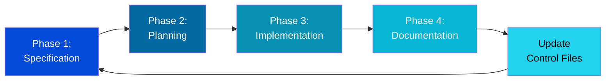
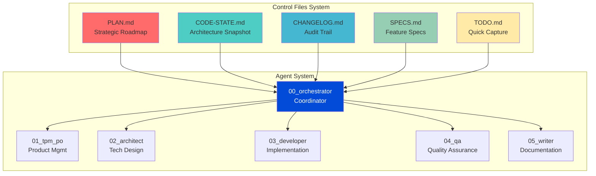

# Development Dashboard

Welcome to the **HP Dev Agent Development Dashboard**. This section provides a comprehensive view of the agent system's development using **Spec-Driven Development (SDD)** control files.

## 📊 Current Status

**Project Phase:** Phase 5 Complete (Site Redesign Planning)  
**System Status:** ✅ Core System Operational  
**Last Updated:** November 10, 2025

### Quick Stats

| Metric | Status |
|--------|--------|
| **Agents Defined** | 6/6 ✅ |
| **Workflows Created** | 5/5 ✅ |
| **MCP Integration** | ✅ Complete |
| **Docusaurus Dashboard** | ✅ Operational |
| **Documentation** | 🔄 In Progress |

## 🎯 What Are Control Files?

Control files are the foundation of **Spec-Driven Development**, a disciplined approach to AI-assisted development. They serve as the "memory" and "governance" system for AI agents, ensuring:

- **Context Retention** - AI agents understand project state across sessions
- **Audit Trail** - Every change is documented with intent and reasoning
- **Workflow Discipline** - Gated approval process prevents runaway actions
- **Knowledge Transfer** - New contributors understand project quickly

## 📁 Control Files Structure

### 1. **[Project Plan](./plan.md)** 📋
**Purpose:** Strategic roadmap and phase tracking  
**Update Frequency:** After each major milestone  
**Key Sections:**
- Current task and active focus
- Project phases (0-5) with completion status
- Features and deliverables
- Timeline and milestones

### 2. **[Code State](./code-state.md)** 🏗️
**Purpose:** Living architecture snapshot  
**Update Frequency:** After every implementation  
**Key Sections:**
- Current architecture (with Mermaid diagrams)
- Technology stack
- File structure
- Implementation status by component

### 3. **[Changelog](./changelog.md)** 📝
**Purpose:** Immutable audit trail  
**Update Frequency:** After every implementation  
**Key Sections:**
- Chronological change history
- Exact prompts that triggered changes
- Files modified
- Rationale and impact

### 4. **[Specifications](./specs.md)** 📐
**Purpose:** Feature specifications and requirements  
**Update Frequency:** When features are planned/modified  
**Key Sections:**
- Feature specifications (SPEC-001, SPEC-002, etc.)
- Goals and success criteria
- User journeys
- Technical requirements

### 5. **[TODO](./todo.md)** ✅
**Purpose:** Quick capture notes and ephemeral tasks  
**Update Frequency:** Daily during active development  
**Key Sections:**
- Today's focus
- Quick wins
- Capture inbox
- Tasks by priority

## 🔄 Spec-Driven Development Workflow

Our development follows a **4-phase gated workflow**:

### Phase Gate Rules

- ⏸️ **STOP after Phase 1** - Specification requires approval
- ⏸️ **STOP after Phase 2** - Plan requires approval
- ⏸️ **STOP after Phase 3** - Implementation requires validation
- ⏸️ **STOP after Phase 4** - Documentation requires review
- 🔄 **Update control files** - Mandatory after approval

## 🎨 Visual Architecture

## 📖 How to Use This Section

### For Developers

1. **Check [Project Plan](./plan.md)** - See what phase we're in and current focus
2. **Review [Code State](./code-state.md)** - Understand current architecture before making changes
3. **Read [Specifications](./specs.md)** - Understand feature requirements before implementation
4. **Update [Changelog](./changelog.md)** - Document your changes with exact prompts
5. **Use [TODO](./todo.md)** - Quick capture during development

### For AI Agents

Agents MUST follow this sequence before ANY operation:

1. **Read PLAN.md** - Understand current task and context
2. **Read CODE-STATE.md** - Understand current architecture
3. **Check SPECS.md** - Verify feature requirements
4. **Execute work** - Follow gated workflow
5. **Update ALL control files** - Mandatory after implementation

### For Stakeholders

- **[Project Plan](./plan.md)** - See project progress and timeline
- **[Specifications](./specs.md)** - Understand planned features
- **[Changelog](./changelog.md)** - Review what changed and why

## 🔐 Governance Rules

### Mandated by `.ai/constitution.md`

All agents MUST:

- ✅ Read control files before starting work
- ✅ Follow the 4-phase gated workflow
- ✅ STOP at each approval gate
- ✅ Update ALL control files after implementation
- ✅ Include exact prompts in CHANGELOG.md
- ✅ Completely rewrite CODE-STATE.md (not just append)

### Update Frequency

| File | Update Trigger | Who Updates |
|------|---------------|-------------|
| PLAN.md | After milestone completion | Developer or Agent |
| CODE-STATE.md | After EVERY implementation | Agent (mandatory rewrite) |
| CHANGELOG.md | After EVERY implementation | Agent (append only) |
| SPECS.md | When features are planned/changed | Product Owner or Developer |
| TODO.md | Daily during active development | Developer |

## 🚀 Getting Started

### First Time Here?

1. Read [Spec-Driven Development Philosophy](https://github.com/githubspec/spec-kit) (external reference)
2. Review our [Constitution](./../../../.ai/constitution.md) (agent rules)
3. Check [Project Plan](./plan.md) to see where we are
4. Explore [Code State](./code-state.md) to understand architecture

### Contributing

When making changes:

1. **Before:** Read PLAN.md and CODE-STATE.md
2. **During:** Follow gated workflow with approval stops
3. **After:** Update ALL control files (use `/update-control-files` command)

---

**Navigation:**
- 📋 [Project Plan](./plan.md)
- 🏗️ [Code State](./code-state.md)
- 📝 [Changelog](./changelog.md)
- 📐 [Specifications](./specs.md)
- ✅ [TODO](./todo.md)
- 🔄 [SDD Workflow Guide](./sdd-workflow.md) **← NEW**

---

*Last updated: 2025-11-10 | HP Dev Agent v1.0*
