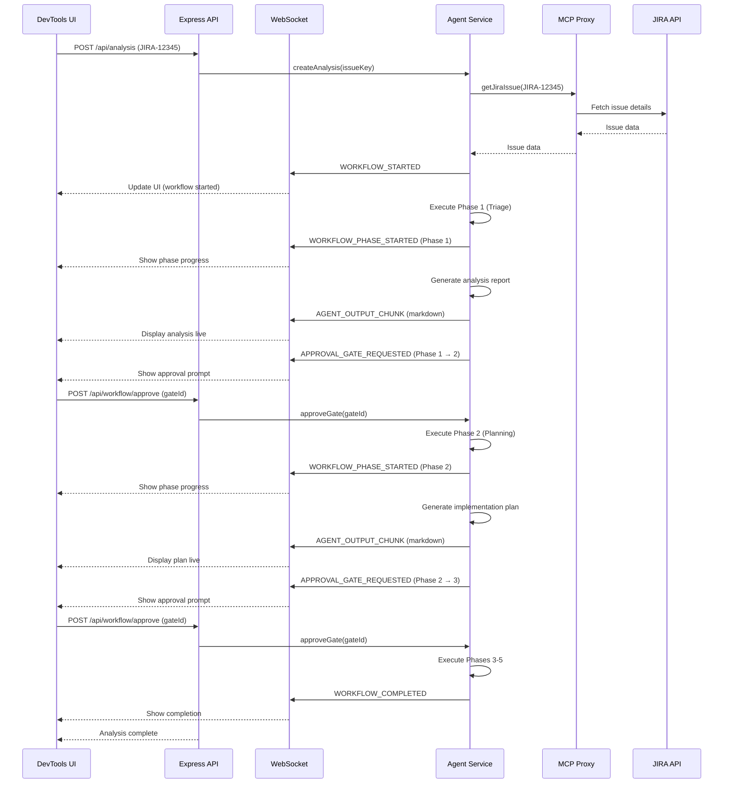
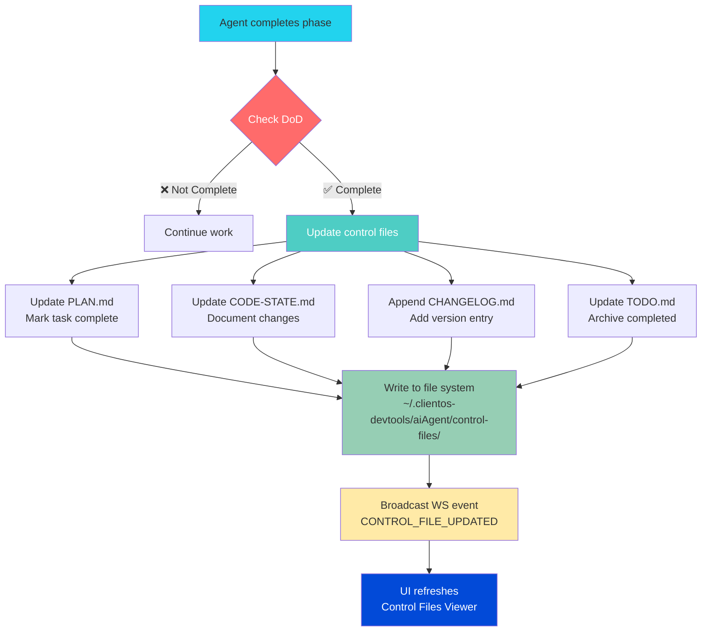
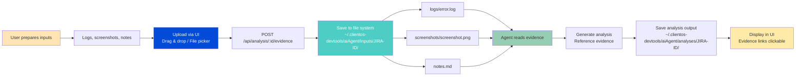

# DevTools Integration Plan: My_Agent + ClientOS DevTools

**Version:** 1.0.0  
**Status:** 📋 Proposal  
**Created:** January 11, 2025  
**Owner:** Integration Team

---

## Executive Summary

This document outlines a comprehensive plan to integrate **My_Agent** (multi-persona AI agent system) into **ClientOS DevTools** (Electron-based developer tool). The integration will create a powerful hybrid application that combines AI-assisted development workflows with real-time application monitoring and debugging capabilities.

**Key Benefits:**

- **For My_Agent:** Leverage DevTools' mature React architecture, file handling, WebSocket infrastructure, and Electron desktop capabilities
- **For DevTools:** Add AI-powered issue analysis, automated documentation generation, intelligent code suggestions, and proactive debugging assistance
- **For Developers:** Unified interface for monitoring, debugging, and AI-assisted development in a single application

**Integration Approach:** Embedded React page within DevTools architecture (not replacing Docusaurus, but using DevTools' React UI framework)

---

## 1. Architecture Analysis

### 1.1 DevTools Current Architecture

```
DevTools (Electron Desktop App)
├── Frontend: React + TypeScript
│   ├── Pages: Routing-based navigation
│   ├── Components: Reusable UI (Modal, Portal, Charts, etc.)
│   ├── Services: Data fetching, WebSocket clients
│   └── Layouts: ContextMainLayout wrapper
├── Backend: Express Server (src/server/)
│   ├── Routes: API endpoints
│   ├── Services: Business logic (profiler, networkProxy, etc.)
│   └── WebSocket: Real-time communication
├── Client Services: Browser injection scripts (src/client/)
│   ├── Services: devToolsConfig, webInstanceConsole, etc.
│   └── Use Cases: profileJWeb, profileNorthboundApis
└── Electron Main: Native app wrapper (src/nativeApp/main.js)
```

**Key DevTools Features:**
- **Multi-instance monitoring:** Track multiple app instances simultaneously
- **Performance profiling:** CPU, memory, network metrics
- **Session recording:** Replay user interactions
- **Network proxy:** Intercept and inspect HTTP requests
- **Console logging:** Aggregate logs from web apps
- **Chat component:** Communication interface (unused for AI currently)

**DevTools Strengths:**
- ✅ Mature React component library with consistent styling
- ✅ Robust WebSocket infrastructure for real-time updates
- ✅ File handling (logs, screenshots, attachments)
- ✅ Desktop integration (Electron APIs: file system, clipboard, notifications)
- ✅ Multi-app instance management

**DevTools Weaknesses:**
- ❌ No AI/LLM integration
- ❌ No automated analysis or intelligent suggestions
- ❌ No JIRA/GitHub integration
- ❌ Limited documentation generation capabilities

---

### 1.2 My_Agent Current Architecture

```
My_Agent (Docusaurus Dashboard + AI Agents)
├── AI Agents: 6 specialized personas (src/.ai/agents/)
│   ├── 00_orchestrator: Workflow coordination
│   ├── 01_tpm_po: Business analysis
│   ├── 02_architect: Technical design
│   ├── 03_developer: TDD implementation
│   ├── 04_qa: Quality validation
│   └── 05_writer: Documentation generation
├── Workflows: 5 gated workflows (src/.ai/workflows/)
│   ├── wf_01_triage: Issue classification
│   ├── wf_02_planning: Task breakdown
│   ├── wf_03_development: TDD execution
│   ├── wf_04_qa: Quality gates
│   └── wf_05_documentation: PR generation
├── Control Files: Persistent context (analysis-workspace/docs/development/)
│   ├── plan.md: Strategic roadmap
│   ├── code-state.md: Architecture snapshot
│   ├── changelog.md: Version history
│   ├── specs.md: Feature specifications
│   └── todo.md: Task tracking
├── Dashboard: Docusaurus-based UI (analysis-workspace/)
│   └── React components rendered by Docusaurus
└── MCP Integration: External service connectors
    ├── atlassian-mcp: JIRA operations
    └── github-mcp: GitHub operations
```

**My_Agent Strengths:**
- ✅ 6 specialized AI agents with clear responsibilities
- ✅ Gated workflows preventing runaway actions
- ✅ Control files system for persistent agent context
- ✅ MCP integration (JIRA, GitHub)
- ✅ Test-Driven Development (TDD) enforcement
- ✅ Comprehensive templates for analysis outputs

**My_Agent Weaknesses:**
- ❌ Docusaurus dashboard (less flexible than custom React app)
- ❌ No desktop integration (browser-based only)
- ❌ No WebSocket infrastructure for real-time agent updates
- ❌ No file handling beyond markdown (logs, screenshots require manual management)
- ❌ No multi-instance support (one analysis at a time)

---

## 2. Integration Strategy

### 2.1 High-Level Integration Architecture

```
Integrated DevTools + My_Agent
├── DevTools Frontend (React)
│   ├── Existing Pages (Performance, Profiler, Network, etc.)
│   └── NEW: AI Agent Page ⭐
│       ├── Agent Dashboard: 6-agent status overview
│       ├── Analysis Workspace: Issue analysis results
│       ├── Control Files Viewer: PLAN, CODE-STATE, CHANGELOG, SPECS, TODO
│       ├── Workflow Visualizer: Interactive workflow diagrams
│       └── Agent Chat: Real-time agent communication
├── DevTools Backend (Express)
│   ├── Existing Routes (profiler, networkProxy, etc.)
│   └── NEW: AI Agent Routes ⭐
│       ├── /api/agents/*: Agent invocation, status, history
│       ├── /api/analysis/*: Analysis CRUD operations
│       ├── /api/control-files/*: Control files management
│       └── /api/mcp/*: MCP proxy (JIRA, GitHub)
├── DevTools WebSocket
│   ├── Existing Channels (performance, console, etc.)
│   └── NEW: AI Agent Channel ⭐
│       ├── agent-progress: Real-time workflow updates
│       ├── agent-output: Streaming analysis results
│       └── approval-request: Gated workflow approval prompts
├── My_Agent Core (Backend Service)
│   ├── Agent Orchestrator: Workflow coordination
│   ├── Agent Executor: Persona invocation
│   ├── Control Files Manager: PLAN/CODE-STATE/etc. operations
│   ├── MCP Client: JIRA/GitHub integration
│   └── Template Renderer: Markdown → JSON for DevTools UI
└── Electron Main (Enhanced)
    ├── Existing: Window management, menus
    └── NEW: AI Context Menu ⭐
        ├── "Analyze Selection": Right-click code → agent analysis
        ├── "Generate Tests": TDD test generation
        └── "Explain Code": Code explanation
```

**Integration Layers:**

1. **UI Layer (React):** New "AI Agent" page in DevTools using existing components (Modal, DataFilter, Portal, etc.)
2. **API Layer (Express):** REST endpoints for agent operations, analysis management, control files
3. **Real-Time Layer (WebSocket):** Streaming agent progress, approval gates, live updates
4. **Agent Layer (Node.js Service):** My_Agent backend running as DevTools service
5. **Desktop Layer (Electron):** Context menus, file system access, native notifications

---

### 2.2 Key Integration Points

#### 2.2.1 UI Integration: AI Agent Page

**Location:** `src/devToolsUI/pages/AIAgentPage/`

**Structure:**
```
AIAgentPage/
├── index.tsx                    # Main page component
├── styles.ts                    # Styled-components
├── AgentDashboard/              # 6-agent status cards
│   ├── index.tsx
│   ├── AgentCard.tsx            # Individual agent status
│   └── styles.ts
├── AnalysisWorkspace/           # Issue analysis display
│   ├── index.tsx
│   ├── AnalysisList.tsx         # List of analyses
│   ├── AnalysisDetail.tsx       # Single analysis view
│   ├── EvidenceViewer.tsx       # Logs, screenshots, attachments
│   └── styles.ts
├── ControlFilesViewer/          # PLAN, CODE-STATE, etc.
│   ├── index.tsx
│   ├── PlanViewer.tsx           # Phase tracking
│   ├── CodeStateViewer.tsx      # Architecture snapshot
│   ├── ChangelogViewer.tsx      # Version history
│   ├── SpecsViewer.tsx          # Feature specs
│   └── styles.ts
├── WorkflowVisualizer/          # Interactive workflow diagrams
│   ├── index.tsx
│   ├── WorkflowDiagram.tsx      # SVG/Mermaid diagram
│   ├── PhaseDetail.tsx          # Phase info panel
│   └── styles.ts
└── AgentChat/                   # Real-time agent communication
    ├── index.tsx
    ├── ChatMessage.tsx          # Single message
    ├── ApprovalGate.tsx         # Approval prompt UI
    └── styles.ts
```

**Reusable DevTools Components:**
- `<Modal>` - For approval gates, agent settings
- `<Portal>` - For floating approval prompts
- `<DataFilter>` - For filtering analyses by status/agent
- `<DataPagination>` - For analysis list pagination
- `<CodeEditorComponent>` - For displaying code snippets
- `<ConfirmationDialog>` - For approval gate confirmations
- `<IframeModal>` - For displaying analysis reports

**New Components to Create:**
- `<AgentStatusCard>` - Agent persona with status (idle/working/waiting approval)
- `<WorkflowProgress>` - Phase progress bar with gates
- `<ApprovalGatePrompt>` - Floating approval request with approve/reject buttons
- `<ControlFileEditor>` - Markdown editor for PLAN.md, TODO.md, etc.
- `<JIRAIssuePicker>` - JIRA issue selector with search

---

#### 2.2.2 Backend Integration: AI Agent Service

**Location:** `src/server/services/aiAgent/`

**Structure:**
```
aiAgent/
├── index.ts                     # Service exports
├── AgentOrchestrator.ts         # Workflow coordination
├── AgentExecutor.ts             # Agent invocation logic
├── ControlFilesManager.ts       # CRUD for control files
├── AnalysisManager.ts           # Analysis CRUD operations
├── MCPClient.ts                 # JIRA/GitHub proxy
├── TemplateRenderer.ts          # Markdown → JSON transformation
├── WorkflowEngine.ts            # Gated workflow execution
└── types.ts                     # TypeScript interfaces
```

**API Routes:** `src/server/routes/aiAgent/`

```typescript
// GET /api/agents - List all agents with status
router.get('/agents', AgentController.listAgents);

// POST /api/agents/:agentId/invoke - Invoke specific agent
router.post('/agents/:agentId/invoke', AgentController.invokeAgent);

// GET /api/agents/:agentId/status - Get agent status
router.get('/agents/:agentId/status', AgentController.getAgentStatus);

// POST /api/analysis - Create new analysis (JIRA issue)
router.post('/analysis', AnalysisController.createAnalysis);

// GET /api/analysis - List all analyses
router.get('/analysis', AnalysisController.listAnalyses);

// GET /api/analysis/:analysisId - Get single analysis
router.get('/analysis/:analysisId', AnalysisController.getAnalysis);

// PUT /api/analysis/:analysisId - Update analysis
router.put('/analysis/:analysisId', AnalysisController.updateAnalysis);

// DELETE /api/analysis/:analysisId - Delete analysis
router.delete('/analysis/:analysisId', AnalysisController.deleteAnalysis);

// GET /api/control-files - List control files (PLAN, CODE-STATE, etc.)
router.get('/control-files', ControlFilesController.listFiles);

// GET /api/control-files/:filename - Get control file content
router.get('/control-files/:filename', ControlFilesController.getFile);

// PUT /api/control-files/:filename - Update control file
router.put('/control-files/:filename', ControlFilesController.updateFile);

// POST /api/mcp/jira/issues/:issueKey - Get JIRA issue
router.post('/api/mcp/jira/issues/:issueKey', MCPController.getJiraIssue);

// POST /api/mcp/github/pulls - Create GitHub PR
router.post('/api/mcp/github/pulls', MCPController.createGithubPR);

// POST /api/workflow/approve - Approve workflow gate
router.post('/api/workflow/approve', WorkflowController.approveGate);

// POST /api/workflow/reject - Reject workflow gate
router.post('/api/workflow/reject', WorkflowController.rejectGate);
```

---

#### 2.2.3 WebSocket Integration: Real-Time Agent Updates

**Channel:** `aiAgent`

**Message Types:**

```typescript
// src/shared/types/websocket/aiAgent.ts

export enum AIAgentMessageType {
  // Agent status updates
  AGENT_STATUS_CHANGED = 'AGENT_STATUS_CHANGED',
  
  // Workflow progress
  WORKFLOW_STARTED = 'WORKFLOW_STARTED',
  WORKFLOW_PHASE_STARTED = 'WORKFLOW_PHASE_STARTED',
  WORKFLOW_PHASE_COMPLETED = 'WORKFLOW_PHASE_COMPLETED',
  WORKFLOW_COMPLETED = 'WORKFLOW_COMPLETED',
  WORKFLOW_FAILED = 'WORKFLOW_FAILED',
  
  // Approval gates
  APPROVAL_GATE_REQUESTED = 'APPROVAL_GATE_REQUESTED',
  APPROVAL_GATE_APPROVED = 'APPROVAL_GATE_APPROVED',
  APPROVAL_GATE_REJECTED = 'APPROVAL_GATE_REJECTED',
  
  // Agent output
  AGENT_OUTPUT_CHUNK = 'AGENT_OUTPUT_CHUNK',
  AGENT_OUTPUT_COMPLETED = 'AGENT_OUTPUT_COMPLETED',
  
  // Control files updates
  CONTROL_FILE_UPDATED = 'CONTROL_FILE_UPDATED',
  
  // Errors
  AGENT_ERROR = 'AGENT_ERROR',
}

export interface AgentStatusChangedMessage {
  type: AIAgentMessageType.AGENT_STATUS_CHANGED;
  payload: {
    agentId: string;
    status: 'idle' | 'working' | 'waiting_approval' | 'error';
    timestamp: string;
  };
}

export interface ApprovalGateRequestedMessage {
  type: AIAgentMessageType.APPROVAL_GATE_REQUESTED;
  payload: {
    gateId: string;
    workflow: string;
    phase: string;
    agentId: string;
    prompt: string;
    options: Array<{ value: string; label: string }>;
    timestamp: string;
  };
}

export interface AgentOutputChunkMessage {
  type: AIAgentMessageType.AGENT_OUTPUT_CHUNK;
  payload: {
    agentId: string;
    analysisId: string;
    chunk: string; // Markdown chunk
    timestamp: string;
  };
}
```

**WebSocket Server Implementation:**

```typescript
// src/server/services/aiAgent/WebSocketHandler.ts

export class AIAgentWebSocketHandler {
  private clients: Set<WebSocket> = new Set();
  
  broadcast(message: AIAgentMessage): void {
    const payload = JSON.stringify(message);
    this.clients.forEach(client => {
      if (client.readyState === WebSocket.OPEN) {
        client.send(payload);
      }
    });
  }
  
  sendApprovalRequest(gateId: string, workflow: string, phase: string): void {
    this.broadcast({
      type: AIAgentMessageType.APPROVAL_GATE_REQUESTED,
      payload: {
        gateId,
        workflow,
        phase,
        agentId: 'orchestrator',
        prompt: `Approve ${workflow} - ${phase}?`,
        options: [
          { value: 'approve', label: 'Approve' },
          { value: 'reject', label: 'Reject' }
        ],
        timestamp: new Date().toISOString()
      }
    });
  }
}
```

---

#### 2.2.4 Control Files Integration

**Strategy:** Store control files in DevTools' data directory, not Docusaurus

**File System Structure:**

```
~/.clientos-devtools/
├── config/
├── logs/
└── aiAgent/                     # NEW: AI Agent data
    ├── analyses/                # Analysis outputs
    │   ├── HPXAPPS-12345/
    │   │   ├── analysis-report.json
    │   │   ├── implementation-plan.json
    │   │   ├── qa-validation.json
    │   │   └── evidence/
    │   │       ├── error.log
    │   │       └── screenshot.png
    │   └── HPXAPPS-67890/
    ├── control-files/           # Control files
    │   ├── plan.md
    │   ├── code-state.md
    │   ├── changelog.md
    │   ├── specs.md
    │   └── todo.md
    └── inputs/                  # Ephemeral inputs (not tracked)
        ├── HPXAPPS-12345/
        │   ├── logs/
        │   ├── screenshots/
        │   └── notes.md
        └── HPXAPPS-67890/
```

**API Endpoints for Control Files:**

```typescript
// GET /api/control-files - List all control files
{
  files: [
    { name: 'plan.md', size: 1800, lastModified: '2025-01-11T10:00:00Z' },
    { name: 'code-state.md', size: 888, lastModified: '2025-01-11T09:30:00Z' },
    // ...
  ]
}

// GET /api/control-files/plan - Get PLAN.md content
{
  filename: 'plan.md',
  content: '# Project Plan\n\n...',
  lastModified: '2025-01-11T10:00:00Z'
}

// PUT /api/control-files/plan - Update PLAN.md
{
  content: '# Project Plan\n\n... (updated content)',
  message: 'Updated Phase 7 status'
}
```

**UI Component for Control Files:**

```typescript
// src/devToolsUI/pages/AIAgentPage/ControlFilesViewer/index.tsx

export const ControlFilesViewer: React.FC = () => {
  const [selectedFile, setSelectedFile] = useState<string>('plan');
  const [content, setContent] = useState<string>('');
  const [isEditing, setIsEditing] = useState<boolean>(false);
  
  const files = [
    { id: 'plan', label: 'PLAN.md', icon: '📋' },
    { id: 'code-state', label: 'CODE-STATE.md', icon: '🏗️' },
    { id: 'changelog', label: 'CHANGELOG.md', icon: '📜' },
    { id: 'specs', label: 'SPECS.md', icon: '📝' },
    { id: 'todo', label: 'TODO.md', icon: '✔️' }
  ];
  
  useEffect(() => {
    fetchControlFile(selectedFile);
  }, [selectedFile]);
  
  const fetchControlFile = async (fileId: string) => {
    const response = await fetch(`/api/control-files/${fileId}`);
    const data = await response.json();
    setContent(data.content);
  };
  
  const saveControlFile = async () => {
    await fetch(`/api/control-files/${selectedFile}`, {
      method: 'PUT',
      headers: { 'Content-Type': 'application/json' },
      body: JSON.stringify({ content })
    });
    setIsEditing(false);
  };
  
  return (
    <Container>
      <Sidebar>
        {files.map(file => (
          <FileButton
            key={file.id}
            active={selectedFile === file.id}
            onClick={() => setSelectedFile(file.id)}
          >
            <FileIcon>{file.icon}</FileIcon>
            <FileName>{file.label}</FileName>
          </FileButton>
        ))}
      </Sidebar>
      <ContentArea>
        <Toolbar>
          <h2>{files.find(f => f.id === selectedFile)?.label}</h2>
          <Button onClick={() => setIsEditing(!isEditing)}>
            {isEditing ? 'Cancel' : 'Edit'}
          </Button>
          {isEditing && <Button onClick={saveControlFile}>Save</Button>}
        </Toolbar>
        {isEditing ? (
          <CodeEditorComponent
            value={content}
            onChange={setContent}
            language="markdown"
          />
        ) : (
          <MarkdownViewer content={content} />
        )}
      </ContentArea>
    </Container>
  );
};
```

---

#### 2.2.5 MCP Integration via Proxy

**Problem:** MCP servers (Docker containers) cannot be accessed directly from Electron renderer process

**Solution:** Proxy MCP requests through DevTools Express server

**Architecture:**

```
DevTools Frontend (Electron Renderer)
    ↓ HTTP POST /api/mcp/jira/issues/HPXAPPS-12345
DevTools Backend (Express Server)
    ↓ Docker exec into atlassian-mcp container
MCP Server (Docker Container)
    ↓ JIRA REST API
JIRA Cloud
```

**Implementation:**

```typescript
// src/server/services/aiAgent/MCPClient.ts

import { exec } from 'child_process';
import { promisify } from 'util';

const execAsync = promisify(exec);

export class MCPClient {
  private jiraContainer = 'atlassian-mcp';
  private githubContainer = 'github-mcp';
  
  async getJiraIssue(issueKey: string): Promise<JiraIssue> {
    const command = `docker exec ${this.jiraContainer} jira_get_issue ${issueKey}`;
    const { stdout } = await execAsync(command);
    return JSON.parse(stdout);
  }
  
  async createGithubPR(data: CreatePRRequest): Promise<PullRequest> {
    const command = `docker exec ${this.githubContainer} pull_request_create \\
      --repo="${data.repo}" \\
      --title="${data.title}" \\
      --body="${data.body}" \\
      --head="${data.head}" \\
      --base="${data.base}"`;
    const { stdout } = await execAsync(command);
    return JSON.parse(stdout);
  }
}
```

**API Routes:**

```typescript
// src/server/routes/aiAgent/mcp.ts

router.post('/mcp/jira/issues/:issueKey', async (req, res) => {
  try {
    const { issueKey } = req.params;
    const mcpClient = new MCPClient();
    const issue = await mcpClient.getJiraIssue(issueKey);
    res.json(issue);
  } catch (error) {
    res.status(500).json({ error: error.message });
  }
});

router.post('/mcp/github/pulls', async (req, res) => {
  try {
    const mcpClient = new MCPClient();
    const pr = await mcpClient.createGithubPR(req.body);
    res.json(pr);
  } catch (error) {
    res.status(500).json({ error: error.message });
  }
});
```

---

## 3. Data Flow Diagrams

### 3.1 Agent Workflow Execution



---

### 3.2 Control Files Update Flow



---

### 3.3 Evidence Handling (Logs, Screenshots)



---

## 4. Component Design

### 4.1 AI Agent Page Layout

```
┌───────────────────────────────────────────────────────────────────┐
│  DevTools - AI Agent                                    [_ □ ×]    │
├───────────────────────────────────────────────────────────────────┤
│  [Performance] [Profiler] [Network] [Console] [AI Agent] 🤖      │
├───────────────────────────────────────────────────────────────────┤
│                                                                     │
│  ┌─────────────────────────────────────────────────────────────┐ │
│  │ Agent Dashboard                                             │ │
│  ├─────────────────────────────────────────────────────────────┤ │
│  │ ┌──────┐ ┌──────┐ ┌──────┐ ┌──────┐ ┌──────┐ ┌──────┐    │ │
│  │ │  🎯  │ │  📋  │ │  🏗️  │ │  ⚙️  │ │  ✅  │ │  📝  │    │ │
│  │ │Orches│ │TPM/PO│ │Archit│ │ Dev  │ │  QA  │ │Writer│    │ │
│  │ │trator│ │      │ │ ect  │ │      │ │      │ │      │    │ │
│  │ │ Idle │ │Working│ │ Idle │ │ Idle │ │ Idle │ │ Idle │    │ │
│  │ └──────┘ └──────┘ └──────┘ └──────┘ └──────┘ └──────┘    │ │
│  └─────────────────────────────────────────────────────────────┘ │
│                                                                     │
│  ┌─────────────────────────────────────────────────────────────┐ │
│  │ Analysis Workspace                    [+ New Analysis]      │ │
│  ├─────────────────────────────────────────────────────────────┤ │
│  │ ┌─ Filters ────────────────────────────────────────────────┐│ │
│  │ │ Status: [All ▼]  Agent: [All ▼]  Repository: [All ▼]   ││ │
│  │ └───────────────────────────────────────────────────────────┘│ │
│  │                                                               │ │
│  │ ┌───────────────────────────────────────────────────────────┐│ │
│  │ │ HPXAPPS-12345: Fix NullPointerException              ✅  ││ │
│  │ │ Created: 2025-01-11 10:00  |  Agent: Developer           ││ │
│  │ │ Status: Completed          |  Repository: ui-toolkit     ││ │
│  │ │ [View Analysis] [View Evidence] [Re-run]                 ││ │
│  │ └───────────────────────────────────────────────────────────┘│ │
│  │                                                               │ │
│  │ ┌───────────────────────────────────────────────────────────┐│ │
│  │ │ HPXAPPS-67890: Implement new feature                 🔄  ││ │
│  │ │ Created: 2025-01-11 12:00  |  Agent: TPM/PO              ││ │
│  │ │ Status: In Progress (Phase 2)                             ││ │
│  │ │ [View Analysis] [View Evidence] [Cancel]                 ││ │
│  │ └───────────────────────────────────────────────────────────┘│ │
│  │                                                               │ │
│  │ [< Prev] [Page 1 of 3] [Next >]                            │ │
│  └─────────────────────────────────────────────────────────────┘ │
│                                                                     │
│  ┌─────────────────────────────────────────────────────────────┐ │
│  │ Control Files                       [PLAN] [CODE-STATE]     │ │
│  ├─────────────────────────────────────────────────────────────┤ │
│  │ ┌─ PLAN.md ──────────────────────────────────────────────┐ │ │
│  │ │ Phase 7: HP Brand Redesign               [Edit]        │ │ │
│  │ │ ━━━━━━━━━━━━━━━━━━━━━━━━━━━━━━━━━━━━━━━━━━━━━━━━━━━━━ │ │ │
│  │ │ Status: 🚧 In Progress (Task 7.2 complete)             │ │ │
│  │ │ Tasks: 5/5 (100%)                                       │ │ │
│  │ │                                                          │ │ │
│  │ │ - ✅ Task 7.1: Apply HP Blue color system              │ │ │
│  │ │ - ✅ Task 7.2: Integrate HP logo                       │ │ │
│  │ │ - ✅ Task 7.3: Add custom hero section                 │ │ │
│  │ │ - ✅ Task 7.4: Create agent showcase cards             │ │ │
│  │ │ - ✅ Task 7.5: Build workflow visualizer               │ │ │
│  │ │                                                          │ │ │
│  │ │ [Show Full Plan] [Mark Phase Complete]                 │ │ │
│  │ └──────────────────────────────────────────────────────────┘ │ │
│  └─────────────────────────────────────────────────────────────┘ │
│                                                                     │
└───────────────────────────────────────────────────────────────────┘
```

---

### 4.2 Approval Gate UI

**Floating Modal (Portal-based):**

```
┌───────────────────────────────────────────────────────────────┐
│  ⏸️  Approval Gate Required                           [×]     │
├───────────────────────────────────────────────────────────────┤
│                                                                 │
│  Workflow: Issue Triage (wf_01)                               │
│  Phase: Business Analysis → Technical Planning                │
│  Agent: TPM/PO → Architect                                    │
│                                                                 │
│  ┌─────────────────────────────────────────────────────────┐ │
│  │ Analysis Report Summary                                 │ │
│  ├─────────────────────────────────────────────────────────┤ │
│  │ Issue: HPXAPPS-12345                                    │ │
│  │ Classification: Bug (P1)                                │ │
│  │ Root Cause: NullPointerException in UserService.java   │ │
│  │ Estimated Effort: M (2-3 hours)                         │ │
│  │                                                          │ │
│  │ [View Full Analysis Report]                             │ │
│  └─────────────────────────────────────────────────────────┘ │
│                                                                 │
│  Approve this phase and proceed to technical planning?        │
│                                                                 │
│  ┌─────────────────┐  ┌─────────────────┐                    │
│  │   ✅ Approve    │  │   ❌ Reject      │                    │
│  └─────────────────┘  └─────────────────┘                    │
│                                                                 │
│  [Show Approval History]                                      │
│                                                                 │
└───────────────────────────────────────────────────────────────┘
```

**Implementation:**

```typescript
// src/devToolsUI/pages/AIAgentPage/AgentChat/ApprovalGate.tsx

export const ApprovalGate: React.FC<ApprovalGateProps> = ({
  gateId,
  workflow,
  phase,
  prompt,
  summary,
  onApprove,
  onReject
}) => {
  const handleApprove = async () => {
    await fetch('/api/workflow/approve', {
      method: 'POST',
      headers: { 'Content-Type': 'application/json' },
      body: JSON.stringify({ gateId })
    });
    onApprove();
  };
  
  const handleReject = async () => {
    await fetch('/api/workflow/reject', {
      method: 'POST',
      headers: { 'Content-Type': 'application/json' },
      body: JSON.stringify({ gateId })
    });
    onReject();
  };
  
  return (
    <Portal>
      <Overlay>
        <Modal>
          <Header>
            <Icon>⏸️</Icon>
            <Title>Approval Gate Required</Title>
            <CloseButton onClick={onReject}>×</CloseButton>
          </Header>
          <Content>
            <WorkflowInfo>
              <InfoRow>
                <Label>Workflow:</Label>
                <Value>{workflow}</Value>
              </InfoRow>
              <InfoRow>
                <Label>Phase:</Label>
                <Value>{phase}</Value>
              </InfoRow>
            </WorkflowInfo>
            <SummaryCard>
              <SummaryTitle>Analysis Report Summary</SummaryTitle>
              <SummaryContent>{summary}</SummaryContent>
              <Button variant="link">View Full Analysis Report</Button>
            </SummaryCard>
            <Prompt>{prompt}</Prompt>
            <Actions>
              <Button variant="success" onClick={handleApprove}>
                ✅ Approve
              </Button>
              <Button variant="danger" onClick={handleReject}>
                ❌ Reject
              </Button>
            </Actions>
            <Button variant="link">Show Approval History</Button>
          </Content>
        </Modal>
      </Overlay>
    </Portal>
  );
};
```

---

### 4.3 Control Files Viewer

**Tabs-based Layout:**

```
┌───────────────────────────────────────────────────────────────┐
│  Control Files                                                 │
├───────────────────────────────────────────────────────────────┤
│  [📋 PLAN] [🏗️ CODE-STATE] [📜 CHANGELOG] [📝 SPECS] [✔️ TODO] │
├───────────────────────────────────────────────────────────────┤
│                                                                 │
│  ┌─ PLAN.md ────────────────────────────────────────────────┐ │
│  │                                               [Edit] [Save]│ │
│  ├─────────────────────────────────────────────────────────┤ │
│  │ # Project Plan                                          │ │
│  │                                                          │ │
│  │ **Current Phase:** Phase 7 Starting 🔧 - HP Branding   │ │
│  │ **Next Phase:** Phase 8 - Tool Integration             │ │
│  │ **Status:** 🔍 Design Complete - Ready for Tasks       │ │
│  │                                                          │ │
│  │ ## Phase 7: HP Brand Redesign 🎨                       │ │
│  │                                                          │ │
│  │ **Status:** ✅ Complete                                 │ │
│  │ **Completed:** 5/5 tasks (2025-01-11)                  │ │
│  │                                                          │ │
│  │ - [x] Task 7.1: Apply HP Blue color system            │ │
│  │ - [x] Task 7.2: Integrate HP logo                     │ │
│  │ - [x] Task 7.3: Add custom hero section               │ │
│  │ - [x] Task 7.4: Create agent showcase cards           │ │
│  │ - [x] Task 7.5: Build workflow visualizer             │ │
│  │                                                          │ │
│  │ ## Phase 8: Tool Integration 🔧                        │ │
│  │                                                          │ │
│  │ **Status:** ⏳ Planning                                 │ │
│  │ **Owner:** Integration Team                            │ │
│  │                                                          │ │
│  │ ...                                                     │ │
│  │                                                          │ │
│  └─────────────────────────────────────────────────────────┘ │
│                                                                 │
│  [< Prev File] [Next File >]                                  │
│                                                                 │
└───────────────────────────────────────────────────────────────┘
```

---

## 5. Technology Stack Alignment

### 5.1 DevTools Tech Stack

| Layer | Technology | Version | Purpose |
|-------|-----------|---------|---------|
| **Desktop** | Electron | 32.x | Native app wrapper |
| **Frontend** | React | 18.3.1 | UI framework |
| **Frontend** | TypeScript | 5.x | Type safety |
| **Frontend** | styled-components | 6.x | CSS-in-JS styling |
| **Backend** | Express | 4.x | HTTP server |
| **Backend** | WebSocket | 8.x | Real-time communication |
| **Build** | Webpack | 5.x | Module bundler |
| **Build** | Babel | 7.x | Transpiler |

### 5.2 My_Agent Tech Stack (Current)

| Layer | Technology | Version | Purpose |
|-------|-----------|---------|---------|
| **Frontend** | Docusaurus | 3.7.0 | Dashboard framework |
| **Frontend** | React | 18.3.1 | UI components |
| **Frontend** | TypeScript | 5.x | Type safety |
| **Agents** | Markdown | - | Agent definitions |
| **Control Files** | Markdown | - | Persistent context |
| **Runtime** | Node.js | 20+ | JavaScript runtime |
| **Package Manager** | Yarn | 1.22+ | Dependency management |

### 5.3 Integrated Stack (Proposed)

| Layer | Technology | Version | Purpose | Source |
|-------|-----------|---------|---------|--------|
| **Desktop** | Electron | 32.x | Native app | DevTools |
| **Frontend** | React | 18.3.1 | UI framework | Both |
| **Frontend** | TypeScript | 5.x | Type safety | Both |
| **Frontend** | styled-components | 6.x | CSS-in-JS | DevTools |
| **Backend** | Express | 4.x | HTTP server | DevTools |
| **Backend** | WebSocket | 8.x | Real-time comms | DevTools |
| **Backend** | AI Agent Service | Custom | Agent orchestration | My_Agent (ported) |
| **Backend** | MCP Proxy | Custom | JIRA/GitHub proxy | New |
| **Data** | File System API | - | Control files storage | New |
| **Build** | Webpack | 5.x | Module bundler | DevTools |
| **Build** | Babel | 7.x | Transpiler | DevTools |

**Key Changes:**
- ❌ Remove Docusaurus (replace with DevTools React pages)
- ✅ Port My_Agent backend to DevTools service
- ✅ Adapt control files to DevTools file system structure
- ✅ Keep Yarn for My_Agent-specific scripts
- ✅ Leverage DevTools WebSocket for real-time agent updates

---

## 6. File Structure (Integrated)

### 6.1 DevTools File Structure (Enhanced)

```
devtools/
├── src/
│   ├── devToolsUI/
│   │   ├── pages/
│   │   │   ├── AIAgentPage/              # 🆕 NEW: AI Agent page
│   │   │   │   ├── index.tsx
│   │   │   │   ├── styles.ts
│   │   │   │   ├── AgentDashboard/
│   │   │   │   │   ├── index.tsx
│   │   │   │   │   ├── AgentCard.tsx
│   │   │   │   │   └── styles.ts
│   │   │   │   ├── AnalysisWorkspace/
│   │   │   │   │   ├── index.tsx
│   │   │   │   │   ├── AnalysisList.tsx
│   │   │   │   │   ├── AnalysisDetail.tsx
│   │   │   │   │   ├── EvidenceViewer.tsx
│   │   │   │   │   └── styles.ts
│   │   │   │   ├── ControlFilesViewer/
│   │   │   │   │   ├── index.tsx
│   │   │   │   │   ├── PlanViewer.tsx
│   │   │   │   │   ├── CodeStateViewer.tsx
│   │   │   │   │   ├── ChangelogViewer.tsx
│   │   │   │   │   ├── SpecsViewer.tsx
│   │   │   │   │   └── styles.ts
│   │   │   │   ├── WorkflowVisualizer/
│   │   │   │   │   ├── index.tsx
│   │   │   │   │   ├── WorkflowDiagram.tsx
│   │   │   │   │   ├── PhaseDetail.tsx
│   │   │   │   │   └── styles.ts
│   │   │   │   └── AgentChat/
│   │   │   │       ├── index.tsx
│   │   │   │       ├── ChatMessage.tsx
│   │   │   │       ├── ApprovalGate.tsx
│   │   │   │       └── styles.ts
│   │   │   ├── PerformancePage/          # Existing
│   │   │   ├── ProfilerPage/             # Existing
│   │   │   └── ...
│   │   ├── components/
│   │   │   ├── AgentStatusCard/          # 🆕 NEW
│   │   │   ├── WorkflowProgress/         # 🆕 NEW
│   │   │   ├── ApprovalGatePrompt/       # 🆕 NEW
│   │   │   ├── ControlFileEditor/        # 🆕 NEW
│   │   │   ├── JIRAIssuePicker/          # 🆕 NEW
│   │   │   └── ...                       # Existing components
│   │   └── services/
│   │       ├── aiAgent/                  # 🆕 NEW: AI Agent API client
│   │       │   ├── index.ts
│   │       │   ├── agentsService.ts
│   │       │   ├── analysisService.ts
│   │       │   ├── controlFilesService.ts
│   │       │   ├── workflowService.ts
│   │       │   └── types.ts
│   │       └── ...                       # Existing services
│   ├── server/
│   │   ├── routes/
│   │   │   ├── aiAgent/                  # 🆕 NEW: AI Agent routes
│   │   │   │   ├── index.ts
│   │   │   │   ├── agents.ts
│   │   │   │   ├── analysis.ts
│   │   │   │   ├── controlFiles.ts
│   │   │   │   ├── mcp.ts
│   │   │   │   └── workflow.ts
│   │   │   └── ...                       # Existing routes
│   │   └── services/
│   │       ├── aiAgent/                  # 🆕 NEW: AI Agent backend
│   │       │   ├── index.ts
│   │       │   ├── AgentOrchestrator.ts
│   │       │   ├── AgentExecutor.ts
│   │       │   ├── ControlFilesManager.ts
│   │       │   ├── AnalysisManager.ts
│   │       │   ├── MCPClient.ts
│   │       │   ├── TemplateRenderer.ts
│   │       │   ├── WorkflowEngine.ts
│   │       │   ├── WebSocketHandler.ts
│   │       │   └── types.ts
│   │       └── ...                       # Existing services
│   ├── shared/
│   │   └── types/
│   │       └── websocket/
│   │           ├── aiAgent.ts            # 🆕 NEW: AI Agent WS types
│   │           └── ...                   # Existing WS types
│   └── nativeApp/
│       └── main.js                       # Enhanced with AI context menus
├── .ai/                                  # 🆕 NEW: My_Agent definitions
│   ├── constitution.md
│   ├── agents/
│   │   ├── 00_orchestrator.agent.md
│   │   ├── 01_tpm_po.agent.md
│   │   ├── 02_architect.agent.md
│   │   ├── 03_developer.agent.md
│   │   ├── 04_qa.agent.md
│   │   └── 05_writer.agent.md
│   ├── workflows/
│   │   ├── wf_01_triage.workflow.md
│   │   ├── wf_02_planning.workflow.md
│   │   ├── wf_03_development.workflow.md
│   │   ├── wf_04_qa.workflow.md
│   │   └── wf_05_documentation.workflow.md
│   ├── templates/
│   │   ├── analysis_report.md
│   │   ├── implementation_plan.md
│   │   ├── qa_validation_report.md
│   │   ├── pull_request.md
│   │   └── commit_message.md
│   └── setup/
│       └── mcp-setup-guide.md
└── ...
```

### 6.2 User Data Directory (Enhanced)

```
~/.clientos-devtools/
├── config/
├── logs/
└── aiAgent/                              # 🆕 NEW: AI Agent data
    ├── analyses/
    │   ├── HPXAPPS-12345/
    │   │   ├── analysis-report.json
    │   │   ├── implementation-plan.json
    │   │   ├── qa-validation.json
    │   │   └── evidence/
    │   │       ├── error.log
    │   │       └── screenshot.png
    │   └── ...
    ├── control-files/
    │   ├── plan.md
    │   ├── code-state.md
    │   ├── changelog.md
    │   ├── specs.md
    │   └── todo.md
    └── inputs/
        ├── HPXAPPS-12345/
        │   ├── logs/
        │   ├── screenshots/
        │   └── notes.md
        └── ...
```

---

## 7. Migration Strategy

### 7.1 My_Agent Components → DevTools Mapping

| My_Agent Component | DevTools Target | Effort | Notes |
|-------------------|-----------------|--------|-------|
| **Docusaurus Dashboard** | ❌ Remove | - | Replace with DevTools React pages |
| **Dashboard Homepage** | `AIAgentPage/index.tsx` | M | Port agent overview, workflow phases |
| **Issue Analysis Display** | `AnalysisWorkspace/` | L | Port analysis list, detail views |
| **Control Files Display** | `ControlFilesViewer/` | M | Port PLAN, CODE-STATE, etc. viewers |
| **Agent Definitions** | `.ai/agents/` | S | Copy as-is (markdown files) |
| **Workflow Definitions** | `.ai/workflows/` | S | Copy as-is (markdown files) |
| **Templates** | `.ai/templates/` | S | Copy as-is (markdown files) |
| **Constitution** | `.ai/constitution.md` | S | Copy as-is |
| **MCP Setup Guide** | `.ai/setup/mcp-setup-guide.md` | S | Copy as-is |
| **Agent Backend Logic** | `server/services/aiAgent/` | XL | Port from scratch (see below) |
| **Control Files Storage** | `~/.clientos-devtools/aiAgent/` | M | Migrate from Docusaurus `docs/` |
| **Input/Output Handling** | `server/services/aiAgent/AnalysisManager.ts` | L | File system operations |
| **WebSocket Integration** | `server/services/aiAgent/WebSocketHandler.ts` | L | Real-time updates |
| **MCP Proxy** | `server/services/aiAgent/MCPClient.ts` | L | Docker exec integration |

**Total Effort:** ~40-50 hours

---

### 7.2 Agent Backend Porting

**Challenge:** My_Agent's backend logic is implicit (agents are markdown files invoked by AI tools). DevTools requires explicit Node.js services.

**Solution:** Create Node.js services that execute agent workflows programmatically.

**Implementation:**

```typescript
// src/server/services/aiAgent/AgentExecutor.ts

import fs from 'fs/promises';
import path from 'path';

export class AgentExecutor {
  private agentsDir = path.join(__dirname, '../../../.ai/agents');
  
  async executeAgent(agentId: string, context: AgentContext): Promise<AgentResult> {
    // 1. Load agent definition
    const agentFile = path.join(this.agentsDir, `${agentId}.agent.md`);
    const agentDef = await fs.readFile(agentFile, 'utf-8');
    
    // 2. Parse agent frontmatter
    const { description, mode, tools } = this.parseAgentFrontmatter(agentDef);
    
    // 3. Prepare agent prompt
    const prompt = this.buildAgentPrompt(agentDef, context);
    
    // 4. Call LLM API (e.g., OpenAI, Anthropic)
    const llmResponse = await this.callLLM(prompt, { model: 'gpt-4', temperature: 0.7 });
    
    // 5. Parse agent output
    const result = this.parseAgentOutput(llmResponse);
    
    // 6. Return structured result
    return result;
  }
  
  private parseAgentFrontmatter(markdown: string): AgentFrontmatter {
    // Extract YAML frontmatter between --- delimiters
    const match = markdown.match(/^---\n([\s\S]*?)\n---/);
    if (!match) throw new Error('Invalid agent definition');
    return yaml.parse(match[1]);
  }
  
  private buildAgentPrompt(agentDef: string, context: AgentContext): string {
    // Replace variables in agent definition with context
    let prompt = agentDef.replace(/\$\{JIRA_ID\}/g, context.issueKey);
    prompt = prompt.replace(/\$\{JIRA_TITLE\}/g, context.issueTitle);
    // ... more replacements
    return prompt;
  }
  
  private async callLLM(prompt: string, options: LLMOptions): Promise<string> {
    // Call OpenAI/Anthropic API
    const response = await fetch('https://api.openai.com/v1/chat/completions', {
      method: 'POST',
      headers: {
        'Authorization': `Bearer ${process.env.OPENAI_API_KEY}`,
        'Content-Type': 'application/json'
      },
      body: JSON.stringify({
        model: options.model,
        messages: [{ role: 'user', content: prompt }],
        temperature: options.temperature
      })
    });
    const data = await response.json();
    return data.choices[0].message.content;
  }
  
  private parseAgentOutput(llmResponse: string): AgentResult {
    // Parse markdown output into structured JSON
    // Extract sections (Summary, Root Cause, Recommendations, etc.)
    return {
      summary: this.extractSection(llmResponse, 'Summary'),
      rootCause: this.extractSection(llmResponse, 'Root Cause'),
      recommendations: this.extractList(llmResponse, 'Recommendations'),
      // ...
    };
  }
}
```

**Key Considerations:**

1. **LLM API Integration:** DevTools needs access to OpenAI/Anthropic APIs
   - **Solution:** Store API keys in DevTools config (`~/.clientos-devtools/config/ai-config.json`)
   - **UI:** Add settings page for API key configuration

2. **Agent Invocation:** How to trigger agent execution?
   - **Option A:** Manual invocation (user clicks "Analyze Issue")
   - **Option B:** Automatic invocation (on JIRA issue create/update webhook)
   - **Recommendation:** Start with Option A, add Option B later

3. **Streaming Output:** Agent output should stream to UI
   - **Solution:** Use WebSocket `AGENT_OUTPUT_CHUNK` events
   - **Implementation:** Send markdown chunks as agent generates output

4. **Error Handling:** What if LLM API fails?
   - **Solution:** Graceful degradation, error messages in UI
   - **Retry logic:** Exponential backoff (1s, 2s, 4s, 8s)

---

### 7.3 Control Files Migration

**Current:** Control files stored in `analysis-workspace/docs/development/` (Docusaurus)

**Target:** Control files stored in `~/.clientos-devtools/aiAgent/control-files/`

**Migration Steps:**

1. **Create directory structure:**
   ```bash
   mkdir -p ~/.clientos-devtools/aiAgent/control-files
   ```

2. **Copy control files:**
   ```bash
   cp analysis-workspace/docs/development/plan.md ~/.clientos-devtools/aiAgent/control-files/
   cp analysis-workspace/docs/development/code-state.md ~/.clientos-devtools/aiAgent/control-files/
   cp analysis-workspace/docs/development/changelog.md ~/.clientos-devtools/aiAgent/control-files/
   cp analysis-workspace/docs/development/specs.md ~/.clientos-devtools/aiAgent/control-files/
   cp analysis-workspace/docs/development/todo.md ~/.clientos-devtools/aiAgent/control-files/
   ```

3. **Update references:**
   - Agent definitions: Update paths to control files
   - Workflows: Update control file read/write paths
   - Backend services: Point to new directory

4. **Test control file operations:**
   - Read PLAN.md via `/api/control-files/plan`
   - Update TODO.md via `/api/control-files/todo`
   - Verify hot-reload (file changes trigger UI<!-- filepath: d:\luis\my_agent\my_agent\analysis-workspace\docs\development\dev_tools_integration.md -->
---
sidebar_position: 8
title: "DevTools Integration Plan"
description: 'Comprehensive analysis and implementation plan for integrating My_Agent into ClientOS DevTools'
custom_metadata:
  type: "integration-plan"
  status: "proposal"
  version: "1.0.0"
created: 2025-01-11T00:00:00Z
last_updated: 2025-01-11T00:00:00Z
---

# DevTools Integration Plan: My_Agent + ClientOS DevTools

**Version:** 1.0.0  
**Status:** 📋 Proposal  
**Created:** January 11, 2025  
**Owner:** Integration Team

---

## Executive Summary

This document outlines a comprehensive plan to integrate **My_Agent** (multi-persona AI agent system) into **ClientOS DevTools** (Electron-based developer tool). The integration will create a powerful hybrid application that combines AI-assisted development workflows with real-time application monitoring and debugging capabilities.

**Key Benefits:**

- **For My_Agent:** Leverage DevTools' mature React architecture, file handling, WebSocket infrastructure, and Electron desktop capabilities
- **For DevTools:** Add AI-powered issue analysis, automated documentation generation, intelligent code suggestions, and proactive debugging assistance
- **For Developers:** Unified interface for monitoring, debugging, and AI-assisted development in a single application

**Integration Approach:** Embedded React page within DevTools architecture (not replacing Docusaurus, but using DevTools' React UI framework)

---

## 1. Architecture Analysis

### 1.1 DevTools Current Architecture

```
DevTools (Electron Desktop App)
├── Frontend: React + TypeScript
│   ├── Pages: Routing-based navigation
│   ├── Components: Reusable UI (Modal, Portal, Charts, etc.)
│   ├── Services: Data fetching, WebSocket clients
│   └── Layouts: ContextMainLayout wrapper
├── Backend: Express Server (src/server/)
│   ├── Routes: API endpoints
│   ├── Services: Business logic (profiler, networkProxy, etc.)
│   └── WebSocket: Real-time communication
├── Client Services: Browser injection scripts (src/client/)
│   ├── Services: devToolsConfig, webInstanceConsole, etc.
│   └── Use Cases: profileJWeb, profileNorthboundApis
└── Electron Main: Native app wrapper (src/nativeApp/main.js)
```

**Key DevTools Features:**
- **Multi-instance monitoring:** Track multiple app instances simultaneously
- **Performance profiling:** CPU, memory, network metrics
- **Session recording:** Replay user interactions
- **Network proxy:** Intercept and inspect HTTP requests
- **Console logging:** Aggregate logs from web apps
- **Chat component:** Communication interface (unused for AI currently)

**DevTools Strengths:**
- ✅ Mature React component library with consistent styling
- ✅ Robust WebSocket infrastructure for real-time updates
- ✅ File handling (logs, screenshots, attachments)
- ✅ Desktop integration (Electron APIs: file system, clipboard, notifications)
- ✅ Multi-app instance management

**DevTools Weaknesses:**
- ❌ No AI/LLM integration
- ❌ No automated analysis or intelligent suggestions
- ❌ No JIRA/GitHub integration
- ❌ Limited documentation generation capabilities

---

### 1.2 My_Agent Current Architecture

```
My_Agent (Docusaurus Dashboard + AI Agents)
├── AI Agents: 6 specialized personas (src/.ai/agents/)
│   ├── 00_orchestrator: Workflow coordination
│   ├── 01_tpm_po: Business analysis
│   ├── 02_architect: Technical design
│   ├── 03_developer: TDD implementation
│   ├── 04_qa: Quality validation
│   └── 05_writer: Documentation generation
├── Workflows: 5 gated workflows (src/.ai/workflows/)
│   ├── wf_01_triage: Issue classification
│   ├── wf_02_planning: Task breakdown
│   ├── wf_03_development: TDD execution
│   ├── wf_04_qa: Quality gates
│   └── wf_05_documentation: PR generation
├── Control Files: Persistent context (analysis-workspace/docs/development/)
│   ├── plan.md: Strategic roadmap
│   ├── code-state.md: Architecture snapshot
│   ├── changelog.md: Version history
│   ├── specs.md: Feature specifications
│   └── todo.md: Task tracking
├── Dashboard: Docusaurus-based UI (analysis-workspace/)
│   └── React components rendered by Docusaurus
└── MCP Integration: External service connectors
    ├── atlassian-mcp: JIRA operations
    └── github-mcp: GitHub operations
```

**My_Agent Strengths:**
- ✅ 6 specialized AI agents with clear responsibilities
- ✅ Gated workflows preventing runaway actions
- ✅ Control files system for persistent agent context
- ✅ MCP integration (JIRA, GitHub)
- ✅ Test-Driven Development (TDD) enforcement
- ✅ Comprehensive templates for analysis outputs

**My_Agent Weaknesses:**
- ❌ Docusaurus dashboard (less flexible than custom React app)
- ❌ No desktop integration (browser-based only)
- ❌ No WebSocket infrastructure for real-time agent updates
- ❌ No file handling beyond markdown (logs, screenshots require manual management)
- ❌ No multi-instance support (one analysis at a time)

---

## 2. Integration Strategy

### 2.1 High-Level Integration Architecture

```
Integrated DevTools + My_Agent
├── DevTools Frontend (React)
│   ├── Existing Pages (Performance, Profiler, Network, etc.)
│   └── NEW: AI Agent Page ⭐
│       ├── Agent Dashboard: 6-agent status overview
│       ├── Analysis Workspace: Issue analysis results
│       ├── Control Files Viewer: PLAN, CODE-STATE, CHANGELOG, SPECS, TODO
│       ├── Workflow Visualizer: Interactive workflow diagrams
│       └── Agent Chat: Real-time agent communication
├── DevTools Backend (Express)
│   ├── Existing Routes (profiler, networkProxy, etc.)
│   └── NEW: AI Agent Routes ⭐
│       ├── /api/agents/*: Agent invocation, status, history
│       ├── /api/analysis/*: Analysis CRUD operations
│       ├── /api/control-files/*: Control files management
│       └── /api/mcp/*: MCP proxy (JIRA, GitHub)
├── DevTools WebSocket
│   ├── Existing Channels (performance, console, etc.)
│   └── NEW: AI Agent Channel ⭐
│       ├── agent-progress: Real-time workflow updates
│       ├── agent-output: Streaming analysis results
│       └── approval-request: Gated workflow approval prompts
├── My_Agent Core (Backend Service)
│   ├── Agent Orchestrator: Workflow coordination
│   ├── Agent Executor: Persona invocation
│   ├── Control Files Manager: PLAN/CODE-STATE/etc. operations
│   ├── MCP Client: JIRA/GitHub integration
│   └── Template Renderer: Markdown → JSON for DevTools UI
└── Electron Main (Enhanced)
    ├── Existing: Window management, menus
    └── NEW: AI Context Menu ⭐
        ├── "Analyze Selection": Right-click code → agent analysis
        ├── "Generate Tests": TDD test generation
        └── "Explain Code": Code explanation
```

**Integration Layers:**

1. **UI Layer (React):** New "AI Agent" page in DevTools using existing components (Modal, DataFilter, Portal, etc.)
2. **API Layer (Express):** REST endpoints for agent operations, analysis management, control files
3. **Real-Time Layer (WebSocket):** Streaming agent progress, approval gates, live updates
4. **Agent Layer (Node.js Service):** My_Agent backend running as DevTools service
5. **Desktop Layer (Electron):** Context menus, file system access, native notifications

---

### 2.2 Key Integration Points

#### 2.2.1 UI Integration: AI Agent Page

**Location:** `src/devToolsUI/pages/AIAgentPage/`

**Structure:**
```
AIAgentPage/
├── index.tsx                    # Main page component
├── styles.ts                    # Styled-components
├── AgentDashboard/              # 6-agent status cards
│   ├── index.tsx
│   ├── AgentCard.tsx            # Individual agent status
│   └── styles.ts
├── AnalysisWorkspace/           # Issue analysis display
│   ├── index.tsx
│   ├── AnalysisList.tsx         # List of analyses
│   ├── AnalysisDetail.tsx       # Single analysis view
│   ├── EvidenceViewer.tsx       # Logs, screenshots, attachments
│   └── styles.ts
├── ControlFilesViewer/          # PLAN, CODE-STATE, etc.
│   ├── index.tsx
│   ├── PlanViewer.tsx           # Phase tracking
│   ├── CodeStateViewer.tsx      # Architecture snapshot
│   ├── ChangelogViewer.tsx      # Version history
│   ├── SpecsViewer.tsx          # Feature specs
│   └── styles.ts
├── WorkflowVisualizer/          # Interactive workflow diagrams
│   ├── index.tsx
│   ├── WorkflowDiagram.tsx      # SVG/Mermaid diagram
│   ├── PhaseDetail.tsx          # Phase info panel
│   └── styles.ts
└── AgentChat/                   # Real-time agent communication
    ├── index.tsx
    ├── ChatMessage.tsx          # Single message
    ├── ApprovalGate.tsx         # Approval prompt UI
    └── styles.ts
```

**Reusable DevTools Components:**
- `<Modal>` - For approval gates, agent settings
- `<Portal>` - For floating approval prompts
- `<DataFilter>` - For filtering analyses by status/agent
- `<DataPagination>` - For analysis list pagination
- `<CodeEditorComponent>` - For displaying code snippets
- `<ConfirmationDialog>` - For approval gate confirmations
- `<IframeModal>` - For displaying analysis reports

**New Components to Create:**
- `<AgentStatusCard>` - Agent persona with status (idle/working/waiting approval)
- `<WorkflowProgress>` - Phase progress bar with gates
- `<ApprovalGatePrompt>` - Floating approval request with approve/reject buttons
- `<ControlFileEditor>` - Markdown editor for PLAN.md, TODO.md, etc.
- `<JIRAIssuePicker>` - JIRA issue selector with search

---

#### 2.2.2 Backend Integration: AI Agent Service

**Location:** `src/server/services/aiAgent/`

**Structure:**
```
aiAgent/
├── index.ts                     # Service exports
├── AgentOrchestrator.ts         # Workflow coordination
├── AgentExecutor.ts             # Agent invocation logic
├── ControlFilesManager.ts       # CRUD for control files
├── AnalysisManager.ts           # Analysis CRUD operations
├── MCPClient.ts                 # JIRA/GitHub proxy
├── TemplateRenderer.ts          # Markdown → JSON transformation
├── WorkflowEngine.ts            # Gated workflow execution
└── types.ts                     # TypeScript interfaces
```

**API Routes:** `src/server/routes/aiAgent/`

```typescript
// GET /api/agents - List all agents with status
router.get('/agents', AgentController.listAgents);

// POST /api/agents/:agentId/invoke - Invoke specific agent
router.post('/agents/:agentId/invoke', AgentController.invokeAgent);

// GET /api/agents/:agentId/status - Get agent status
router.get('/agents/:agentId/status', AgentController.getAgentStatus);

// POST /api/analysis - Create new analysis (JIRA issue)
router.post('/analysis', AnalysisController.createAnalysis);

// GET /api/analysis - List all analyses
router.get('/analysis', AnalysisController.listAnalyses);

// GET /api/analysis/:analysisId - Get single analysis
router.get('/analysis/:analysisId', AnalysisController.getAnalysis);

// PUT /api/analysis/:analysisId - Update analysis
router.put('/analysis/:analysisId', AnalysisController.updateAnalysis);

// DELETE /api/analysis/:analysisId - Delete analysis
router.delete('/analysis/:analysisId', AnalysisController.deleteAnalysis);

// GET /api/control-files - List control files (PLAN, CODE-STATE, etc.)
router.get('/control-files', ControlFilesController.listFiles);

// GET /api/control-files/:filename - Get control file content
router.get('/control-files/:filename', ControlFilesController.getFile);

// PUT /api/control-files/:filename - Update control file
router.put('/control-files/:filename', ControlFilesController.updateFile);

// POST /api/mcp/jira/issues/:issueKey - Get JIRA issue
router.post('/api/mcp/jira/issues/:issueKey', MCPController.getJiraIssue);

// POST /api/mcp/github/pulls - Create GitHub PR
router.post('/api/mcp/github/pulls', MCPController.createGithubPR);

// POST /api/workflow/approve - Approve workflow gate
router.post('/api/workflow/approve', WorkflowController.approveGate);

// POST /api/workflow/reject - Reject workflow gate
router.post('/api/workflow/reject', WorkflowController.rejectGate);
```

---

#### 2.2.3 WebSocket Integration: Real-Time Agent Updates

**Channel:** `aiAgent`

**Message Types:**

```typescript
// src/shared/types/websocket/aiAgent.ts

export enum AIAgentMessageType {
  // Agent status updates
  AGENT_STATUS_CHANGED = 'AGENT_STATUS_CHANGED',
  
  // Workflow progress
  WORKFLOW_STARTED = 'WORKFLOW_STARTED',
  WORKFLOW_PHASE_STARTED = 'WORKFLOW_PHASE_STARTED',
  WORKFLOW_PHASE_COMPLETED = 'WORKFLOW_PHASE_COMPLETED',
  WORKFLOW_COMPLETED = 'WORKFLOW_COMPLETED',
  WORKFLOW_FAILED = 'WORKFLOW_FAILED',
  
  // Approval gates
  APPROVAL_GATE_REQUESTED = 'APPROVAL_GATE_REQUESTED',
  APPROVAL_GATE_APPROVED = 'APPROVAL_GATE_APPROVED',
  APPROVAL_GATE_REJECTED = 'APPROVAL_GATE_REJECTED',
  
  // Agent output
  AGENT_OUTPUT_CHUNK = 'AGENT_OUTPUT_CHUNK',
  AGENT_OUTPUT_COMPLETED = 'AGENT_OUTPUT_COMPLETED',
  
  // Control files updates
  CONTROL_FILE_UPDATED = 'CONTROL_FILE_UPDATED',
  
  // Errors
  AGENT_ERROR = 'AGENT_ERROR',
}

export interface AgentStatusChangedMessage {
  type: AIAgentMessageType.AGENT_STATUS_CHANGED;
  payload: {
    agentId: string;
    status: 'idle' | 'working' | 'waiting_approval' | 'error';
    timestamp: string;
  };
}

export interface ApprovalGateRequestedMessage {
  type: AIAgentMessageType.APPROVAL_GATE_REQUESTED;
  payload: {
    gateId: string;
    workflow: string;
    phase: string;
    agentId: string;
    prompt: string;
    options: Array<{ value: string; label: string }>;
    timestamp: string;
  };
}

export interface AgentOutputChunkMessage {
  type: AIAgentMessageType.AGENT_OUTPUT_CHUNK;
  payload: {
    agentId: string;
    analysisId: string;
    chunk: string; // Markdown chunk
    timestamp: string;
  };
}
```

**WebSocket Server Implementation:**

```typescript
// src/server/services/aiAgent/WebSocketHandler.ts

export class AIAgentWebSocketHandler {
  private clients: Set<WebSocket> = new Set();
  
  broadcast(message: AIAgentMessage): void {
    const payload = JSON.stringify(message);
    this.clients.forEach(client => {
      if (client.readyState === WebSocket.OPEN) {
        client.send(payload);
      }
    });
  }
  
  sendApprovalRequest(gateId: string, workflow: string, phase: string): void {
    this.broadcast({
      type: AIAgentMessageType.APPROVAL_GATE_REQUESTED,
      payload: {
        gateId,
        workflow,
        phase,
        agentId: 'orchestrator',
        prompt: `Approve ${workflow} - ${phase}?`,
        options: [
          { value: 'approve', label: 'Approve' },
          { value: 'reject', label: 'Reject' }
        ],
        timestamp: new Date().toISOString()
      }
    });
  }
}
```

---

#### 2.2.4 Control Files Integration

**Strategy:** Store control files in DevTools' data directory, not Docusaurus

**File System Structure:**

```
~/.clientos-devtools/
├── config/
├── logs/
└── aiAgent/                     # NEW: AI Agent data
    ├── analyses/                # Analysis outputs
    │   ├── HPXAPPS-12345/
    │   │   ├── analysis-report.json
    │   │   ├── implementation-plan.json
    │   │   ├── qa-validation.json
    │   │   └── evidence/
    │   │       ├── error.log
    │   │       └── screenshot.png
    │   └── HPXAPPS-67890/
    ├── control-files/           # Control files
    │   ├── plan.md
    │   ├── code-state.md
    │   ├── changelog.md
    │   ├── specs.md
    │   └── todo.md
    └── inputs/                  # Ephemeral inputs (not tracked)
        ├── HPXAPPS-12345/
        │   ├── logs/
        │   ├── screenshots/
        │   └── notes.md
        └── HPXAPPS-67890/
```

**API Endpoints for Control Files:**

```typescript
// GET /api/control-files - List all control files
{
  files: [
    { name: 'plan.md', size: 1800, lastModified: '2025-01-11T10:00:00Z' },
    { name: 'code-state.md', size: 888, lastModified: '2025-01-11T09:30:00Z' },
    // ...
  ]
}

// GET /api/control-files/plan - Get PLAN.md content
{
  filename: 'plan.md',
  content: '# Project Plan\n\n...',
  lastModified: '2025-01-11T10:00:00Z'
}

// PUT /api/control-files/plan - Update PLAN.md
{
  content: '# Project Plan\n\n... (updated content)',
  message: 'Updated Phase 7 status'
}
```

**UI Component for Control Files:**

```typescript
// src/devToolsUI/pages/AIAgentPage/ControlFilesViewer/index.tsx

export const ControlFilesViewer: React.FC = () => {
  const [selectedFile, setSelectedFile] = useState<string>('plan');
  const [content, setContent] = useState<string>('');
  const [isEditing, setIsEditing] = useState<boolean>(false);
  
  const files = [
    { id: 'plan', label: 'PLAN.md', icon: '📋' },
    { id: 'code-state', label: 'CODE-STATE.md', icon: '🏗️' },
    { id: 'changelog', label: 'CHANGELOG.md', icon: '📜' },
    { id: 'specs', label: 'SPECS.md', icon: '📝' },
    { id: 'todo', label: 'TODO.md', icon: '✔️' }
  ];
  
  useEffect(() => {
    fetchControlFile(selectedFile);
  }, [selectedFile]);
  
  const fetchControlFile = async (fileId: string) => {
    const response = await fetch(`/api/control-files/${fileId}`);
    const data = await response.json();
    setContent(data.content);
  };
  
  const saveControlFile = async () => {
    await fetch(`/api/control-files/${selectedFile}`, {
      method: 'PUT',
      headers: { 'Content-Type': 'application/json' },
      body: JSON.stringify({ content })
    });
    setIsEditing(false);
  };
  
  return (
    <Container>
      <Sidebar>
        {files.map(file => (
          <FileButton
            key={file.id}
            active={selectedFile === file.id}
            onClick={() => setSelectedFile(file.id)}
          >
            <FileIcon>{file.icon}</FileIcon>
            <FileName>{file.label}</FileName>
          </FileButton>
        ))}
      </Sidebar>
      <ContentArea>
        <Toolbar>
          <h2>{files.find(f => f.id === selectedFile)?.label}</h2>
          <Button onClick={() => setIsEditing(!isEditing)}>
            {isEditing ? 'Cancel' : 'Edit'}
          </Button>
          {isEditing && <Button onClick={saveControlFile}>Save</Button>}
        </Toolbar>
        {isEditing ? (
          <CodeEditorComponent
            value={content}
            onChange={setContent}
            language="markdown"
          />
        ) : (
          <MarkdownViewer content={content} />
        )}
      </ContentArea>
    </Container>
  );
};
```

---

#### 2.2.5 MCP Integration via Proxy

**Problem:** MCP servers (Docker containers) cannot be accessed directly from Electron renderer process

**Solution:** Proxy MCP requests through DevTools Express server

**Architecture:**

```
DevTools Frontend (Electron Renderer)
    ↓ HTTP POST /api/mcp/jira/issues/HPXAPPS-12345
DevTools Backend (Express Server)
    ↓ Docker exec into atlassian-mcp container
MCP Server (Docker Container)
    ↓ JIRA REST API
JIRA Cloud
```

**Implementation:**

```typescript
// src/server/services/aiAgent/MCPClient.ts

import { exec } from 'child_process';
import { promisify } from 'util';

const execAsync = promisify(exec);

export class MCPClient {
  private jiraContainer = 'atlassian-mcp';
  private githubContainer = 'github-mcp';
  
  async getJiraIssue(issueKey: string): Promise<JiraIssue> {
    const command = `docker exec ${this.jiraContainer} jira_get_issue ${issueKey}`;
    const { stdout } = await execAsync(command);
    return JSON.parse(stdout);
  }
  
  async createGithubPR(data: CreatePRRequest): Promise<PullRequest> {
    const command = `docker exec ${this.githubContainer} pull_request_create \\
      --repo="${data.repo}" \\
      --title="${data.title}" \\
      --body="${data.body}" \\
      --head="${data.head}" \\
      --base="${data.base}"`;
    const { stdout } = await execAsync(command);
    return JSON.parse(stdout);
  }
}
```

**API Routes:**

```typescript
// src/server/routes/aiAgent/mcp.ts

router.post('/mcp/jira/issues/:issueKey', async (req, res) => {
  try {
    const { issueKey } = req.params;
    const mcpClient = new MCPClient();
    const issue = await mcpClient.getJiraIssue(issueKey);
    res.json(issue);
  } catch (error) {
    res.status(500).json({ error: error.message });
  }
});

router.post('/mcp/github/pulls', async (req, res) => {
  try {
    const mcpClient = new MCPClient();
    const pr = await mcpClient.createGithubPR(req.body);
    res.json(pr);
  } catch (error) {
    res.status(500).json({ error: error.message });
  }
});
```

---

## 3. Data Flow Diagrams

### 3.1 Agent Workflow Execution


---

### 3.2 Control Files Update Flow


---

### 3.3 Evidence Handling (Logs, Screenshots)


---

## 4. Component Design

### 4.1 AI Agent Page Layout

```
┌───────────────────────────────────────────────────────────────────┐
│  DevTools - AI Agent                                    [_ □ ×]    │
├───────────────────────────────────────────────────────────────────┤
│  [Performance] [Profiler] [Network] [Console] [AI Agent] 🤖      │
├───────────────────────────────────────────────────────────────────┤
│                                                                     │
│  ┌─────────────────────────────────────────────────────────────┐ │
│  │ Agent Dashboard                                             │ │
│  ├─────────────────────────────────────────────────────────────┤ │
│  │ ┌──────┐ ┌──────┐ ┌──────┐ ┌──────┐ ┌──────┐ ┌──────┐    │ │
│  │ │  🎯  │ │  📋  │ │  🏗️  │ │  ⚙️  │ │  ✅  │ │  📝  │    │ │
│  │ │Orches│ │TPM/PO│ │Archit│ │ Dev  │ │  QA  │ │Writer│    │ │
│  │ │trator│ │      │ │ ect  │ │      │ │      │ │      │    │ │
│  │ │ Idle │ │Working│ │ Idle │ │ Idle │ │ Idle │ │ Idle │    │ │
│  │ └──────┘ └──────┘ └──────┘ └──────┘ └──────┘ └──────┘    │ │
│  └─────────────────────────────────────────────────────────────┘ │
│                                                                     │
│  ┌─────────────────────────────────────────────────────────────┐ │
│  │ Analysis Workspace                    [+ New Analysis]      │ │
│  ├─────────────────────────────────────────────────────────────┤ │
│  │ ┌─ Filters ────────────────────────────────────────────────┐│ │
│  │ │ Status: [All ▼]  Agent: [All ▼]  Repository: [All ▼]   ││ │
│  │ └───────────────────────────────────────────────────────────┘│ │
│  │                                                               │ │
│  │ ┌───────────────────────────────────────────────────────────┐│ │
│  │ │ HPXAPPS-12345: Fix NullPointerException              ✅  ││ │
│  │ │ Created: 2025-01-11 10:00  |  Agent: Developer           ││ │
│  │ │ Status: Completed          |  Repository: ui-toolkit     ││ │
│  │ │ [View Analysis] [View Evidence] [Re-run]                 ││ │
│  │ └───────────────────────────────────────────────────────────┘│ │
│  │                                                               │ │
│  │ ┌───────────────────────────────────────────────────────────┐│ │
│  │ │ HPXAPPS-67890: Implement new feature                 🔄  ││ │
│  │ │ Created: 2025-01-11 12:00  |  Agent: TPM/PO              ││ │
│  │ │ Status: In Progress (Phase 2)                             ││ │
│  │ │ [View Analysis] [View Evidence] [Cancel]                 ││ │
│  │ └───────────────────────────────────────────────────────────┘│ │
│  │                                                               │ │
│  │ [< Prev] [Page 1 of 3] [Next >]                            │ │
│  └─────────────────────────────────────────────────────────────┘ │
│                                                                     │
│  ┌─────────────────────────────────────────────────────────────┐ │
│  │ Control Files                       [PLAN] [CODE-STATE]     │ │
│  ├─────────────────────────────────────────────────────────────┤ │
│  │ ┌─ PLAN.md ──────────────────────────────────────────────┐ │ │
│  │ │ Phase 7: HP Brand Redesign               [Edit]        │ │ │
│  │ │ ━━━━━━━━━━━━━━━━━━━━━━━━━━━━━━━━━━━━━━━━━━━━━━━━━━━━━ │ │ │
│  │ │ Status: 🚧 In Progress (Task 7.2 complete)             │ │ │
│  │ │ Tasks: 5/5 (100%)                                       │ │ │
│  │ │                                                          │ │ │
│  │ │ - ✅ Task 7.1: Apply HP Blue color system              │ │ │
│  │ │ - ✅ Task 7.2: Integrate HP logo                       │ │ │
│  │ │ - ✅ Task 7.3: Add custom hero section                 │ │ │
│  │ │ - ✅ Task 7.4: Create agent showcase cards             │ │ │
│  │ │ - ✅ Task 7.5: Build workflow visualizer               │ │ │
│  │ │                                                          │ │ │
│  │ │ [Show Full Plan] [Mark Phase Complete]                 │ │ │
│  │ └──────────────────────────────────────────────────────────┘ │ │
│  └─────────────────────────────────────────────────────────────┘ │
│                                                                     │
└───────────────────────────────────────────────────────────────────┘
```

---

### 4.2 Approval Gate UI

**Floating Modal (Portal-based):**

```
┌───────────────────────────────────────────────────────────────┐
│  ⏸️  Approval Gate Required                           [×]     │
├───────────────────────────────────────────────────────────────┤
│                                                                 │
│  Workflow: Issue Triage (wf_01)                               │
│  Phase: Business Analysis → Technical Planning                │
│  Agent: TPM/PO → Architect                                    │
│                                                                 │
│  ┌─────────────────────────────────────────────────────────┐ │
│  │ Analysis Report Summary                                 │ │
│  ├─────────────────────────────────────────────────────────┤ │
│  │ Issue: HPXAPPS-12345                                    │ │
│  │ Classification: Bug (P1)                                │ │
│  │ Root Cause: NullPointerException in UserService.java   │ │
│  │ Estimated Effort: M (2-3 hours)                         │ │
│  │                                                          │ │
│  │ [View Full Analysis Report]                             │ │
│  └─────────────────────────────────────────────────────────┘ │
│                                                                 │
│  Approve this phase and proceed to technical planning?        │
│                                                                 │
│  ┌─────────────────┐  ┌─────────────────┐                    │
│  │   ✅ Approve    │  │   ❌ Reject      │                    │
│  └─────────────────┘  └─────────────────┘                    │
│                                                                 │
│  [Show Approval History]                                      │
│                                                                 │
└───────────────────────────────────────────────────────────────┘
```

**Implementation:**

```typescript
// src/devToolsUI/pages/AIAgentPage/AgentChat/ApprovalGate.tsx

export const ApprovalGate: React.FC<ApprovalGateProps> = ({
  gateId,
  workflow,
  phase,
  prompt,
  summary,
  onApprove,
  onReject
}) => {
  const handleApprove = async () => {
    await fetch('/api/workflow/approve', {
      method: 'POST',
      headers: { 'Content-Type': 'application/json' },
      body: JSON.stringify({ gateId })
    });
    onApprove();
  };
  
  const handleReject = async () => {
    await fetch('/api/workflow/reject', {
      method: 'POST',
      headers: { 'Content-Type': 'application/json' },
      body: JSON.stringify({ gateId })
    });
    onReject();
  };
  
  return (
    <Portal>
      <Overlay>
        <Modal>
          <Header>
            <Icon>⏸️</Icon>
            <Title>Approval Gate Required</Title>
            <CloseButton onClick={onReject}>×</CloseButton>
          </Header>
          <Content>
            <WorkflowInfo>
              <InfoRow>
                <Label>Workflow:</Label>
                <Value>{workflow}</Value>
              </InfoRow>
              <InfoRow>
                <Label>Phase:</Label>
                <Value>{phase}</Value>
              </InfoRow>
            </WorkflowInfo>
            <SummaryCard>
              <SummaryTitle>Analysis Report Summary</SummaryTitle>
              <SummaryContent>{summary}</SummaryContent>
              <Button variant="link">View Full Analysis Report</Button>
            </SummaryCard>
            <Prompt>{prompt}</Prompt>
            <Actions>
              <Button variant="success" onClick={handleApprove}>
                ✅ Approve
              </Button>
              <Button variant="danger" onClick={handleReject}>
                ❌ Reject
              </Button>
            </Actions>
            <Button variant="link">Show Approval History</Button>
          </Content>
        </Modal>
      </Overlay>
    </Portal>
  );
};
```

---

### 4.3 Control Files Viewer

**Tabs-based Layout:**

```
┌───────────────────────────────────────────────────────────────┐
│  Control Files                                                 │
├───────────────────────────────────────────────────────────────┤
│  [📋 PLAN] [🏗️ CODE-STATE] [📜 CHANGELOG] [📝 SPECS] [✔️ TODO] │
├───────────────────────────────────────────────────────────────┤
│                                                                 │
│  ┌─ PLAN.md ────────────────────────────────────────────────┐ │
│  │                                               [Edit] [Save]│ │
│  ├─────────────────────────────────────────────────────────┤ │
│  │ # Project Plan                                          │ │
│  │                                                          │ │
│  │ **Current Phase:** Phase 7 Starting 🔧 - HP Branding   │ │
│  │ **Next Phase:** Phase 8 - Tool Integration             │ │
│  │ **Status:** 🔍 Design Complete - Ready for Tasks       │ │
│  │                                                          │ │
│  │ ## Phase 7: HP Brand Redesign 🎨                       │ │
│  │                                                          │ │
│  │ **Status:** ✅ Complete                                 │ │
│  │ **Completed:** 5/5 tasks (2025-01-11)                  │ │
│  │                                                          │ │
│  │ - [x] Task 7.1: Apply HP Blue color system            │ │
│  │ - [x] Task 7.2: Integrate HP logo                     │ │
│  │ - [x] Task 7.3: Add custom hero section               │ │
│  │ - [x] Task 7.4: Create agent showcase cards           │ │
│  │ - [x] Task 7.5: Build workflow visualizer             │ │
│  │                                                          │ │
│  │ ## Phase 8: Tool Integration 🔧                        │ │
│  │                                                          │ │
│  │ **Status:** ⏳ Planning                                 │ │
│  │ **Owner:** Integration Team                            │ │
│  │                                                          │ │
│  │ ...                                                     │ │
│  │                                                          │ │
│  └─────────────────────────────────────────────────────────┘ │
│                                                                 │
│  [< Prev File] [Next File >]                                  │
│                                                                 │
└───────────────────────────────────────────────────────────────┘
```

---

## 5. Technology Stack Alignment

### 5.1 DevTools Tech Stack

| Layer | Technology | Version | Purpose |
|-------|-----------|---------|---------|
| **Desktop** | Electron | 32.x | Native app wrapper |
| **Frontend** | React | 18.3.1 | UI framework |
| **Frontend** | TypeScript | 5.x | Type safety |
| **Frontend** | styled-components | 6.x | CSS-in-JS styling |
| **Backend** | Express | 4.x | HTTP server |
| **Backend** | WebSocket | 8.x | Real-time communication |
| **Build** | Webpack | 5.x | Module bundler |
| **Build** | Babel | 7.x | Transpiler |

### 5.2 My_Agent Tech Stack (Current)

| Layer | Technology | Version | Purpose |
|-------|-----------|---------|---------|
| **Frontend** | Docusaurus | 3.7.0 | Dashboard framework |
| **Frontend** | React | 18.3.1 | UI components |
| **Frontend** | TypeScript | 5.x | Type safety |
| **Agents** | Markdown | - | Agent definitions |
| **Control Files** | Markdown | - | Persistent context |
| **Runtime** | Node.js | 20+ | JavaScript runtime |
| **Package Manager** | Yarn | 1.22+ | Dependency management |

### 5.3 Integrated Stack (Proposed)

| Layer | Technology | Version | Purpose | Source |
|-------|-----------|---------|---------|--------|
| **Desktop** | Electron | 32.x | Native app | DevTools |
| **Frontend** | React | 18.3.1 | UI framework | Both |
| **Frontend** | TypeScript | 5.x | Type safety | Both |
| **Frontend** | styled-components | 6.x | CSS-in-JS | DevTools |
| **Backend** | Express | 4.x | HTTP server | DevTools |
| **Backend** | WebSocket | 8.x | Real-time comms | DevTools |
| **Backend** | AI Agent Service | Custom | Agent orchestration | My_Agent (ported) |
| **Backend** | MCP Proxy | Custom | JIRA/GitHub proxy | New |
| **Data** | File System API | - | Control files storage | New |
| **Build** | Webpack | 5.x | Module bundler | DevTools |
| **Build** | Babel | 7.x | Transpiler | DevTools |

**Key Changes:**
- ❌ Remove Docusaurus (replace with DevTools React pages)
- ✅ Port My_Agent backend to DevTools service
- ✅ Adapt control files to DevTools file system structure
- ✅ Keep Yarn for My_Agent-specific scripts
- ✅ Leverage DevTools WebSocket for real-time agent updates

---

## 6. File Structure (Integrated)

### 6.1 DevTools File Structure (Enhanced)

```
devtools/
├── src/
│   ├── devToolsUI/
│   │   ├── pages/
│   │   │   ├── AIAgentPage/              # 🆕 NEW: AI Agent page
│   │   │   │   ├── index.tsx
│   │   │   │   ├── styles.ts
│   │   │   │   ├── AgentDashboard/
│   │   │   │   │   ├── index.tsx
│   │   │   │   │   ├── AgentCard.tsx
│   │   │   │   │   └── styles.ts
│   │   │   │   ├── AnalysisWorkspace/
│   │   │   │   │   ├── index.tsx
│   │   │   │   │   ├── AnalysisList.tsx
│   │   │   │   │   ├── AnalysisDetail.tsx
│   │   │   │   │   ├── EvidenceViewer.tsx
│   │   │   │   │   └── styles.ts
│   │   │   │   ├── ControlFilesViewer/
│   │   │   │   │   ├── index.tsx
│   │   │   │   │   ├── PlanViewer.tsx
│   │   │   │   │   ├── CodeStateViewer.tsx
│   │   │   │   │   ├── ChangelogViewer.tsx
│   │   │   │   │   ├── SpecsViewer.tsx
│   │   │   │   │   └── styles.ts
│   │   │   │   ├── WorkflowVisualizer/
│   │   │   │   │   ├── index.tsx
│   │   │   │   │   ├── WorkflowDiagram.tsx
│   │   │   │   │   ├── PhaseDetail.tsx
│   │   │   │   │   └── styles.ts
│   │   │   │   └── AgentChat/
│   │   │   │       ├── index.tsx
│   │   │   │       ├── ChatMessage.tsx
│   │   │   │       ├── ApprovalGate.tsx
│   │   │   │       └── styles.ts
│   │   │   ├── PerformancePage/          # Existing
│   │   │   ├── ProfilerPage/             # Existing
│   │   │   └── ...
│   │   ├── components/
│   │   │   ├── AgentStatusCard/          # 🆕 NEW
│   │   │   ├── WorkflowProgress/         # 🆕 NEW
│   │   │   ├── ApprovalGatePrompt/       # 🆕 NEW
│   │   │   ├── ControlFileEditor/        # 🆕 NEW
│   │   │   ├── JIRAIssuePicker/          # 🆕 NEW
│   │   │   └── ...                       # Existing components
│   │   └── services/
│   │       ├── aiAgent/                  # 🆕 NEW: AI Agent API client
│   │       │   ├── index.ts
│   │       │   ├── agentsService.ts
│   │       │   ├── analysisService.ts
│   │       │   ├── controlFilesService.ts
│   │       │   ├── workflowService.ts
│   │       │   └── types.ts
│   │       └── ...                       # Existing services
│   ├── server/
│   │   ├── routes/
│   │   │   ├── aiAgent/                  # 🆕 NEW: AI Agent routes
│   │   │   │   ├── index.ts
│   │   │   │   ├── agents.ts
│   │   │   │   ├── analysis.ts
│   │   │   │   ├── controlFiles.ts
│   │   │   │   ├── mcp.ts
│   │   │   │   └── workflow.ts
│   │   │   └── ...                       # Existing routes
│   │   └── services/
│   │       ├── aiAgent/                  # 🆕 NEW: AI Agent backend
│   │       │   ├── index.ts
│   │       │   ├── AgentOrchestrator.ts
│   │       │   ├── AgentExecutor.ts
│   │       │   ├── ControlFilesManager.ts
│   │       │   ├── AnalysisManager.ts
│   │       │   ├── MCPClient.ts
│   │       │   ├── TemplateRenderer.ts
│   │       │   ├── WorkflowEngine.ts
│   │       │   ├── WebSocketHandler.ts
│   │       │   └── types.ts
│   │       └── ...                       # Existing services
│   ├── shared/
│   │   └── types/
│   │       └── websocket/
│   │           ├── aiAgent.ts            # 🆕 NEW: AI Agent WS types
│   │           └── ...                   # Existing WS types
│   └── nativeApp/
│       └── main.js                       # Enhanced with AI context menus
├── .ai/                                  # 🆕 NEW: My_Agent definitions
│   ├── constitution.md
│   ├── agents/
│   │   ├── 00_orchestrator.agent.md
│   │   ├── 01_tpm_po.agent.md
│   │   ├── 02_architect.agent.md
│   │   ├── 03_developer.agent.md
│   │   ├── 04_qa.agent.md
│   │   └── 05_writer.agent.md
│   ├── workflows/
│   │   ├── wf_01_triage.workflow.md
│   │   ├── wf_02_planning.workflow.md
│   │   ├── wf_03_development.workflow.md
│   │   ├── wf_04_qa.workflow.md
│   │   └── wf_05_documentation.workflow.md
│   ├── templates/
│   │   ├── analysis_report.md
│   │   ├── implementation_plan.md
│   │   ├── qa_validation_report.md
│   │   ├── pull_request.md
│   │   └── commit_message.md
│   └── setup/
│       └── mcp-setup-guide.md
└── ...
```

### 6.2 User Data Directory (Enhanced)

```
~/.clientos-devtools/
├── config/
├── logs/
└── aiAgent/                              # 🆕 NEW: AI Agent data
    ├── analyses/
    │   ├── HPXAPPS-12345/
    │   │   ├── analysis-report.json
    │   │   ├── implementation-plan.json
    │   │   ├── qa-validation.json
    │   │   └── evidence/
    │   │       ├── error.log
    │   │       └── screenshot.png
    │   └── ...
    ├── control-files/
    │   ├── plan.md
    │   ├── code-state.md
    │   ├── changelog.md
    │   ├── specs.md
    │   └── todo.md
    └── inputs/
        ├── HPXAPPS-12345/
        │   ├── logs/
        │   ├── screenshots/
        │   └── notes.md
        └── ...
```

---

## 7. Migration Strategy

### 7.1 My_Agent Components → DevTools Mapping

| My_Agent Component | DevTools Target | Effort | Notes |
|-------------------|-----------------|--------|-------|
| **Docusaurus Dashboard** | ❌ Remove | - | Replace with DevTools React pages |
| **Dashboard Homepage** | `AIAgentPage/index.tsx` | M | Port agent overview, workflow phases |
| **Issue Analysis Display** | `AnalysisWorkspace/` | L | Port analysis list, detail views |
| **Control Files Display** | `ControlFilesViewer/` | M | Port PLAN, CODE-STATE, etc. viewers |
| **Agent Definitions** | `.ai/agents/` | S | Copy as-is (markdown files) |
| **Workflow Definitions** | `.ai/workflows/` | S | Copy as-is (markdown files) |
| **Templates** | `.ai/templates/` | S | Copy as-is (markdown files) |
| **Constitution** | `.ai/constitution.md` | S | Copy as-is |
| **MCP Setup Guide** | `.ai/setup/mcp-setup-guide.md` | S | Copy as-is |
| **Agent Backend Logic** | `server/services/aiAgent/` | XL | Port from scratch (see below) |
| **Control Files Storage** | `~/.clientos-devtools/aiAgent/` | M | Migrate from Docusaurus `docs/` |
| **Input/Output Handling** | `server/services/aiAgent/AnalysisManager.ts` | L | File system operations |
| **WebSocket Integration** | `server/services/aiAgent/WebSocketHandler.ts` | L | Real-time updates |
| **MCP Proxy** | `server/services/aiAgent/MCPClient.ts` | L | Docker exec integration |

**Total Effort:** ~40-50 hours

---

### 7.2 Agent Backend Porting

**Challenge:** My_Agent's backend logic is implicit (agents are markdown files invoked by AI tools). DevTools requires explicit Node.js services.

**Solution:** Create Node.js services that execute agent workflows programmatically.

**Implementation:**

```typescript
// src/server/services/aiAgent/AgentExecutor.ts

import fs from 'fs/promises';
import path from 'path';

export class AgentExecutor {
  private agentsDir = path.join(__dirname, '../../../.ai/agents');
  
  async executeAgent(agentId: string, context: AgentContext): Promise<AgentResult> {
    // 1. Load agent definition
    const agentFile = path.join(this.agentsDir, `${agentId}.agent.md`);
    const agentDef = await fs.readFile(agentFile, 'utf-8');
    
    // 2. Parse agent frontmatter
    const { description, mode, tools } = this.parseAgentFrontmatter(agentDef);
    
    // 3. Prepare agent prompt
    const prompt = this.buildAgentPrompt(agentDef, context);
    
    // 4. Call LLM API (e.g., OpenAI, Anthropic)
    const llmResponse = await this.callLLM(prompt, { model: 'gpt-4', temperature: 0.7 });
    
    // 5. Parse agent output
    const result = this.parseAgentOutput(llmResponse);
    
    // 6. Return structured result
    return result;
  }
  
  private parseAgentFrontmatter(markdown: string): AgentFrontmatter {
    // Extract YAML frontmatter between --- delimiters
    const match = markdown.match(/^---\n([\s\S]*?)\n---/);
    if (!match) throw new Error('Invalid agent definition');
    return yaml.parse(match[1]);
  }
  
  private buildAgentPrompt(agentDef: string, context: AgentContext): string {
    // Replace variables in agent definition with context
    let prompt = agentDef.replace(/\$\{JIRA_ID\}/g, context.issueKey);
    prompt = prompt.replace(/\$\{JIRA_TITLE\}/g, context.issueTitle);
    // ... more replacements
    return prompt;
  }
  
  private async callLLM(prompt: string, options: LLMOptions): Promise<string> {
    // Call OpenAI/Anthropic API
    const response = await fetch('https://api.openai.com/v1/chat/completions', {
      method: 'POST',
      headers: {
        'Authorization': `Bearer ${process.env.OPENAI_API_KEY}`,
        'Content-Type': 'application/json'
      },
      body: JSON.stringify({
        model: options.model,
        messages: [{ role: 'user', content: prompt }],
        temperature: options.temperature
      })
    });
    const data = await response.json();
    return data.choices[0].message.content;
  }
  
  private parseAgentOutput(llmResponse: string): AgentResult {
    // Parse markdown output into structured JSON
    // Extract sections (Summary, Root Cause, Recommendations, etc.)
    return {
      summary: this.extractSection(llmResponse, 'Summary'),
      rootCause: this.extractSection(llmResponse, 'Root Cause'),
      recommendations: this.extractList(llmResponse, 'Recommendations'),
      // ...
    };
  }
}
```

**Key Considerations:**

1. **LLM API Integration:** DevTools needs access to OpenAI/Anthropic APIs
   - **Solution:** Store API keys in DevTools config (`~/.clientos-devtools/config/ai-config.json`)
   - **UI:** Add settings page for API key configuration

2. **Agent Invocation:** How to trigger agent execution?
   - **Option A:** Manual invocation (user clicks "Analyze Issue")
   - **Option B:** Automatic invocation (on JIRA issue create/update webhook)
   - **Recommendation:** Start with Option A, add Option B later

3. **Streaming Output:** Agent output should stream to UI
   - **Solution:** Use WebSocket `AGENT_OUTPUT_CHUNK` events
   - **Implementation:** Send markdown chunks as agent generates output

4. **Error Handling:** What if LLM API fails?
   - **Solution:** Graceful degradation, error messages in UI
   - **Retry logic:** Exponential backoff (1s, 2s, 4s, 8s)

---

### 7.3 Control Files Migration

**Current:** Control files stored in `analysis-workspace/docs/development/` (Docusaurus)

**Target:** Control files stored in `~/.clientos-devtools/aiAgent/control-files/`

**Migration Steps:**

1. **Create directory structure:**
   ```bash
   mkdir -p ~/.clientos-devtools/aiAgent/control-files
   ```

2. **Copy control files:**
   ```bash
   cp analysis-workspace/docs/development/plan.md ~/.clientos-devtools/aiAgent/control-files/
   cp analysis-workspace/docs/development/code-state.md ~/.clientos-devtools/aiAgent/control-files/
   cp analysis-workspace/docs/development/changelog.md ~/.clientos-devtools/aiAgent/control-files/
   cp analysis-workspace/docs/development/specs.md ~/.clientos-devtools/aiAgent/control-files/
   cp analysis-workspace/docs/development/todo.md ~/.clientos-devtools/aiAgent/control-files/
   ```

3. **Update references:**
   - Agent definitions: Update paths to control files
   - Workflows: Update control file read/write paths
   - Backend services: Point to new directory

4. **Test control file operations:**
   - Read PLAN.md via `/api/control-files/plan`
   - Update TODO.md via `/api/control-files/todo`
   - Verify hot-reload (file changes trigger UI