# Spec-Driven Workflow Guide

**Version:** 1.0.0  
**Last Updated:** 2025-10-21

## Table of Contents

1. [Overview](#overview)
2. [Control Files Explained](#control-files-explained)
3. [The Complete Workflow](#the-complete-workflow)
4. [Phase-by-Phase Guide](#phase-by-phase-guide)
5. [Prompts Reference](#prompts-reference)
6. [Decision Trees](#decision-trees)
7. [Best Practices](#best-practices)
8. [Troubleshooting](#troubleshooting)

---

## Overview

### What is Spec-Driven Development?

Spec-Driven Development is a methodology where you:
1. **Define requirements** clearly before coding (SPECS.md)
2. **Plan implementation** in detailed phases (PLAN.md)
3. **Track progress** against the plan
4. **Maintain state** of what exists (CODE-STATE.md)
5. **Document changes** as they happen (CHANGELOG.md)
6. **Capture ideas** quickly without disrupting flow (TODO.md)

### Why Use This Workflow?

**Benefits:**
- ✅ Clear requirements reduce ambiguity and rework
- ✅ Detailed planning makes implementation predictable
- ✅ Regular tracking prevents drift and forgotten tasks
- ✅ State snapshots enable accurate status reporting
- ✅ Change history provides audit trail and context
- ✅ AI agents work more effectively with structured context

**When to Use:**
- New features or major enhancements
- Projects requiring traceability (compliance, audits)
- Teams with multiple contributors
- Long-running projects (>1 month)
- AI-assisted development workflows

**When NOT to Use:**
- Trivial bug fixes (<1 hour)
- Exploratory spikes or prototypes
- Emergency hotfixes
- One-off scripts or utilities

---

## Control Files Explained

### SPECS.md - Feature Specifications

**Purpose:** Define WHAT to build and WHY

**Contains:**
- Requirements (functional and non-functional)
- User stories (who, what, why)
- Acceptance criteria (testable conditions)
- Dependencies and constraints
- Risks and open questions

**Status:** Draft → Approved → In Development → Implemented

**Update Frequency:** As needed during planning, rarely during implementation

**Example:**
```markdown
## SPEC-001: User Authentication

**Status:** Approved
**Priority:** High

### Problem Statement
Users need a secure way to access the system...

### Functional Requirements
**REQ-001-F-001: Email/Password Login**
- System SHALL accept email and password credentials
- System SHALL validate credentials against database
...

### Acceptance Criteria
**Given** user has valid credentials
**When** user submits login form
**Then** user is authenticated and redirected to dashboard
```

---

### PLAN.md - Implementation Plan

**Purpose:** Define HOW to build it and WHEN

**Contains:**
- Features broken into phases
- Tasks with acceptance criteria
- Effort estimates (S/M/L/XL)
- Dependencies between tasks
- Current focus and blockers
- Status tracking (✅❌⬜🚧)

**Update Frequency:** Daily (as tasks progress)

**Example:**
```markdown
### Feature: User Authentication
**Status:** 🚧 In Progress
**Spec:** SPEC-001

#### Phase 1: Foundation
**Status:** ✅ Complete
**Completed:** 5/5 tasks

##### Tasks
- [x] Define User model with email, password fields
  - Acceptance: Model created, documented, tested
  - Effort: S (1-2 hours)
  - Dependencies: None
  
- [x] Implement password hashing service
  - Acceptance: Passwords hashed with bcrypt, salt rounds = 10
  - Effort: M (2-3 hours)
  - Dependencies: User model defined
```

---

### CODE-STATE.md - Current Architecture Snapshot

**Purpose:** Document WHAT EXISTS NOW

**Contains:**
- Tech stack with version numbers
- Architecture diagrams (Mermaid)
- Implementation status per feature
- Test coverage metrics
- Current blockers and issues
- Dependencies and integrations

**Update Frequency:** Weekly or after each implementation phase

**Example:**
```markdown
## Implementation Status

### Feature: User Authentication
**Status:** 🚧 In Progress (80% complete)
**Last Updated:** 2025-10-21

#### Components
- ✅ User model - Complete, tested
- ✅ AuthService - Complete, tested
- 🚧 LoginForm - In progress (60% done)
- ⬜ PasswordReset - Not started

#### Tests
- Unit tests: 25/28 passing (89% coverage)
- Integration tests: 8/10 passing
- E2E tests: 3/5 passing

#### Blockers
- 🟡 JWT library has peer dependency warning
```

---

### CHANGELOG.md - Change History

**Purpose:** Record WHAT CHANGED and WHEN

**Contains:**
- Chronological list of changes
- Version numbers (semantic versioning)
- Categories (Added, Changed, Fixed, etc.)
- Files changed per entry
- Context (why change was made)
- Triggering prompt/workflow

**Update Frequency:** After completing each feature or phase

**Rules:**
- Append-only (never edit past entries)
- Always include date (ISO 8601)
- List all files changed
- Reference triggering prompt

**Example:**
```markdown
## [1.2.0] - 2025-10-21

**Triggered by:** feat-imp-with-detailed-output.prompt.md
**Related:** SPEC-001 User Authentication

### Added
- User authentication with email/password
- JWT-based session management
- Password hashing with bcrypt

### Fixed
- Login form validation edge cases

**Files Changed:**
- `src/models/User.ts` (new)
- `src/services/AuthService.ts` (new)
- `src/components/LoginForm.tsx` (new)

**Total Files Modified:** 3 new, 0 modified
```

---

### TODO.md - Quick Capture Notes

**Purpose:** Capture ideas WITHOUT disrupting flow

**Contains:**
- Today's Focus (3-5 current priorities)
- Capture Inbox (unprocessed notes)
- Categorized items (Ideas, Questions, Bugs)
- Research items
- Parked items (deferred)

**Update Frequency:** Throughout the day as needed

**Processing:** Use `todo-integrator.prompt.md` to move items into PLAN or SPECS

**Example:**
```markdown
## 📥 Capture Inbox

- [ ] Add "remember me" checkbox to login
- [ ] Consider adding OAuth (Google, GitHub)
- [ ] Bug: Login button disabled on initial load

## 💡 Ideas

- [ ] Implement password strength meter
- [ ] Add 2FA support for enterprise users
```

---

## The Complete Workflow

### High-Level Flow

```mermaid
graph TB
    Start[💡 New Idea/Feature] --> TODO[Capture in TODO.md]
    TODO --> Spec{Needs<br/>Specification?}
    
    Spec -->|Yes| SpecWriter[spec-writer.prompt.md]
    Spec -->|No| Direct[Add directly to PLAN.md]
    
    SpecWriter --> SPECS[SPECS.md Updated]
    SPECS --> PlanGen[plan-generator.prompt.md]
    
    PlanGen --> PLAN[PLAN.md Updated with Tasks]
    Direct --> PLAN
    
    PLAN --> Implement[feat-imp-with-detailed-output.prompt.md]
    Implement --> Code[Write Code]
    
    Code --> StateUpdate[state-analyzer.prompt.md]
    StateUpdate --> CodeState[CODE-STATE.md Updated]
    
    CodeState --> Align[alignment-checker.prompt.md]
    Align --> Drift{Drift<br/>Detected?}
    
    Drift -->|Yes| FixDrift[Fix PLAN/CODE-STATE]
    Drift -->|No| ChangeLog[changelog-updater.prompt.md]
    FixDrift --> ChangeLog
    
    ChangeLog --> CHANGELOG[CHANGELOG.md Updated]
    CHANGELOG --> Review[control-files-reviewer.prompt.md]
    
    Review --> Quality{Quality<br/>Issues?}
    Quality -->|Yes| Improve[Make Improvements]
    Quality -->|No| Done[✅ Feature Complete]
    
    Improve --> Review
```



### Workflow Phases

**Phase 1: Planning** (Before Coding)
1. Capture idea in TODO.md
2. Create specification with spec-writer.prompt.md → SPECS.md
3. Generate plan with plan-generator.prompt.md → PLAN.md
4. Review and approve plan

**Phase 2: Implementation** (During Coding)
1. Mark tasks as 🚧 In Progress in PLAN.md
2. Implement code using feat-imp-with-detailed-output.prompt.md
3. Mark tasks as ✅ Done as completed
4. Update TODO.md with new notes

**Phase 3: Tracking** (After Implementation)
1. Update CODE-STATE.md with state-analyzer.prompt.md
2. Check alignment with alignment-checker.prompt.md
3. Fix any drift between PLAN and CODE-STATE
4. Update CHANGELOG.md with changelog-updater.prompt.md

**Phase 4: Review** (Regularly)
1. Run control-files-reviewer.prompt.md weekly
2. Process TODO.md with todo-integrator.prompt.md
3. Address quality issues
4. Plan next iteration

---

## Phase-by-Phase Guide

### Phase 1: Planning

#### Step 1: Capture the Idea

**Use:** TODO.md directly

**Action:**
```markdown
## 📥 Capture Inbox

- [ ] Add user search with filters by role, status, date
```

**Time:** 30 seconds

---

#### Step 2: Create Specification

**Use:** `spec-writer.prompt.md`

**When to use:**
- Feature is complex (>4 hours work)
- Multiple stakeholders involved
- Requirements need clarification
- User experience is important

**Process:**
1. Launch spec-writer.prompt.md
2. Answer clarification questions
3. Review generated specification
4. Approve and save to SPECS.md

**Example Session:**
```
User: "I want to add user search functionality"

Agent (spec-writer):
To create a complete specification, I have some questions:

1. What fields should be searchable? (name, email, role, etc.)
2. Should search be real-time or manual (search button)?
3. What's the expected dataset size? (10s, 100s, 1000s+ users)
4. Any performance requirements? (response time)
5. Should results be paginated?

User: 
1. Name, email, and role
2. Real-time as user types
3. Up to 5000 users
4. Should respond within 500ms
5. Yes, 25 per page

Agent:
Perfect! I'll create SPEC-002 for User Search...

[Generates complete specification with requirements, 
acceptance criteria, technical approach, and test strategy]
```

**Output:** SPECS.md updated with SPEC-002

**Time:** 10-20 minutes

---

#### Step 3: Generate Implementation Plan

**Use:** `plan-generator.prompt.md`

**When to use:**
- After specification is approved
- Before starting implementation
- To break down complex features

**Process:**
1. Launch plan-generator.prompt.md
2. Select specification (SPEC-002)
3. Review generated task breakdown
4. Adjust phases or tasks if needed
5. Approve and save to PLAN.md

**Example Session:**
```
Agent (plan-generator):
Which specification should I create a plan for?

Available:
1. SPEC-001: User Authentication (Approved)
2. SPEC-002: User Search (Approved)

User: 2

Agent:
I'll create an implementation plan for SPEC-002: User Search

[Analyzes specification, tech stack, current code]

Generated plan with:
- 3 phases
- 12 tasks
- Estimated 8-10 hours total

Phase 1: Foundation (3 hours)
- Create search API endpoint
- Add search service with filtering logic
- Write comprehensive tests

Phase 2: UI Components (4 hours)
- Build SearchBar component
- Integrate with UserList
- Add real-time debouncing
- Implement pagination

Phase 3: Polish (2 hours)
- Add loading states
- Handle edge cases
- Performance optimization
- Documentation

Would you like me to add this to PLAN.md?
```

**Output:** PLAN.md updated with Feature: User Search

**Time:** 5-10 minutes

---

### Phase 2: Implementation

#### Step 4: Choose What to Work On

**Use:** `start-implementation.prompt.md`

**When to use:**
- Starting a work session
- Finished previous task, need next one
- Multiple options available, need guidance
- Want context and dependencies verified

**Process:**
1. Launch start-implementation.prompt.md
2. Review current project state and ready tasks
3. Select from presented options (prioritized)
4. Get full context (specs, acceptance criteria, files)
5. Choose to auto-update PLAN.md or launch implementation

**Example Session:**
```
Agent (start-implementation):
Reading PLAN.md...

📊 Project: E-commerce Analytics Dashboard
🎯 Current Phase: Phase 2 - Core Features
✅ Completed: 8 tasks
🚧 In Progress: 1 task
⬜ Ready to Start: 5 tasks

---

🎯 Ready to Start - 5 Options

**Option 1: Implement WebSocket Connection** 🔴 HIGH
- Feature: Real-time Sales Dashboard
- Effort: L (3-4 hours)
- Spec: SPEC-002
- Dependencies: All met ✅
- Why start: Critical blocker, unblocks real-time metrics

**Option 2: Add Error Boundaries**
- Effort: S (1-2 hours)
- Why start: Quick win, improves stability

[... more options ...]

Which option? (1-5 or 'analyze')

User: 1

Agent: [Shows full context, acceptance criteria, approach]

Ready to start? (yes/no)

User: yes

Agent:
Would you like me to:
A) Update PLAN.md (mark in progress)
B) Launch feat-imp-with-detailed-output.prompt.md
C) Show details again
D) I'll handle it

User: B

Agent: [Provides context and launches implementation]
```

**Output:** Clear task choice with full context, smooth handoff to implementation

**Time:** 2-5 minutes

---

#### Step 5: Implement the Task

**Use:** `feat-imp-with-detailed-output.prompt.md` (existing gated workflow)

**Process:**

**Phase 1 - Analysis:**
```
Agent: I'll analyze the requirements for User Search feature

[Reads SPEC-002, PLAN.md tasks, CODE-STATE.md]

Analysis Summary:
- Requirements: Clear and testable
- Dependencies: UserService must exist ✅
- Risks: Performance with 5K users (needs optimization)
- Approach: Use debounced search with backend filtering

Checklist:
✅ Spec is approved
✅ All dependencies available
✅ Tech stack supports requirements
⚠️ Performance testing needed

Ready to proceed to Phase 2: Action Plan?
```

**Phase 2 - Action Plan:**
```
Agent: Detailed implementation plan:

Files to Create:
1. src/api/routes/users.ts - Add GET /api/users/search endpoint
2. src/services/searchService.ts - Search logic with filtering
3. src/components/SearchBar.tsx - Search input with debouncing
4. tests/searchService.test.ts - Service tests
5. tests/SearchBar.test.tsx - Component tests

Files to Modify:
1. src/components/UserList.tsx - Integrate SearchBar
2. src/api/index.ts - Register search route

Test Strategy:
- Unit: searchService filters correctly
- Integration: API returns correct results
- E2E: Search works end-to-end with typing

Ready to implement? (approve/adjust/cancel)
```

**Phase 3 - Implementation:**
```
Agent: Implementing Phase 1, Task 1: Create search API endpoint

[Creates src/api/routes/users.ts]
[Implements filtering logic]
[Writes tests]

✅ Task 1 complete - Search endpoint created
✅ Tests passing: 8/8

Updating PLAN.md to mark task as done...

Moving to Task 2: Build SearchBar component...
```

**Manual Task Updates:**
```markdown
### Feature: User Search

#### Phase 1: Foundation
- [x] Create search API endpoint ← Mark done
- [🚧] Build SearchBar component ← Mark in progress
- [ ] Integrate with UserList
```

**Time:** Varies by feature (2-20+ hours)

---

### Phase 3: Tracking

#### Step 6: Update Current State

**Use:** `state-analyzer.prompt.md`

**When to use:**
- Weekly (maintain freshness)
- After completing each implementation phase
- Before status meetings or reviews

**Process:**
1. Launch state-analyzer.prompt.md
2. Agent scans codebase automatically
3. Review generated CODE-STATE update
4. Approve changes

**Example Session:**
```
Agent (state-analyzer):
Analyzing codebase for current state...

[Scans files, tests, dependencies]

Found changes since last update (2025-10-14):
- 3 new components: SearchBar, FilterPanel, ResultsList
- 1 new API endpoint: GET /api/users/search
- 15 new tests (all passing)
- Test coverage: 84% → 87%

Implementation Status Updates:
- User Search: 60% → 90% complete
- User Authentication: 100% (no change)

New Blockers: None

CODE-STATE.md updates:

[Shows diff of changes]

Apply these updates?
```

**Output:** CODE-STATE.md updated with current snapshot

**Time:** 1-2 hours (mostly automated)

---

#### Step 7: Check Alignment

**Use:** `alignment-checker.prompt.md`

**When to use:**
- End of each implementation phase
- Weekly check-ins
- Before planning meetings
- When something feels "off"

**Purpose:** Find tasks marked wrong status, unplanned work, or missing implementations

**Process:**
1. Launch alignment-checker.prompt.md
2. Review alignment report
3. Fix discrepancies (update PLAN or CODE-STATE)

**Example Session:**
```
Agent (alignment-checker):
Comparing PLAN.md vs CODE-STATE.md...

Overall Alignment: 92% ✅ Good

Issues Found:

🟡 Minor Mismatch (3 items):
1. Task "Add search endpoint" marked ⬜ Not Started in PLAN
   but found implemented in code
   → Action: Update PLAN to ✅ Done

2. Task "Add pagination" marked ✅ Done in PLAN
   but no pagination found in SearchBar component
   → Action: Either implement or revert PLAN status

📍 Unplanned Work (1 item):
1. FilterPanel component exists but not in PLAN
   → Action: Add to PLAN retroactively or remove

Quick Fixes (5 minutes):
- Update 2 task statuses in PLAN
- Add FilterPanel task to PLAN

Would you like me to apply quick fixes now?
```

**Output:** List of actions to fix drift

**Time:** 10-15 minutes

---

#### Step 8: Document Changes

**Use:** `changelog-updater.prompt.md`

**When to use:**
- After completing a feature
- After significant bug fixes
- Before creating releases
- After breaking changes

**Process:**
1. Launch changelog-updater.prompt.md
2. Describe what changed
3. Review generated entry
4. Approve to update CHANGELOG.md

**Example Session:**
```
Agent (changelog-updater):
What changes should I document?

User: 
Completed user search feature with real-time filtering

Agent:
[Analyzes recent commits, PLAN.md updates, CODE-STATE.md]

Detected changes:
- Added: SearchBar component
- Added: GET /api/users/search endpoint
- Added: 15 new tests
- Modified: UserList to integrate search

Current version: 1.1.0
Recommended new version: 1.2.0 (minor - new feature)

Generated CHANGELOG entry:

## [1.2.0] - 2025-10-21

**Triggered by:** feat-imp-with-detailed-output.prompt.md
**Related:** SPEC-002 User Search

### Added
- User search with real-time filtering by name, email, role
- Search API endpoint with debouncing and performance optimization
- Comprehensive test suite (15 tests, 100% coverage)

**Files Changed:**
- src/components/SearchBar.tsx (new)
- src/api/routes/users.ts (new)
- src/components/UserList.tsx (modified)

Add to CHANGELOG.md?
```

**Output:** CHANGELOG.md updated with new entry

**Time:** 5-10 minutes

---

### Phase 4: Review

#### Step 9: Process TODO Items

**Use:** `todo-integrator.prompt.md`

**When to use:**
- Weekly cleanup of TODO.md
- When inbox has 10+ items
- Before planning next sprint

**Process:**
1. Launch todo-integrator.prompt.md
2. Select items to process
3. Classify each (PLAN task, SPEC requirement, or keep in TODO)
4. Review and approve integrations

**Example Session:**
```
Agent (todo-integrator):
TODO items ready for integration:

Capture Inbox:
1. [ ] Add "remember me" checkbox to login
2. [ ] Consider OAuth support
3. [ ] Bug: Search crashes with special characters

Which items to integrate? (1,2,3 or "all")

User: all

Agent:
Processing item 1: "Add remember me checkbox"
→ This is a small enhancement, adding to PLAN.md

Processing item 2: "Consider OAuth support"
→ This is a major feature, needs specification
→ Create SPEC-003 or keep in TODO for later?

User: Keep in TODO for now

Agent:
Processing item 3: "Search crashes with special characters"
→ This is a bug fix, adding to PLAN.md

Summary:
- Added 2 tasks to PLAN.md
- Kept 1 item in TODO (OAuth - needs more research)
- Marked 3 items as processed in TODO.md

Done!
```

**Output:** TODO.md cleaned up, PLAN.md updated

**Time:** 10-20 minutes

---

#### Step 10: Holistic Review

**Use:** `control-files-reviewer.prompt.md`

**When to use:**
- Weekly health check
- End of sprint/phase
- Before major planning session
- Onboarding new team members

**Process:**
1. Launch control-files-reviewer.prompt.md
2. Review generated report
3. Address high-priority issues
4. Schedule medium/low priority fixes

**Example Session:**
```
Agent (control-files-reviewer):
Reviewing all control files...

[Analyzes PLAN.md, CODE-STATE.md, SPECS.md, CHANGELOG.md, TODO.md]

Overall Quality Score: 4.1/5 (Good)

Files:
- PLAN.md: 4/5 (Good)
- CODE-STATE.md: 3/5 (Needs update - 2 weeks old)
- SPECS.md: 5/5 (Excellent)
- CHANGELOG.md: 5/5 (Excellent)
- TODO.md: 3/5 (Cluttered inbox)

Issues Found: 8 total
- 🔴 Critical: 0
- 🟠 Moderate: 2
- 🟡 Minor: 6

High Priority (Do this week):
1. Update CODE-STATE.md (1-2 hours) - outdated
2. Clean up TODO.md inbox (15 minutes) - 20 old items

Medium Priority:
3. Add effort estimates to 3 tasks in PLAN

Recommendations: [Detailed action items]

Would you like me to help with any fixes?
```

**Output:** Quality report with prioritized action items

**Time:** 5-10 minutes for report, varies for fixes

---

## Prompts Reference

### Quick Prompt Guide

| Prompt | When to Use | Input Needed | Output | Time |
|--------|-------------|--------------|--------|------|
| **workflow-bootstrap** | New project setup | Project details | All 5 control files | 10-15 min |
| **spec-writer** | Planning new feature | Feature idea/description | SPECS.md updated | 10-20 min |
| **plan-generator** | After spec approved | Which spec to plan | PLAN.md with tasks | 5-10 min |
| **start-implementation** | Start work session | None (auto-analyzes) | Task options + context | 2-5 min |
| **todo-integrator** | Weekly cleanup | Which TODO items | PLAN/SPECS updated | 10-20 min |
| **state-analyzer** | Weekly or after phase | None (auto-scans) | CODE-STATE.md updated | 1-2 hours |
| **alignment-checker** | End of phase | None | Alignment report | 10-15 min |
| **control-files-reviewer** | Weekly health check | None | Quality report | 5-10 min |
| **changelog-updater** | After feature done | What changed | CHANGELOG.md updated | 5-10 min |

### Prompt Relationships


---

## Decision Trees

### "Where Should This Go?"

```
Do I have an idea/task/note?
│
├─ Is it rough/unformed?
│  └─ → Add to TODO.md inbox
│
├─ Is it a small task (<4 hours)?
│  └─ → Add directly to PLAN.md
│
├─ Is it a feature needing specification?
│  └─ → Use spec-writer.prompt.md → SPECS.md
│
└─ Is it architectural decision?
   └─ → Document in CODE-STATE.md or constitution.md
```

### "Which Prompt Should I Use?"

```
What do I want to do?
│
├─ Create specification
│  └─ → spec-writer.prompt.md
│
├─ Plan implementation
│  └─ → plan-generator.prompt.md
│
├─ Organize TODO items
│  └─ → todo-integrator.prompt.md
│
├─ Update current state
│  └─ → state-analyzer.prompt.md
│
├─ Check if plan matches reality
│  └─ → alignment-checker.prompt.md
│
├─ Review all files for quality
│  └─ → control-files-reviewer.prompt.md
│
├─ Document changes
│  └─ → changelog-updater.prompt.md
│
└─ Set up new project
   └─ → workflow-bootstrap.prompt.md
```

### "How Often Should I Run This?"

| Prompt | Frequency | Trigger Event |
|--------|-----------|---------------|
| spec-writer | As needed | New feature idea needs clarity |
| plan-generator | As needed | Spec approved, ready to implement |
| todo-integrator | Weekly | TODO inbox has 10+ items |
| state-analyzer | Weekly | After implementation phase |
| alignment-checker | Weekly | End of phase, or when drift suspected |
| control-files-reviewer | Weekly | Sprint planning or health check |
| changelog-updater | After feature | Feature complete or significant change |
| workflow-bootstrap | Once | Starting new project |

---

## Best Practices

### Daily Habits

✅ **Do:**
- Update PLAN.md task status immediately when work state changes
- Capture quick notes in TODO.md without overthinking
- Mark tasks 🚧 when starting, ✅ when done
- Write commit messages referencing PLAN.md tasks

❌ **Don't:**
- Batch update all task statuses at end of day (update as you go)
- Skip TODO.md thinking you'll remember (you won't)
- Leave tasks marked 🚧 for more than 2 days
- Make code changes without referencing PLAN or SPEC

### Weekly Habits

✅ **Do:**
- Run state-analyzer.prompt.md every Friday
- Run alignment-checker.prompt.md weekly
- Process TODO.md with todo-integrator.prompt.md
- Run control-files-reviewer.prompt.md for health check

❌ **Don't:**
- Let CODE-STATE.md go >2 weeks without update
- Accumulate 50+ items in TODO inbox
- Ignore alignment warnings
- Skip weekly reviews

### Per-Phase Habits

✅ **Do:**
- Create specification before starting major features
- Generate detailed plan before implementation
- Check alignment at end of each phase
- Update CHANGELOG after completing feature
- Review all control files before moving to next phase

❌ **Don't:**
- Start coding without a plan for complex features
- Skip alignment checks (drift accumulates)
- Forget to document changes in CHANGELOG
- Move to next feature with unresolved drift

### Quality Gates

**Before Starting Feature:**
- [ ] Specification exists and is approved
- [ ] Implementation plan created with task breakdown
- [ ] Dependencies are available
- [ ] Tech stack supports requirements

**During Implementation:**
- [ ] Task status updated in PLAN.md as work progresses
- [ ] Code matches specification requirements
- [ ] Tests written and passing
- [ ] Quick notes captured in TODO.md

**Before Marking Feature Complete:**
- [ ] All tasks in PLAN.md marked ✅
- [ ] CODE-STATE.md updated with new components
- [ ] Alignment check passed (PLAN matches CODE-STATE)
- [ ] CHANGELOG.md updated with changes
- [ ] All tests passing
- [ ] No critical blockers

**Before Sprint Planning:**
- [ ] Previous sprint's features complete
- [ ] Control files review passed (4/5 or better)
- [ ] TODO.md processed and cleaned up
- [ ] CODE-STATE.md is current (<1 week old)
- [ ] No unresolved alignment issues

---

## Troubleshooting

### "I Have Drift Between PLAN and CODE-STATE"

**Symptoms:**
- PLAN shows tasks as ⬜ but code exists
- PLAN shows tasks as ✅ but code missing
- CODE-STATE shows features that aren't in PLAN

**Solution:**
1. Run `alignment-checker.prompt.md` to identify all drift
2. Review each discrepancy
3. Update PLAN.md task statuses to match reality
4. Add unplanned work to PLAN retroactively
5. Implement or revert tasks that don't match

**Prevention:**
- Update PLAN.md immediately when task status changes
- Run alignment check at end of each phase
- Don't batch status updates

---

### "My CODE-STATE.md is Outdated"

**Symptoms:**
- Last updated >2 weeks ago
- Doesn't reflect recent implementations
- Architecture diagrams are wrong

**Solution:**
1. Run `state-analyzer.prompt.md`
2. Review generated updates
3. Approve and save

**Prevention:**
- Run state-analyzer weekly (every Friday)
- Set calendar reminder
- Include in sprint checklist

---

### "My TODO.md is Overwhelming"

**Symptoms:**
- 50+ items in inbox
- Items from 2+ months ago
- Can't find current priorities
- Duplicates of items in PLAN

**Solution:**
1. Run `todo-integrator.prompt.md`
2. Process all items (integrate, keep, or delete)
3. Archive completed items
4. Mark duplicates of PLAN items as integrated

**Prevention:**
- Process TODO weekly
- Integrate items when inbox reaches 10-15
- Use "Recently Integrated" section to track

---

### "I Don't Know What to Work On Next"

**Symptoms:**
- Multiple features in progress
- No clear priority
- Lost in details
- Starting work session without direction

**Solution:**
1. Run `start-implementation.prompt.md`
2. Review presented options (prioritized automatically)
3. Choose based on:
   - Priority (High/Medium/Low)
   - Effort (quick win vs substantial work)
   - Dependencies (what's blocking other work)
   - Context switching (continue in-progress vs start new)
4. Get full context and begin work

**Alternative:**
1. Review PLAN.md "Current Task" section
2. Look for tasks marked 🚧 (in progress)
3. If none, check highest priority feature
4. Start with first ⬜ task in Phase 1

**Prevention:**
- Use start-implementation.prompt.md at beginning of each work session
- Keep "Current Task" section updated in PLAN.md
- Work on one feature at a time
- Mark priorities clearly (High/Medium/Low)

---

### "My Control Files Contradict Each Other"

**Symptoms:**
- PLAN references SPEC-005 but only SPEC-003 exists
- CHANGELOG mentions Feature X but it's not in PLAN
- SPECS says "approved" but PLAN shows "not started"

**Solution:**
1. Run `control-files-reviewer.prompt.md`
2. Review consistency issues in report
3. Fix cross-references
4. Ensure version numbers and dates align

**Prevention:**
- Run reviewer weekly
- Use prompts (they maintain consistency)
- Cross-reference when manually editing

---

### "I'm Starting Fresh, Overwhelmed by Setup"

**Symptoms:**
- New project, no control files
- Don't know where to start
- Too many templates and prompts

**Solution:**
1. Run `workflow-bootstrap.prompt.md`
2. Answer setup questions (10-15 minutes)
3. Review generated files
4. Refine with other prompts as needed

**Result:**
- All 5 control files created
- Initial features planned
- Ready to start coding

---

## Examples

See the [examples directory](./examples/) for detailed walkthroughs:

- [From TODO to Implementation](./examples/todo-to-implementation.md) - Complete flow from idea to deployed feature
- [New Project Bootstrap](./examples/new-project-bootstrap.md) - Setting up control files for a new project
- [Alignment and Review](./examples/alignment-and-review.md) - Finding and fixing drift

---

## Additional Resources

*   [Quick Reference Guide](./quick-reference.md) - One-page cheat sheet
*   [SPEC-DRIVEN-DEVELOPMENT.md](../../specs/SPEC-DRIVEN-DEVELOPMENT.md) - Philosophy and principles
*   [MULTI-AGENT-SYSTEMS.md](../../guides/MULTI-AGENT-SYSTEMS.md) - Governance patterns
*   [Template Files](../../templates/control-files/) - All control file templates
*   [Prompt Files](../../prompts/github-actions/) - All workflow prompts
*   [Analytics Interaction Analysis Tool Usage](./analytics-tool-usage.md)

---

**Questions or Issues?**

If you encounter problems not covered here:
1. Run `control-files-reviewer.prompt.md` for diagnosis
2. Check the [examples](./examples/) for similar scenarios
3. Review the relevant prompt's documentation
4. Ask for help with specific symptoms

---

**Version History:**
- 1.0.0 (2025-10-21): Initial comprehensive guide

**Maintained by:** Development Team  
**Last Review:** 2025-10-21
