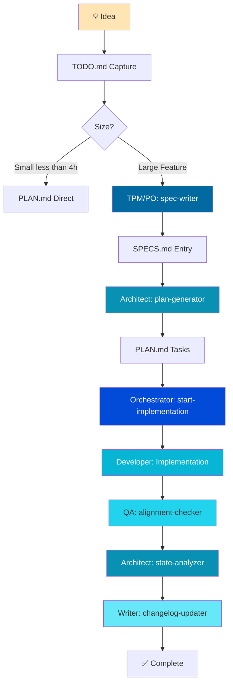

# SDD Workflow Guide for HP Dev Agent

**Version:** 1.0.0  
**Last Updated:** November 10, 2025  
**Status:** 🎯 Active

---

## Purpose

This guide adapts the **Spec-Driven Development (SDD)** workflow for HP Dev Agent's own development process. Instead of using 9 separate custom prompts, we leverage our **existing 6 agent personas** to implement the same disciplined, spec-driven approach.

**Key Philosophy:**
- **Intent as Truth** - Specifications define WHAT to build, not HOW
- **Gated Workflow** - Explicit approval gates prevent runaway actions
- **Persistent Context** - Control files provide "memory" across sessions
- **Agent Orchestration** - Multiple specialized agents work together

---

## The Adapted SDD Workflow

### Workflow Overview



---

## Agent-to-Workflow Mapping

### 1. **TPM/PO Agent → spec-writer**

**Responsibility:** Create detailed specifications in SPECS.md

**When to Invoke:**
- New feature idea (>4 hours estimated work)
- Requirements need clarification
- Multiple stakeholders involved

**Input:**
- Rough feature idea from TODO.md or user request
- Business goals and user problems

**Process:**
1. Ask clarifying questions (who, what, why, how many, performance needs)
2. Document problem statement and proposed solution
3. Define functional requirements (SHALL/SHOULD statements)
4. Create acceptance criteria (Given/When/Then format)
5. Specify non-functional requirements (performance, security)
6. List explicitly what is OUT OF SCOPE

**Output:** SPECS.md entry following this structure:

```markdown
## SPEC-XXX: [Feature Name]

**Status:** 📝 Draft
**Priority:** High | Medium | Low
**Owner:** [Name]
**Effort Estimate:** XL (more than 4h) | L (3-4h) | M (2-3h) | S (1-2h)

### Problem Statement
[Why we need this - business context]

### Proposed Solution
[High-level approach]

### User Story
As a [user type], I want to [action] so that [benefit].

### Functional Requirements
**REQ-XXX-F-001:** System SHALL [specific behavior]
**REQ-XXX-F-002:** System SHOULD [desired behavior]

### Acceptance Criteria
**Scenario 1: Happy Path**
- **Given** [context]
- **When** [action]
- **Then** [expected result]

**Scenario 2: Edge Case**
- **Given** [edge case context]
- **When** [action]
- **Then** [error handling]

### Non-Functional Requirements
- **Performance:** [response time, throughput]
- **Security:** [auth, data protection]
- **Accessibility:** [WCAG compliance]

### Out of Scope
- [Explicitly list what NOT to build]

### Dependencies
- [Other specs, services, or features required]

### Definition of Ready (DoR)
- [ ] Requirements are clear and testable
- [ ] All dependencies identified
- [ ] Technical feasibility confirmed
- [ ] Acceptance criteria defined
- [ ] Effort estimated
```

**Example Invocation:**
```
@HP Dev Agent, TPM/PO agent: Create a spec for adding OAuth2 authentication 
support to the agent system, allowing GitHub and Google login.
```

---

### 2. **Architect Agent → plan-generator**

**Responsibility:** Break specifications into implementable tasks with effort estimates

**When to Invoke:**
- After spec is approved
- Before starting implementation
- Need task decomposition

**Input:**
- SPEC-XXX from SPECS.md
- Current CODE-STATE.md (understand existing architecture)
- PLAN.md (understand current project state)

**Process:**
1. Read and analyze the specification
2. Review current architecture (CODE-STATE.md)
3. Break feature into logical phases (Foundation, Implementation, Polish)
4. Decompose each phase into granular tasks (1-4 hours each)
5. Define acceptance criteria per task
6. Estimate effort (S/M/L/XL)
7. Identify dependencies between tasks
8. Determine task sequence (what can be parallelized)

**Output:** PLAN.md updated with feature tasks following this structure:

```markdown
### Feature: [Feature Name]
**Status:** ⬜ Not Started
**Spec:** SPEC-XXX
**Owner:** [Team/Person]
**Priority:** High | Medium | Low

#### Phase 1: Foundation
**Status:** ⬜ Not Started
**Completed:** 0/N tasks

##### Tasks
- [ ] Task 1: [Clear, actionable description]
  - **Acceptance:** [How to verify done]
  - **Effort:** S (1-2h)
  - **Dependencies:** None
  - **Files:** [Expected files to create/modify]

- [ ] Task 2: [Description]
  - **Acceptance:** [Verification steps]
  - **Effort:** M (2-3h)
  - **Dependencies:** Task 1 complete
  - **Files:** [Files list]

#### Phase 2: Implementation
[Same structure]

#### Phase 3: Polish & Testing
[Same structure]

#### Definition of Done (DoD)
- [ ] All acceptance criteria met
- [ ] Unit tests passing (>80% coverage)
- [ ] Integration tests passing
- [ ] Code reviewed
- [ ] Documentation updated
- [ ] No critical blockers
```

**Example Invocation:**
```
@HP Dev Agent, Architect agent: Generate implementation plan for SPEC-007 
(OAuth2 authentication). Break it into phases and tasks with effort estimates.
```

---

### 3. **Orchestrator Agent → start-implementation**

**Responsibility:** Help developer choose what to work on next with full context

**When to Invoke:**
- Starting a work session
- Finished previous task, need next one
- Multiple options available, need prioritization

**Input:**
- PLAN.md (all tasks and their status)
- CODE-STATE.md (current implementation state)
- SPECS.md (requirements context)

**Process:**
1. Read PLAN.md to identify ready tasks (dependencies met)
2. Prioritize tasks by:
   - Critical path (blocks other work)
   - Quick wins (low effort, high value)
   - Current phase focus
3. Present 3-5 options with context:
   - Effort estimate
   - Why this task is important
   - Dependencies status
   - Related spec
4. User selects task
5. Provide full context:
   - Spec details
   - Acceptance criteria
   - Related files
   - Approach suggestions
6. Mark task as 🚧 In Progress in PLAN.md
7. Hand off to Developer agent

**Output:** Clear task selection + context package + updated PLAN.md

**Example Invocation:**
```
@HP Dev Agent, Orchestrator: What should I work on next? Show me ready tasks.
```

**Example Response:**
```
📊 Current State:
- Phase 2: OAuth2 Implementation (3/8 tasks complete)
- Phase 3: Dashboard Redesign (not started, blocked)

🎯 Ready Tasks (3 options):

**Option 1: Implement OAuth2 callback handler** 🔴 CRITICAL
- Effort: L (3-4h)
- Spec: SPEC-007
- Why: Blocks OAuth2 feature completion
- Dependencies: All met ✅
- Files: src/auth/oauth2-callback.ts, tests/

**Option 2: Add loading states to control files display**
- Effort: S (1-2h)
- Why: Quick win, improves UX
- Dependencies: None ✅

**Option 3: Write QA tests for agent orchestration**
- Effort: M (2-3h)
- Spec: SPEC-002
- Why: Improves test coverage (currently 65%)

Which task? (1-3 or 'analyze' for more details)
```

---

### 4. **Developer Agent → Implementation**

**Responsibility:** Execute the selected task following TDD principles

**When to Invoke:**
- After Orchestrator provides task context
- Ready to write code

**Input:**
- Task details from PLAN.md
- Acceptance criteria from SPEC
- Current CODE-STATE.md

**Process:**
1. **RED:** Write failing test based on acceptance criteria
2. **GREEN:** Implement minimum code to make test pass
3. **REFACTOR:** Clean up code, ensure quality
4. Mark task ✅ in PLAN.md when acceptance met
5. Quick note in TODO.md if discovered issues

**Output:** 
- Code implementation
- Passing tests
- Updated PLAN.md (task marked done)

**Example Invocation:**
```
@HP Dev Agent, Developer: Implement Task 2.3 from PLAN.md - "Add OAuth2 
callback handler". Follow TDD: write tests first, then implementation.
```

---

### 5. **QA Agent → alignment-checker**

**Responsibility:** Verify consistency between PLAN, CODE-STATE, and actual code

**When to Invoke:**
- End of each phase
- Before marking feature complete
- Weekly quality check
- When something feels "off"

**Input:**
- PLAN.md (what should exist)
- CODE-STATE.md (what we say exists)
- Actual codebase (what actually exists)
- SPECS.md (original requirements)

**Process:**
1. Compare PLAN.md task status vs. actual files
2. Check CODE-STATE.md accuracy
3. Verify acceptance criteria are met
4. Check for drift:
   - Tasks marked done but code missing
   - Code exists but not in CODE-STATE.md
   - Implementation doesn't match spec
5. Generate alignment report with severity:
   - 🔴 **Critical**: Blocks feature (missing core files)
   - 🟡 **Medium**: Quality issue (tests missing)
   - 🟢 **Minor**: Documentation drift

**Output:** Alignment report + recommended fixes

**Example Invocation:**
```
@HP Dev Agent, QA: Run alignment check for Phase 2 (OAuth2). Verify PLAN.md 
matches CODE-STATE.md and actual implementation.
```

**Example Report:**
```markdown
## Alignment Report - Phase 2: OAuth2

**Status:** 🟡 Medium Issues Found

### Findings

🔴 **CRITICAL** (0 issues)

🟡 **MEDIUM** (2 issues)
1. **Missing Tests:** 
   - PLAN Task 2.4 marked ✅ but tests/oauth2-callback.test.ts has 0 tests
   - **Fix:** Implement test suite

2. **CODE-STATE Drift:**
   - CODE-STATE.md says "OAuth2Service - Complete"
   - But src/services/OAuth2Service.ts missing error handling
   - **Fix:** Update implementation or CODE-STATE

🟢 **MINOR** (1 issue)
1. **Documentation:** SPECS.md not updated with final OAuth2 flow diagram

### Recommendations
1. [Priority 1] Add tests for Task 2.4
2. [Priority 2] Fix OAuth2Service error handling
3. [Priority 3] Update SPECS.md diagram
```

---

### 6. **QA Agent → control-files-reviewer**

**Responsibility:** Quality check all control files for completeness and consistency

**When to Invoke:**
- Weekly (Friday afternoon)
- Before major milestone
- After completing a feature

**Input:**
- All 5 control files (PLAN, CODE-STATE, CHANGELOG, SPECS, TODO)

**Process:**
1. **PLAN.md Quality Checks:**
   - All tasks have acceptance criteria?
   - Effort estimates present?
   - Dependencies clearly stated?
   - Status markers accurate (✅🚧⬜❌)?

2. **CODE-STATE.md Quality Checks:**
   - Architecture diagrams up to date?
   - Component status table accurate?
   - Mermaid diagrams render correctly?
   - Last updated within 2 weeks?

3. **CHANGELOG.md Quality Checks:**
   - All recent changes documented?
   - Triggering prompts included?
   - Files changed listed?
   - Version numbers follow semver?

4. **SPECS.md Quality Checks:**
   - Acceptance criteria testable?
   - Requirements numbered (REQ-XXX-F-001)?
   - Out of scope explicitly stated?
   - DoR/DoD defined?

5. **TODO.md Quality Checks:**
   - Inbox not overwhelming (less than 20 items)?
   - Old completed items archived?
   - Parked items still relevant?

**Output:** Quality report with improvement recommendations

**Example Invocation:**
```
@HP Dev Agent, QA: Review all control files for quality. Generate report 
with any issues found.
```

---

### 7. **Architect Agent → state-analyzer**

**Responsibility:** Completely rewrite CODE-STATE.md after implementation changes

**When to Invoke:**
- After completing a phase
- Weekly (as part of regular maintenance)
- After significant architectural changes

**Input:**
- Current codebase (file structure, dependencies)
- package.json (tech stack)
- PLAN.md (features implemented)
- Git history (recent changes)

**Process:**
1. Scan project structure
2. Analyze tech stack and versions
3. Update architecture diagrams (Mermaid)
4. Update component status tables
5. Update implementation status per feature
6. Update test coverage metrics
7. Identify and document blockers
8. **Completely rewrite** CODE-STATE.md (don't just append)

**Output:** Completely refreshed CODE-STATE.md

**Example Invocation:**
```
@HP Dev Agent, Architect: Analyze current code state and completely rewrite 
CODE-STATE.md. Include updated architecture diagrams and component status.
```

---

### 8. **Writer Agent → changelog-updater**

**Responsibility:** Document changes in CHANGELOG.md after feature completion

**When to Invoke:**
- After completing a feature or phase
- Before creating a PR
- After merging to main

**Input:**
- PLAN.md tasks completed
- Git diff (files changed)
- Triggering prompt/command
- Version number

**Process:**
1. Determine version bump (major/minor/patch)
2. Categorize changes:
   - **Added**: New features
   - **Changed**: Modified behavior
   - **Fixed**: Bug fixes
   - **Security**: Vulnerability fixes
   - **Deprecated**: Soon-to-be-removed
   - **Removed**: Deleted features
3. List all files changed
4. Include triggering prompt
5. **Append** to CHANGELOG.md (never edit past entries)

**Output:** New CHANGELOG.md entry

**Example Invocation:**
```
@HP Dev Agent, Writer: Update CHANGELOG.md for OAuth2 feature completion. 
Version 1.1.0. List all changed files and triggering spec.
```

---

### 9. **TPM/PO Agent → todo-integrator**

**Responsibility:** Process TODO.md inbox and move items to PLAN or SPECS

**When to Invoke:**
- Monday morning (weekly planning)
- When TODO inbox > 20 items
- Before quarterly planning

**Input:**
- TODO.md (capture inbox)
- PLAN.md (current features/tasks)
- SPECS.md (existing specs)

**Process:**
1. Review each TODO item:
   - **Is it a quick task (less than 1 hour)?** → Add directly to PLAN.md
   - **Is it a feature idea (more than 4 hours)?** → Create SPEC-XXX in SPECS.md
   - **Is it a bug?** → Create bug spec or add to PLAN
   - **Is it a question?** → Answer or add to SPECS as open question
   - **Is it stale/irrelevant?** → Archive/delete
2. Prioritize items (High/Medium/Low)
3. Clear processed items from TODO.md
4. Update PLAN.md and SPECS.md

**Output:** 
- Cleaned TODO.md
- Updated PLAN.md with new tasks
- New SPEC entries if needed

**Example Invocation:**
```
@HP Dev Agent, TPM/PO: Process TODO.md inbox. Move items to PLAN or SPECS 
as appropriate. Archive stale items.
```

---

## Task Structure Standards

### Effort Estimates

Use this scale consistently:

| Symbol | Effort | Time Range | Example |
|--------|--------|------------|---------|
| **S** | Small | 1-2 hours | Add validation, fix typo, update docs |
| **M** | Medium | 2-3 hours | Create component, write tests, refactor service |
| **L** | Large | 3-4 hours | Implement feature phase, design API, integrate service |
| **XL** | Extra Large | >4 hours | Should be broken down into smaller tasks |

**Rule:** If estimate is XL, use Architect agent (plan-generator) to decompose.

### Acceptance Criteria Format

Every task MUST have testable acceptance criteria:

```markdown
- [ ] Task: Implement OAuth2 callback handler
  - **Acceptance:**
    - ✅ Endpoint /auth/oauth2/callback accepts GET requests
    - ✅ Validates state parameter matches session
    - ✅ Exchanges code for access token
    - ✅ Creates user session with expiry
    - ✅ Redirects to dashboard on success
    - ✅ Shows error page on failure
    - ✅ Unit tests cover happy path and 3 error cases
  - **Effort:** L (3-4h)
  - **Dependencies:** OAuth2 config complete
  - **Files:** 
    - src/auth/oauth2-callback.ts (new)
    - tests/auth/oauth2-callback.test.ts (new)
```

### Definition of Ready (DoR)

Before starting implementation, verify:

- [ ] Requirements are clear and unambiguous
- [ ] Acceptance criteria are testable
- [ ] All dependencies are available
- [ ] Technical approach is feasible
- [ ] Effort is estimated (not XL)
- [ ] Spec is approved (if applicable)

### Definition of Done (DoD)

Before marking task complete, verify:

- [ ] All acceptance criteria met
- [ ] Unit tests written and passing
- [ ] Integration tests passing (if applicable)
- [ ] Code follows project standards
- [ ] No critical blockers
- [ ] Documentation updated
- [ ] PLAN.md task marked ✅
- [ ] CODE-STATE.md updated (if architectural change)

---

## Daily Workflow Example

### Morning (Starting Work)

```bash
# 1. Check current state
@HP Dev Agent, Orchestrator: What should I work on next?

# 2. Orchestrator presents options
# User selects Option 2: "Add error boundaries to control files display"

# 3. Orchestrator provides context and marks task 🚧
# Hands off to Developer agent

# 4. Developer implements with TDD
@HP Dev Agent, Developer: Implement selected task. Write tests first.
```

### During Work

```bash
# Quick capture notes without breaking flow
# Edit TODO.md directly:
## 📥 Capture Inbox
- [ ] Error boundary should also catch Mermaid rendering errors
- [ ] Consider adding retry button
```

### After Work

```bash
# 1. Mark task complete
# Edit PLAN.md: Change [ ] to [x] for completed task

# 2. Quick alignment check
@HP Dev Agent, QA: Quick alignment check for Task 3.2 I just completed.

# 3. Update TODO if needed (capture learnings)
```

### End of Phase

```bash
# 1. Full alignment check
@HP Dev Agent, QA: Run complete alignment check for Phase 3.

# 2. Update CODE-STATE
@HP Dev Agent, Architect: Rewrite CODE-STATE.md with current architecture.

# 3. Update CHANGELOG
@HP Dev Agent, Writer: Update CHANGELOG for Phase 3 completion. Version 1.2.0.

# 4. Quality review
@HP Dev Agent, QA: Review all control files for quality issues.
```

---

## Weekly Routine

### Monday Morning

```bash
# Process TODO inbox
@HP Dev Agent, TPM/PO: Process TODO.md inbox. Move items to PLAN or create 
specs as needed.

# Review priorities
@HP Dev Agent, Orchestrator: Show me this week's priorities.
```

### Friday Afternoon

```bash
# Update CODE-STATE
@HP Dev Agent, Architect: Rewrite CODE-STATE.md with current state.

# Alignment check
@HP Dev Agent, QA: Run alignment check across all control files.

# Quality review
@HP Dev Agent, QA: Review control files quality. Generate report.

# Clean TODO
# Review and archive completed items in TODO.md
```

---

## Benefits of This Adapted Workflow

### For HP Dev Agent Development

1. **Self-Dogfooding:** We use the agent system to develop itself
2. **Continuous Improvement:** SDD discipline improves agent quality
3. **Context Retention:** Control files provide memory across sessions
4. **Traceability:** Every change tracked from spec to implementation
5. **Quality Assurance:** Built-in QA checks prevent drift

### For Agent System Features

This SDD workflow demonstrates:

1. **Multi-Agent Orchestration:** Shows how agents work together
2. **Gated Workflows:** Example of approval gate enforcement
3. **Context Management:** How control files provide persistent memory
4. **Role Specialization:** Each agent has clear, focused responsibility

---

## Comparison: Traditional vs. Agent-Based SDD

| Aspect | Traditional SDD (Custom Prompts) | my_agent Adapted SDD |
|--------|----------------------------------|----------------------|
| **Tools** | 9 custom .prompt.md files | 6 existing agent personas |
| **Invocation** | /speckit.spec-writer | @HP Dev Agent, TPM/PO: spec-writer |
| **Context** | Single prompt execution | Multi-turn agent conversation |
| **Memory** | Stateless prompts | Agents reference control files |
| **Flexibility** | Fixed prompt structure | Agents adapt to conversation |
| **Integration** | Separate tools | Unified agent system |
| **Learning** | User learns 9 prompts | User learns 6 agent roles |

---

## Integration with Existing Constitution

The `.ai/constitution.md` should be updated to mandate:

1. **Control Files Maintenance:**
   - PLAN.md: Update daily as tasks progress
   - CODE-STATE.md: Rewrite weekly (Architect agent)
   - CHANGELOG.md: Append after each feature (Writer agent)
   - SPECS.md: Update when requirements change (TPM/PO agent)
   - TODO.md: Process weekly (TPM/PO agent)

2. **SDD Workflow Enforcement:**
   - Features requiring more than 4 hours MUST have SPEC-XXX entry
   - All tasks MUST have acceptance criteria
   - Effort estimates MUST be present (S/M/L/XL)
   - XL tasks MUST be decomposed
   - DoR checked before starting
   - DoD checked before marking complete

3. **Agent Coordination:**
   - Orchestrator manages workflow transitions
   - Each agent updates their respective control files
   - Approval gates enforced between phases
   - Quality checks (QA agent) before milestone completion

---

## Next Steps

1. **Update Constitution:** Add SDD workflow mandates
2. **Enhance Agent Files:** Add SDD responsibilities to each `.ai/agents/*.agent.md`
3. **Test Workflow:** Use this SDD process for next my_agent feature
4. **Iterate:** Refine based on real-world usage
5. **Document Learnings:** Capture improvements in TODO.md → SPECS.md

---

**Last Updated:** 2025-11-10  
**Version:** 1.0.0  
**Related Files:**
- [Development Dashboard](./index.md)
- [Project Plan](./plan.md)
- [Specifications](./specs.md)
- [Constitution](../../../.ai/constitution.md)
