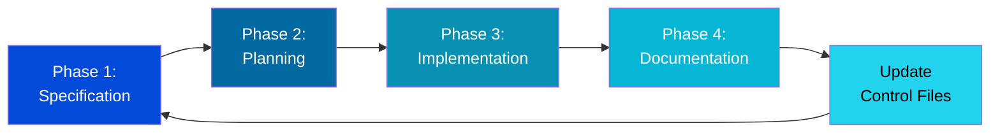

# Development Dashboard

Welcome to the **IntelliFinance Development Dashboard**. This section provides a comprehensive view of the project's development using **Spec-Driven Development (SDD)** control files.

## 📊 Current Status

**Project Phase:** Phase 3 In Progress (Financial Account Management)
**System Status:** ✅ Core System Operational
**Last Updated:** November 12, 2025

### Quick Stats

| Metric                  | Status          |
| :---------------------- | :-------------- |
| **User Authentication** | ✅ Complete     |
| **Account Management**  | 🔄 In Progress |
| **Backend API**         | ✅ Operational  |
| **Frontend UI**         | ✅ Operational  |

## 🎯 What Are Control Files?

Control files are the foundation of **Spec-Driven Development**, a disciplined approach to AI-assisted development. They serve as the "memory" and "governance" system for the project, ensuring:

-   **Context Retention** - Understand project state across sessions.
-   **Audit Trail** - Every change is documented with intent and reasoning.
-   **Workflow Discipline** - A structured approach to development prevents chaos.
-   **Knowledge Transfer** - New contributors can get up to speed quickly.

## 📁 Control Files Structure

### 1. **[Project Plan](./plan.md)** 📋

**Purpose:** Strategic roadmap and phase tracking.
**Update Frequency:** After each major milestone.

### 2. **[Code State](./code-state.md)** 🏗️

**Purpose:** A living snapshot of the application's architecture.
**Update Frequency:** After every significant implementation.

### 3. **[Changelog](./changelog.md)** 📝

**Purpose:** An immutable audit trail of changes.
**Update Frequency:** After every versioned release.

### 4. **[Specifications](./specs.md)** 📐

**Purpose:** Detailed feature specifications and requirements.
**Update Frequency:** When new features are planned or existing ones are modified.

### 5. **[TODO](./todo.md)** ✅

**Purpose:** Quick capture for notes and ephemeral tasks.
**Update Frequency:** Daily during active development.

## 🔄 Spec-Driven Development Workflow

Our development follows a **4-phase workflow**:

## 📖 How to Use This Section

### For Developers

1.  **Check [Project Plan](./plan.md)** - See what phase we're in and the current focus.
2.  **Review [Code State](./code-state.md)** - Understand the current architecture before making changes.
3.  **Read [Specifications](./specs.md)** - Understand feature requirements before implementation.
4.  **Update [Changelog](./changelog.md)** - Document your changes with each release.
5.  **Use [TODO](./todo.md)** - For quick capture during development.

---

**Navigation:**

-   📋 [Project Plan](./plan.md)
-   🏗️ [Code State](./code-state.md)
-   📝 [Changelog](./changelog.md)
-   📐 [Specifications](./specs.md)
-   ✅ [TODO](./todo.md)
-   🔄 [SDD Workflow Guide](./sdd-workflow.md)