# Integration Guide: How Prompts Work Together

**Understanding the orchestration of workflow prompts and their data flows**

---

## Overview

The spec-driven workflow system consists of **8 specialized prompts** that work together in a coordinated sequence to maintain synchronization between your plans, specifications, code, and documentation. This guide explains how these prompts integrate, their dependencies, and the data that flows between them.

---

## System Architecture

### Prompt Ecosystem

---

## Data Flow Patterns

### Pattern 1: New Project Initialization

**Entry Point:** User wants to start a new project with control files

```mermaid
sequenceDiagram
    participant User
    participant WB as workflow-bootstrap
    participant Files as Control Files
    
    User->>WB: Start bootstrap wizard
    WB->>User: Ask project questions (tech, features, goals)
    User->>WB: Provide answers
    WB->>Files: Generate PLAN.md
    WB->>Files: Generate CODE-STATE.md
    WB->>Files: Generate SPECS.md (draft)
    WB->>Files: Generate TODO.md
    WB->>Files: Generate CHANGELOG.md (v0.1.0)
    WB->>User: ✅ All files created, ready to start
```

**Data Flow:**
1. **Input:** User answers 12-15 questions (project name, tech stack, features, priorities)
2. **Processing:** Bootstrap generates structured content for all 5 files
3. **Output:**
   - `PLAN.md` with features and phases
   - `CODE-STATE.md` with planned architecture
   - `SPECS.md` with draft specifications
   - `TODO.md` with initial ideas/questions
   - `CHANGELOG.md` with v0.1.0 entry

**Next Steps:** Use `spec-writer` to enhance draft specs, then `plan-generator` to detail plans

---

### Pattern 2: Spec-Driven Feature Development

**Entry Point:** User has a feature idea to implement

```mermaid
sequenceDiagram
    participant User
    participant TODO as TODO.md
    participant SW as spec-writer
    participant SPECS as SPECS.md
    participant PG as plan-generator
    participant PLAN as PLAN.md
    participant CODE as Source Code
    participant SA as state-analyzer
    participant STATE as CODE-STATE.md
    
    User->>TODO: Capture idea in TODO.md
    User->>SW: Run spec-writer for feature
    SW->>User: Ask clarifying questions
    User->>SW: Answer questions
    SW->>SPECS: Write detailed spec (SPEC-NNN)
    
    User->>PG: Run plan-generator with SPEC-NNN
    PG->>SPECS: Read specification
    PG->>PLAN: Generate implementation plan
    PG->>PLAN: Add tasks, phases, estimates
    
    User->>CODE: Implement feature (follow PLAN)
    
    User->>SA: Run state-analyzer
    SA->>CODE: Scan codebase
    SA->>STATE: Update architecture, status, blockers
    
    User->>TODO: Mark original idea as ✅ Done
```

**Data Flow:**
1. **TODO.md** → Idea capture
2. **spec-writer** → Create **SPECS.md** entry (requirements, acceptance criteria)
3. **SPECS.md** → Input for **plan-generator**
4. **plan-generator** → Create **PLAN.md** entry (tasks, phases, effort)
5. **Source Code** → Implementation guided by PLAN
6. **state-analyzer** → Update **CODE-STATE.md** (actual state)

**Key Integration Points:**
- SPECS provides structured requirements for PLAN
- PLAN references SPEC by ID (e.g., "Feature SPEC-001")
- CODE-STATE tracks implementation progress vs PLAN

---

### Pattern 3: TODO Integration Workflow

**Entry Point:** User has accumulated many TODO items and wants to organize them

```mermaid
sequenceDiagram
    participant User
    participant TODO as TODO.md
    participant TI as todo-integrator
    participant PLAN as PLAN.md
    participant SPECS as SPECS.md
    
    User->>TODO: Capture ideas/bugs/questions over time (10+ items)
    User->>TI: Run todo-integrator
    TI->>TODO: Read all TODO sections
    TI->>User: Categorize each item
    User->>TI: Choose: PLAN task, SPEC requirement, or keep in TODO
    
    loop For each TODO item
        alt Add to PLAN
            TI->>PLAN: Create new task in appropriate phase
            TI->>TODO: Mark as ✅ Integrated into PLAN
        else Add to SPECS
            TI->>SPECS: Add to existing spec or note for new spec
            TI->>TODO: Mark as ✅ Integrated into SPECS
        else Keep in TODO
            TI->>TODO: Move to appropriate section (Research, Parked)
        end
    end
    
    TI->>User: ✅ TODO processed, PLAN/SPECS updated
```

**Data Flow:**
1. **Input:** TODO.md with multiple unprocessed items
2. **Processing:** Interactive categorization and integration
3. **Output:**
   - High-priority items → PLAN.md as tasks
   - Feature enhancements → SPECS.md as requirements
   - Research items → Remain in TODO.md (Research section)
   - Low-priority items → Moved to Parked section

**Integration Logic:**
- **Bugs/Issues** → PLAN.md (immediate tasks)
- **Feature Ideas** → SPECS.md (requirements) or TODO.md (Ideas)
- **Questions** → TODO.md (Questions) or trigger spec-writer
- **Research** → TODO.md (Research section)

---

### Pattern 4: Weekly State Synchronization

**Entry Point:** End of sprint/week, need to ensure control files match reality

**Data Flow:**
1. **state-analyzer** reads **Source Code** → updates **CODE-STATE.md**
2. **alignment-checker** compares **PLAN.md** vs **CODE-STATE.md** → identifies drift
3. **changelog-updater** reads **CODE-STATE** + **PLAN** → generates **CHANGELOG.md** entry
4. **control-files-reviewer** reads all 5 files → reports quality issues

**Timing Recommendation:**
- `state-analyzer`: Weekly (15 minutes)
- `alignment-checker`: Weekly or end-of-phase (15 minutes)
- `changelog-updater`: End-of-sprint or milestone (5 minutes)
- `control-files-reviewer`: Monthly or end-of-phase (15 minutes)

---

### Pattern 5: Alignment Correction Cycle

**Entry Point:** `alignment-checker` detected drift, need to fix

```mermaid
sequenceDiagram
    participant AC as alignment-checker
    participant User
    participant PLAN as PLAN.md
    participant SPECS as SPECS.md
    participant SW as spec-writer
    participant PG as plan-generator
    
    AC->>User: Report: 3 completed tasks unmarked
    AC->>User: Report: 2 features implemented without specs
    
    User->>PLAN: Mark 3 completed tasks as ✅
    
    User->>SW: Create specs for unplanned features
    SW->>SPECS: Generate SPEC-NNN and SPEC-NNN+1
    
    User->>PG: Update PLAN to reference new specs
    PG->>PLAN: Add retrospective tasks/features
    
    User->>AC: Re-run alignment-checker
    AC->>User: ✅ Alignment improved to 95%
```

**Data Flow:**
1. **alignment-checker** identifies 5 types of drift
2. User decides how to correct each type
3. Update PLAN, SPECS, or both
4. Re-run alignment-checker to validate

---

## Prompt Dependencies

### Dependency Graph

**Legend:**
- **Solid arrow** (→): Strong dependency (required input)
- **Dashed arrow** (-.->): Weak dependency (optional or conditional)

### Dependency Details

| Prompt | Depends On | Reason |
|--------|------------|--------|
| **workflow-bootstrap** | None | Entry point, creates initial files |
| **spec-writer** | None | Can create specs standalone |
| **plan-generator** | SPECS.md | Reads specs to generate detailed plans |
| **todo-integrator** | TODO.md | Reads TODO, writes to PLAN/SPECS |
| **state-analyzer** | Source Code | Scans codebase to update CODE-STATE |
| **alignment-checker** | PLAN.md + CODE-STATE.md | Compares both to detect drift |
| **changelog-updater** | CODE-STATE.md + PLAN.md | Detects changes to document |
| **control-files-reviewer** | All 5 control files | Reviews all for quality |

---

## Integration with Existing Tools

### Relationship with `plan-state-evaluator.prompt.md`

The workflow system **complements** rather than replaces `plan-state-evaluator`:

**plan-state-evaluator.prompt.md (585 lines):**
- **Role:** Comprehensive analyzer and advisor
- **Scope:** Analyzes all control files holistically
- **Output:** Detailed recommendations, strategic insights
- **Use Case:** Monthly deep dive, major decision points
- **Strength:** Wisdom and strategic guidance

**New Workflow Prompts:**
- **Role:** Specialized, actionable tools
- **Scope:** Specific tasks (write spec, update state, check alignment)
- **Output:** Direct file updates, immediate actions
- **Use Case:** Daily/weekly maintenance
- **Strength:** Efficiency and task focus

### Complementary Usage

**When to Use Each:**

| Tool | Frequency | Time | Purpose |
|------|-----------|------|---------|
| spec-writer | As needed | 30-60 min | Create/enhance specifications |
| plan-generator | Per spec | 20-30 min | Generate detailed implementation plan |
| todo-integrator | Weekly | 15-20 min | Process TODO inbox |
| state-analyzer | Weekly | 10-15 min | Update CODE-STATE from code |
| alignment-checker | Weekly | 10-15 min | Detect drift between PLAN/STATE |
| changelog-updater | Per milestone | 5-10 min | Document changes |
| control-files-reviewer | Monthly | 15-20 min | Quality assurance |
| **plan-state-evaluator** | **Monthly** | **30-45 min** | **Strategic review & advice** |

---

## Cross-File Data Contracts

### What Each Prompt Reads/Writes

#### workflow-bootstrap

**Reads:**
- User input (interactive questions)

**Writes:**
- `PLAN.md` (v0.1.0)
- `CODE-STATE.md` (v0.1.0)
- `SPECS.md` (v0.1.0, draft specs)
- `TODO.md` (v0.1.0, initial structure)
- `CHANGELOG.md` (v0.1.0, first entry)

**Data Contract:**
- All files include YAML front matter with metadata
- PLAN references SPECS by ID (SPEC-001, SPEC-002...)
- SPECS use consistent status values (Draft, In Review, Approved, Implemented)

---

#### spec-writer

**Reads:**
- Existing `SPECS.md` (to append or update)
- User input (feature details, requirements)

**Writes:**
- `SPECS.md` (new spec or updated spec)

**Data Contract:**
- Spec ID format: `SPEC-###` (zero-padded)
- Status: Draft | In Review | Approved | Implemented | Deprecated
- Sections: Problem Statement, User Stories, Functional Requirements, Non-Functional Requirements, Acceptance Criteria
- Acceptance criteria use Given/When/Then format

---

#### plan-generator

**Reads:**
- `SPECS.md` (specific spec by ID, e.g., SPEC-001)
- Existing `PLAN.md` (to append or update)

**Writes:**
- `PLAN.md` (new feature section or updated tasks)

**Data Contract:**
- Feature references SPEC by ID
- Tasks include: description, acceptance criteria, effort estimate (S/M/L), dependencies
- Status markers: ✅ Complete, 🚧 In Progress, ⬜ Not Started, ❌ Blocked
- Phases numbered consistently (Phase 1, Phase 2...)

---

#### todo-integrator

**Reads:**
- `TODO.md` (all sections: Inbox, Ideas, Questions, Research, Bugs)
- Existing `PLAN.md` and `SPECS.md`

**Writes:**
- `TODO.md` (marks items as processed)
- `PLAN.md` (adds tasks from TODO items)
- `SPECS.md` (adds requirements or notes for future specs)

**Data Contract:**
- TODO items marked with status: ⬜ New, 🚧 Processing, ✅ Integrated
- PLAN tasks created from TODO include traceability: "Source: TODO item (2025-10-21)"
- SPECS updated with note: "Originated from TODO idea"

---

#### state-analyzer

**Reads:**
- Source code (all files in repository)
- `package.json`, config files
- Test files and coverage reports

**Writes:**
- `CODE-STATE.md` (updates all sections)

**Data Contract:**
- Tech stack lists dependencies with versions
- Implementation status uses percentages: 0%, 25%, 50%, 75%, 100%
- Blockers categorized: 🔴 Critical, 🟡 Warning, 🟢 Info
- Architecture diagrams use Mermaid syntax

---

#### alignment-checker

**Reads:**
- `PLAN.md` (all features, tasks, status)
- `CODE-STATE.md` (implementation status, components)

**Writes:**
- Report output (may suggest updates to PLAN or STATE)
- Optionally: `TODO.md` (adds drift issues to Urgent section)

**Data Contract:**
- Drift categories: Unmarked Completed, Unplanned Work, Timeline Drift, Quality Gates, Spec Gaps
- Alignment score: 0-100% (calculated)
- Recommendations prioritized: 🔴 High, 🟡 Medium, 🟢 Low

---

#### changelog-updater

**Reads:**
- `CODE-STATE.md` (changes since last version)
- `PLAN.md` (completed features)
- `CHANGELOG.md` (last version number)

**Writes:**
- `CHANGELOG.md` (new entry with semantic version)

**Data Contract:**
- Version format: MAJOR.MINOR.PATCH (semantic versioning)
- Categories: Added, Changed, Deprecated, Removed, Fixed, Security
- Entry format: `[version] - YYYY-MM-DD` with bullet points
- Links to related specs/tasks

---

#### control-files-reviewer

**Reads:**
- `PLAN.md`
- `CODE-STATE.md`
- `SPECS.md`
- `TODO.md`
- `CHANGELOG.md`

**Writes:**
- Quality report (recommendations)
- Optionally: `TODO.md` (adds quality issues)

**Data Contract:**
- Per-file score: 0-100
- Overall grade: A+ to F
- Issues categorized by file and priority
- Cross-file consistency checks included

---

## Common Integration Scenarios

### Scenario 1: "I have a feature idea"

**Path:**
1. Capture in `TODO.md` (Inbox or Ideas section)
2. Run `spec-writer` → Create detailed `SPECS.md` entry
3. Run `plan-generator` → Generate `PLAN.md` implementation plan
4. Code the feature (guided by PLAN)
5. Run `state-analyzer` → Update `CODE-STATE.md`
6. Run `changelog-updater` → Document in `CHANGELOG.md`

**Prompts Used:** spec-writer → plan-generator → state-analyzer → changelog-updater

---

### Scenario 2: "I coded something, forgot to update docs"

**Path:**
1. Run `state-analyzer` → Update `CODE-STATE.md` with actual state
2. Run `alignment-checker` → Identify drift (unplanned work)
3. Run `spec-writer` → Retroactively create spec
4. Run `plan-generator` → Add retrospective entry to PLAN
5. Run `changelog-updater` → Document change

**Prompts Used:** state-analyzer → alignment-checker → spec-writer → plan-generator → changelog-updater

---

### Scenario 3: "I have 20 TODO items, need to organize"

**Path:**
1. Run `todo-integrator` → Process all TODO items
   - High-priority bugs → `PLAN.md` tasks
   - Feature ideas → `SPECS.md` requirements or stay in TODO
   - Questions → Trigger `spec-writer` or stay in TODO
2. Run `plan-generator` if new specs created → Update `PLAN.md`

**Prompts Used:** todo-integrator → (optional) spec-writer → (optional) plan-generator

---

### Scenario 4: "End of sprint, need to sync everything"

**Path:**
1. Run `state-analyzer` → Update `CODE-STATE.md`
2. Run `alignment-checker` → Fix any drift in `PLAN.md`
3. Run `changelog-updater` → Document sprint changes
4. Run `control-files-reviewer` → Check quality
5. Process any issues found

**Prompts Used:** state-analyzer → alignment-checker → changelog-updater → control-files-reviewer

---

### Scenario 5: "Starting a brand new project"

**Path:**
1. Run `workflow-bootstrap` → Create all 5 control files
2. Run `spec-writer` → Enhance initial draft specs
3. Run `plan-generator` → Add detail to initial plans
4. Start coding!

**Prompts Used:** workflow-bootstrap → spec-writer → plan-generator

---

## Error Handling & Edge Cases

### What if files are corrupted or missing?

**Response by Prompt:**

| Prompt | Missing PLAN | Missing STATE | Missing SPECS |
|--------|--------------|---------------|---------------|
| spec-writer | ⚠️ Warns, continues | ✅ Not needed | Creates file if missing |
| plan-generator | Creates file if missing | ✅ Not needed | ❌ Error (requires SPECS) |
| state-analyzer | ✅ Not needed | Creates file if missing | ✅ Not needed |
| alignment-checker | ❌ Error (requires PLAN) | ❌ Error (requires STATE) | ⚠️ Warns |
| changelog-updater | ✅ Best effort | ✅ Best effort | Creates file if missing |

**Recommendation:** Always run `workflow-bootstrap` first if files are missing.

---

### What if YAML front matter is malformed?

**Behavior:**
- Prompts will attempt to read and may warn about invalid metadata
- Most prompts focus on content body, not front matter validation
- `control-files-reviewer` will flag front matter issues

**Recovery:**
- Run `control-files-reviewer` to identify issues
- Manually fix YAML syntax
- Re-run prompts

---

### What if versions are inconsistent?

**Example:** PLAN.md is v0.5.0 but CODE-STATE.md is v0.2.0

**Impact:**
- `alignment-checker` may note version mismatch
- No functional impact (versions are informational)

**Recommendation:**
- Increment versions consistently when making significant updates
- Use semantic versioning: MAJOR.MINOR.PATCH

---

## Best Practices for Integration

### 1. **Sequential Execution**
- Follow natural workflow order: SPECS → PLAN → CODE → STATE → CHANGELOG
- Don't skip steps (e.g., don't run plan-generator without specs)

### 2. **Regular Synchronization**
- Run `state-analyzer` + `alignment-checker` weekly
- Don't let drift accumulate (harder to fix later)

### 3. **Capture First, Process Later**
- Use TODO.md liberally during coding
- Process with `todo-integrator` weekly

### 4. **Review Before Acting**
- All prompts show proposed changes before writing
- Always review alignment-checker and control-files-reviewer reports

### 5. **Leverage Plan-State-Evaluator for Strategy**
- Use workflow prompts for tactical daily/weekly work
- Use `plan-state-evaluator` for monthly strategic review

---

## Troubleshooting Integration Issues

### Issue: Prompts produce conflicting recommendations

**Example:** `alignment-checker` says "mark task complete" but `control-files-reviewer` says "task lacks acceptance criteria"

**Resolution:**
1. Fix the quality issue first (add acceptance criteria)
2. Then mark task complete
3. Re-run both prompts to validate

---

### Issue: Circular dependency (prompt A needs output of prompt B, which needs output of A)

**Example:** `plan-generator` needs SPECS, but `spec-writer` suggests reviewing PLAN first

**Resolution:**
- Write draft spec first (spec-writer without consulting PLAN)
- Generate initial plan (plan-generator from draft spec)
- Refine spec based on plan insights (spec-writer again)
- Finalize plan (plan-generator again)

---

### Issue: Too much manual overhead, workflow feels heavy

**Symptoms:**
- Spending more time updating docs than coding
- Control files feel like busywork

**Resolution:**
1. Start minimal: Use only spec-writer + plan-generator + state-analyzer
2. Add other prompts gradually as needed
3. Adjust frequency: Maybe monthly instead of weekly for some prompts
4. Consider: Maybe project is too small for full workflow (use TODO.md only)

---

## Summary: The Integration Picture

**The workflow system is designed as a modular toolkit:**
- Each prompt is **standalone** (can be used independently)
- Prompts **integrate naturally** through control files (data flows)
- You **choose your own adventure** (don't need all prompts for all projects)
- **Start simple, scale up** as project complexity grows

**Core Loop (Minimum Viable Workflow):**
1. spec-writer → SPECS.md
2. plan-generator → PLAN.md
3. [Code implementation]
4. state-analyzer → CODE-STATE.md

**Extended Loop (Full Workflow):**
1. workflow-bootstrap → All files
2. spec-writer → SPECS.md
3. plan-generator → PLAN.md
4. [Coding]
5. todo-integrator → Process ideas
6. state-analyzer → CODE-STATE.md
7. alignment-checker → Detect drift
8. changelog-updater → CHANGELOG.md
9. control-files-reviewer → Quality check
10. Repeat 4-9 weekly

---

## Related Documentation

*   [Analytics Interaction Analysis Tool Usage](./analytics-tool-usage.md)

---

**Next:** [Quick Reference](./quick-reference.md) | [Main Guide](./spec-driven-workflow.md)
