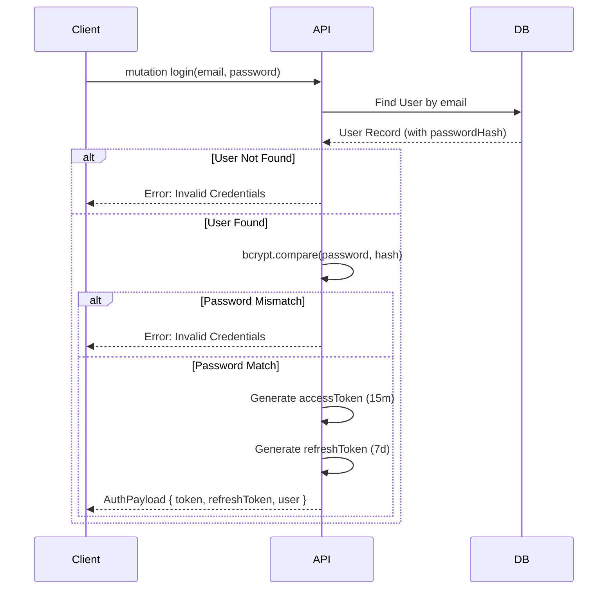

# Feature Specification: Authentication & User Core

**Feature Branch**: `002-user-auth`
**Created**: 2025-02-18
**Status**: Draft
**Input**: User description: "Authentication & User Core with Dual Token Strategy"

## User Scenarios & Testing *(mandatory)*

### User Story 1 - User Registration (Priority: P1)

As a new user, I want to register an account so that I can access the application's features.

**Why this priority**: It is the entry point for all users. Without registration, no other features can be used.

**Independent Test**: Can be tested by calling the `register` mutation and verifying a new user record is created in the database and tokens are returned.

**Acceptance Scenarios**:

1. **Given** a valid email and password, **When** I submit the registration form, **Then** a new user account is created, and I receive an access token and refresh token.
2. **Given** an email that already exists, **When** I attempt to register, **Then** the system returns a "User already exists" error.
3. **Given** an invalid email format or weak password, **When** I attempt to register, **Then** the system rejects the request with validation errors.

---

### User Story 2 - User Login (Priority: P1)

As a registered user, I want to log in with my credentials so that I can securely access my data.

**Why this priority**: Essential for identity verification and access control.

**Independent Test**: Can be tested by calling the `login` mutation with valid/invalid credentials.

**Acceptance Scenarios**:

1. **Given** valid credentials, **When** I login, **Then** I receive a valid `accessToken` (15 min) and a `refreshToken` (7 days).
2. **Given** invalid credentials, **When** I login, **Then** the system returns an "Invalid credentials" error.
3. **Given** a successful login, **When** I inspect the response, **Then** the `passwordHash` is NOT included in the user object.

---

### User Story 3 - Session Refresh (Priority: P2)

As a user with an expired access token, I want to automatically refresh my session so that I don't have to log in repeatedly.

**Why this priority**: Improves user experience by maintaining sessions securely without frequent re-logins.

**Independent Test**: Can be tested by mocking an expired access token and calling the `refreshToken` mutation.

**Acceptance Scenarios**:

1. **Given** a valid `refreshToken`, **When** I request a new token, **Then** I receive a new `accessToken`.
2. **Given** an invalid or expired `refreshToken`, **When** I request a new token, **Then** the request is denied, and I must log in again.

---

### User Story 4 - Protected Resource Access (Priority: P2)

As a logged-in user, I want to fetch my own profile details so that I can verify my identity.

**Why this priority**: Verifies the authentication middleware/shield is working correctly.

**Independent Test**: Can be tested by calling the `me` query with and without the `Authorization` header.

**Acceptance Scenarios**:

1. **Given** a valid `accessToken`, **When** I query `me`, **Then** I receive my user details (id, email, fullName).
2. **Given** no token or an invalid token, **When** I query `me`, **Then** I receive an "Unauthorized" error.

### Edge Cases

- **Concurrent Logins**: System should handle multiple active sessions (or invalidate old ones if that was the requirement, but here standard JWT behavior applies).
- **Database Failure**: Graceful error handling if DB is unreachable during auth.
- **Clock Skew**: Token validation should handle minor server time differences.

## Requirements *(mandatory)*

### Functional Requirements

- **FR-001**: System MUST support a `User` model with `id` (UUID), `email` (Unique), `passwordHash`, `fullName`, `createdAt`, `updatedAt`. (Note: Add comments for future relations to `Transaction` and `Category`).
- **FR-002**: System MUST use `bcrypt` for hashing passwords before storage.
- **FR-003**: System MUST implement Dual Token Strategy: `accessToken` (15 min) and `refreshToken` (7 days).
- **FR-004**: System MUST expose GraphQL mutations: `register(input: RegisterInput)`, `login(input: LoginInput)`, `refreshToken(token: String)`.
- **FR-005**: System MUST expose a protected GraphQL query: `me` returning the current user.
- **FR-006**: System MUST share Zod validation schemas (`RegisterInput`, `LoginInput`) between Backend and Frontend via `packages/types`.
- **FR-007**: System MUST implement a GraphQL Shield/Middleware to block unauthorized access to protected resolvers.
- **FR-008**: System MUST reject duplicate emails during registration.

### Key Entities

- **User**: The core identity entity. Attributes: `id` (UUID), `email` (String, Unique), `passwordHash` (String), `fullName` (String), `createdAt` (DateTime), `updatedAt` (DateTime).
  - *Future Relation Placeholder*: `Transaction` (1:N)
  - *Future Relation Placeholder*: `Category` (1:N)
- **AuthPayload**: Return type for auth operations. Contains `token` (String), `refreshToken` (String), `user` (User).

## Success Criteria *(mandatory)*

### Measurable Outcomes

- **SC-001**: Users can successfully register and login, receiving valid JWTs.
- **SC-002**: Password hashes in the database are never plain text.
- **SC-003**: Access to the `me` query is strictly denied without a valid token.
- **SC-004**: Shared validation prevents invalid data from reaching the backend logic.

## Technical Design Notes

### Mermaid Sequence Diagram (Login Flow)

