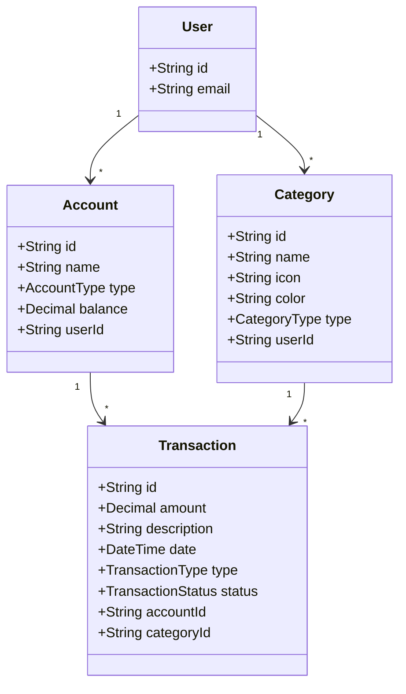

# Feature Specification: Financial Core & Transactions List MVP

**Feature Branch**: `005-financial-core`
**Created**: 2025-11-30
**Status**: Draft
**Input**: User description: "Financial Core & Transactions List MVP"

## User Scenarios & Testing *(mandatory)*

### User Story 1 - View Transactions (Priority: P1)

As a user, I want to view a list of my financial transactions so that I can track my spending and income.

**Why this priority**: Core functionality of the application.

**Independent Test**: Can be tested by querying the `transactions` API and verifying the response against the database.

**Acceptance Scenarios**:

1. **Given** a user with transactions, **When** I visit the transactions page, **Then** I see a list of transactions with date, description, category, account, and amount.
2. **Given** a user with no transactions, **When** I visit the transactions page, **Then** I see an empty state or empty list.
3. **Given** an income transaction, **When** displayed in the list, **Then** the amount is shown in green.
4. **Given** an expense transaction, **When** displayed in the list, **Then** the amount is shown in red.

### User Story 2 - Filter Transactions (Priority: P2)

As a user, I want to filter my transactions by account and date range so that I can analyze specific periods or accounts.

**Why this priority**: Enhances usability and analysis capabilities.

**Independent Test**: Can be tested by calling the `transactions` query with different filter parameters.

**Acceptance Scenarios**:

1. **Given** a selected account, **When** I apply the filter, **Then** only transactions belonging to that account are displayed.
2. **Given** a date range, **When** I apply the filter, **Then** only transactions within that range are displayed.

### User Story 3 - View Financial Summary (Priority: P2)

As a user, I want to see a summary of my current balance, total income, and total expenses so that I have a quick overview of my financial health.

**Why this priority**: Provides immediate value and context to the user.

**Independent Test**: Can be tested by verifying the summary cards against the calculated totals of the user's accounts and transactions.

**Acceptance Scenarios**:

1. **Given** the transactions page, **When** loaded, **Then** I see cards for 'Saldo' (Balance), 'Receitas' (Income), and 'Despesas' (Expenses).
2. **Given** no filters are active, **When** viewing the summary, **Then** 'Receitas' and 'Despesas' show totals for the **Current Month**.
3. **Given** a date filter is applied, **When** viewing the summary, **Then** 'Receitas' and 'Despesas' show totals for the **Selected Date Range**.
4. **Given** any filter state, **When** viewing the summary, **Then** 'Saldo' shows the **Current Total Balance** of all accounts (ignoring filters).

---

## Requirements *(mandatory)*

### Functional Requirements

- **FR-001**: System MUST support `Account` model with `id`, `name`, `type` (CHECKING, CREDIT_CARD, CASH), `balance`, `userId`.
- **FR-002**: System MUST support `Category` model with `id`, `name`, `icon`, `color`, `type` (INCOME, EXPENSE), `userId`.
- **FR-003**: System MUST support `Transaction` model with `id`, `amount`, `description`, `date`, `type` (INCOME, EXPENSE, TRANSFER), `status` (PENDING, COMPLETED), `accountId`, `categoryId`.
- **FR-004**: System MUST seed default categories (Salário, Mercado, Alimentação, Transporte, Moradia, Lazer, Outros, etc.) and a demo account with transactions from the provided sample.
- **FR-005**: System MUST expose GraphQL queries: `accounts`, `categories`, `transactions(filter: TransactionFilter)`. `TransactionFilter` MUST support `accountId`, `categoryId`, `startDate`, `endDate`, and `type`.
- **FR-006**: System MUST expose GraphQL mutation: `createTransaction` (for seeding/testing).
- **FR-007**: Frontend MUST use Material UI (MUI) v5+ with Emotion. TailwindCSS is FORBIDDEN.
- **FR-008**: Frontend MUST implement `AuthenticatedLayout` with fixed AppBar and User Avatar.
- **FR-009**: Frontend MUST implement `TransactionsPage` with Header, SummaryCards, FilterSection, and TransactionList.
- **FR-010**: TransactionList MUST display Income in Green (`success.main`) and Expense in Red (`error.main`).

### Key Entities

- **Account**: Represents a financial account (Checking, Credit Card, Cash).
- **Category**: Represents a classification for transactions (Income/Expense).
- **Transaction**: Represents a financial movement linked to an Account and Category.

### Design Specifications (Strict Tokens)

- **Primary Color**: `#0D47A1` (Deep Blue)
- **Error Color**: `#D32F2F` (Red)
- **Success Color**: `#2E7D32` (Green)
- **Background**: `#F4F6F8` (Light Gray)
- **Shapes**: `borderRadius: 8px`
- **Inputs**: `variant='outlined'`
- **Cards**: `elevation={1}`

## Success Criteria *(mandatory)*

### Measurable Outcomes

- **SC-001**: Database is successfully seeded with demo data (Accounts, Categories, Transactions).
- **SC-002**: UI matches the specified Material UI design guidelines (Colors, Typography, Spacing).
- **SC-003**: Users can filter transactions by Account and Date.
- **SC-004**: Income and Expense transactions are visually distinct (Green/Red).

## Technical Design Notes

### Mermaid Class Diagram (Data Model)

### UI Layout Structure

- **AuthenticatedLayout**
  - **AppBar** (Fixed, Default Color, Elevation 1)
    - Title (Left)
    - User Avatar (Right)
  - **Container** (maxWidth='lg', py=4)
    - **TransactionsPage**
      - **Header** (Title 'Minhas Transações')
      - **SummaryCards** (Grid of 3 Cards: Saldo, Receitas, Despesas)
      - **FilterSection** (Card)
        - Search Input ("Buscar por descrição")
        - Date Range Inputs (Start/End)
        - "Mais Filtros" Button
        - "Aplicar" Button
        - Active Filter Chips (Removable)
      - **TransactionList** (Card)
        - Table with columns: Data, Descrição, Categoria (Chip), Conta, Valor (Colored)
        - Pagination Footer ("Mostrando X-Y de Z", "Página X de Y")
      - **FloatingActionButton** (Bottom Right, Fixed)
        - Icon: Add
      - **FloatingActionButton** (Bottom Right, Fixed)
        - Icon: Add
        - Action: **Placeholder** (Log to console / Show "Coming Soon" toast). Full creation flow is out of scope for MVP.

## Clarifications

### Session 2025-11-30

- Q: What is the time period for the 'Income' and 'Expenses' summary cards? → A: Default to Current Month; update to match Filtered Range when filters are applied.
- Q: How should the 'Balance' (Saldo) card behave when date filters are applied? → A: Always show Current Balance (real-time snapshot), ignoring date filters.
- Q: Should users be able to filter transactions by 'Type' (Income/Expense/Transfer)? → A: Yes, add `type` filter to API and UI.
- Q: What is the scope of the 'New Transaction' button for this MVP? → A: Placeholder/Mock only. Full creation flow is out of scope.
