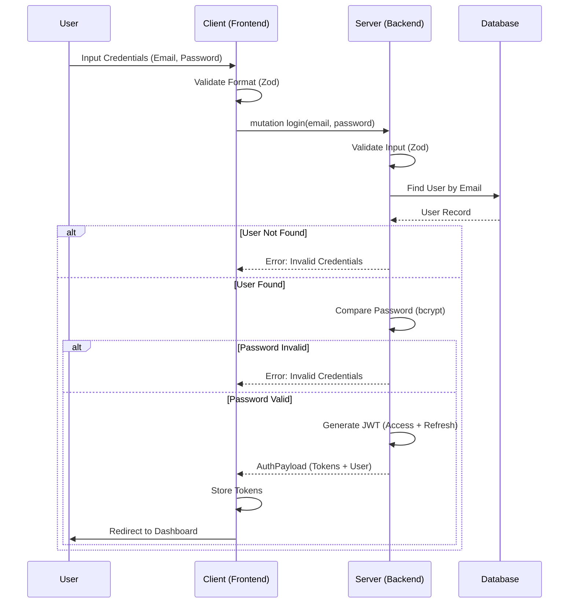

# Feature Specification: Authentication & User Core

**Feature Branch**: `feature/02-auth-user`
**Created**: 2025-11-28
**Status**: Draft
**Input**: User description: "Implement User entity, Auth flow (JWT, Dual Token, Bcrypt), GraphQL API (Register, Login, Refresh, Me), and Shared Zod Validation."

## User Scenarios & Testing _(mandatory)_

### User Story 1 - User Registration (Priority: P1)

As a new user, I want to create an account providing my details so that I can access the system.

**Why this priority**: Essential for onboarding users.

**Independent Test**:

- Call `register` mutation with unique email -> Success (200, AuthPayload).
- Call `register` with duplicate email -> Error (User exists).

**Acceptance Scenarios**:

1. **Given** valid input (Name, Email, Password), **When** `register` is called, **Then** a new User record is created in DB, password is hashed, and an `accessToken` and `refreshToken` are returned.
2. **Given** an existing email, **When** `register` is called, **Then** the system returns a "User already exists" error.
3. **Given** invalid input (e.g. invalid email format), **When** `register` is called, **Then** the system returns a Zod validation error.

---

### User Story 2 - User Login (Priority: P1)

As a registered user, I want to login with my credentials so that I can authenticate my session.

**Why this priority**: Essential for access control.

**Independent Test**:

- Call `login` with valid creds -> Success.
- Call `login` with invalid creds -> Error.

**Acceptance Scenarios**:

1. **Given** a registered email and correct password, **When** `login` is called, **Then** the system returns a valid `accessToken` (15m) and `refreshToken` (7d).
2. **Given** incorrect password, **When** `login` is called, **Then** the system returns a generic authentication error.
3. **Given** non-existent email, **When** `login` is called, **Then** the system returns a generic authentication error.

---

### User Story 3 - Token Refresh (Priority: P2)

As a user with an expired access token, I want to use my refresh token to get a new access token so that I stay logged in.

**Why this priority**: Critical for user experience (avoiding frequent logins).

**Independent Test**:

- Call `refreshToken` with valid token -> Success.
- Call with invalid token -> Error.

**Acceptance Scenarios**:

1. **Given** a valid, non-expired `refreshToken`, **When** `refreshToken` mutation is called, **Then** a new `accessToken` and `refreshToken` are returned.
2. **Given** an invalid or expired `refreshToken`, **When** `refreshToken` mutation is called, **Then** the system returns an Unauthorized error.

---

### User Story 4 - View Own Profile (Priority: P2)

As an authenticated user, I want to view my profile details.

**Why this priority**: Validates that the authentication middleware correctly identifies the user.

**Independent Test**:

- Call `me` query with header -> Success.
- Call without header -> Error.

**Acceptance Scenarios**:

1. **Given** a valid `Authorization` header, **When** `me` query is called, **Then** the system returns the user's `id`, `email`, and `fullName`.
2. **Given** a missing or invalid token, **When** `me` query is called, **Then** the system returns an Unauthorized error.

### Edge Cases

- **Database Down**: If DB is unreachable during Auth, return 500.
- **Clock Skew**: JWT verification should account for minor clock skews if possible, or rely on standard library defaults.
- **Malicious Input**: Extremely long strings for password/email should be rejected by Zod before reaching DB or hashing.

## Requirements _(mandatory)_

### Functional Requirements

- **FR-001**: System MUST define a `User` model in `packages/database/prisma/schema.prisma` with fields: `id` (UUID), `email` (Unique), `passwordHash`, `fullName`, `createdAt`, `updatedAt`.
  - _Note: Leave comments in schema for future relations to `Transaction` and `Category`._
- **FR-002**: System MUST use `bcrypt` to hash passwords.
- **FR-003**: System MUST implement Dual Token Strategy:
  - `accessToken`: 15 min expiration.
  - `refreshToken`: 7 days expiration.
- **FR-004**: System MUST expose GraphQL Mutations in `apps/backend`:
  - `register(input: RegisterInput): AuthPayload`
  - `login(input: LoginInput): AuthPayload`
  - `refreshToken(token: String): AuthPayload`
- **FR-005**: System MUST expose GraphQL Query: `me: User` (Protected).
- **FR-006**: System MUST define Zod schemas for `RegisterInput` and `LoginInput` in `packages/types` to be shared between Frontend and Backend.
- **FR-007**: System MUST implement a GraphQL Shield/Middleware to protect private queries.
- **FR-008**: System MUST reject duplicate emails during registration.

### Key Entities _(include if feature involves data)_

- **User**: The core identity entity.
  - `id`: UUID
  - `email`: String (Unique)
  - `passwordHash`: String
  - `fullName`: String
  - `createdAt`: DateTime
  - `updatedAt`: DateTime
- **AuthPayload**: GraphQL type containing `token` (String), `refreshToken` (String), and `user` (User).

## Success Criteria _(mandatory)_

### Measurable Outcomes

- **SC-001**: Backend successfully compiles with new Prisma schema and types.
- **SC-002**: `register` and `login` mutations work as expected in integration tests.
- **SC-003**: `me` query is inaccessible without a valid token.
- **SC-004**: Shared Zod schemas are imported and used in `apps/backend`.

## Diagrams

### Login Flow (Mermaid)

